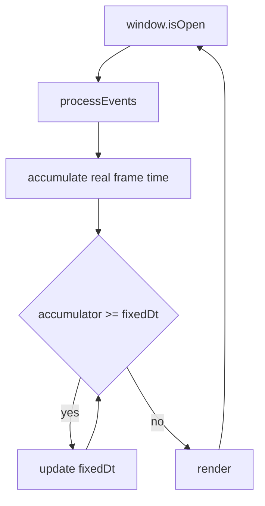
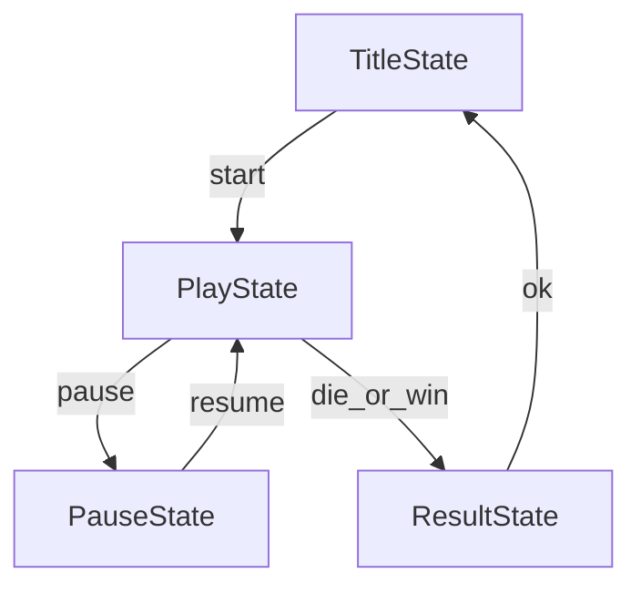

# Building a C++ SFML game from scratch

Synthesis of widely recommended practices for a new C++ game using SFML. Sources are listed in [bibliography.md](./bibliography.md). This page does **not** prescribe one repository’s architecture.

## What SFML gives you (and what it does not)

SFML is a multimedia library: windowing, events, 2D drawing, audio, networking. It is **not** a game engine. There is no built-in scene graph, physics, ECS, scripting, or content pipeline ([SFML FAQ](https://www.sfml-dev.org/faq/general/)). You own structure, time stepping, and content workflow.

SFML 3 requires **C++17+**. Prefer the current stable release and the matching [tutorials](https://www.sfml-dev.org/tutorials/3.1/).

## 1. Minimal bootstrap

Keep `main` thin. Create a `Game` / `Application` / `Engine` object that owns the window and runs the loop.

```cpp
int main()
{
    Game game;
    game.run();
}
```

This is the shape used throughout [*SFML Game Development*](https://github.com/SFML/SFML-Game-Development-Book) and practical SFML engine write-ups (e.g. [Game Code School — simple engine](https://gamecodeschool.com/sfml/simple-game-engine.html)): constructor creates `sf::RenderWindow` (and loads shared resources); `run()` contains the loop.

Split early into focused methods (even if they live in separate `.cpp` files):

| Method | Responsibility |
|--------|----------------|
| `processEvents` / `input` | Drain the event queue; update input state |
| `update` | Advance simulation by a time step |
| `render` / `draw` | Clear, draw, display |

That split scales: pause can skip `update` while still handling input and drawing.

## 2. Game loop and time



Canonical structure ([Game Programming Patterns — Game Loop](http://gameprogrammingpatterns.com/game-loop.html), Packt SFML book):

1. Process input
2. Update game state
3. Render

### Prefer a fixed simulation timestep

Variable “move N pixels per frame” ties gameplay to FPS. Industry practice is to **decouple** simulation rate from display rate ([Glenn Fiedler — Fix Your Timestep!](https://gafferongames.com/post/fix_your_timestep/)):

- Measure wall-clock frame time (`sf::Clock` or equivalent).
- Add it to an **accumulator** (clamp large spikes, e.g. 0.25 s, to avoid the “spiral of death”).
- While `accumulator >= dt`, call `update(dt)` and subtract `dt` (often `dt = 1/60`).
- Call `render` once per outer iteration (display may run faster or slower than simulation).

Optional polish: interpolate between previous and current simulation states when rendering (`alpha = accumulator / dt`) so motion stays smooth when render rate ≠ sim rate. Many prototypes skip interpolation until hitching is visible.

`sf::RenderWindow::setFramerateLimit` / vsync only caps **presentation**. Do not treat them as your physics clock.

## 3. Input

### Drain the queue every frame

Unread events make the window feel stuck and delay `Closed` / resize handling. In SFML 3:

```cpp
while (const std::optional event = window.pollEvent())
{
    // handle *event with is<T>() / getIf<T>(), or use window.handleEvents(...)
}
```

See the official [Events tutorial](https://www.sfml-dev.org/tutorials/3.1/window/events/).

### Events vs real-time state

| Use events for | Use real-time / held flags for |
|----------------|--------------------------------|
| Close, resize, focus | Hold-to-move (or keep bools set by press/release) |
| Single-shot UI (click, menu confirm) | Continuous aiming / strafing |
| Text entry (`TextEntered`) | |

A common book pattern: `KeyPressed` / `KeyReleased` set booleans; `update` reads those booleans. Alternatively poll `sf::Keyboard::isKeyPressed` in `update` for gameplay holds. Prefer **scancodes** for layout-stable controls.

Always handle **`Closed`**. Plan for **`Resized`** (views) and often **`FocusLost`** (pause / mute).

## 4. Code organization

Practices that show up repeatedly in SFML tutorials, the Packt book, and forum guidance:

- **One owner for the window** — usually the game/engine object; avoid a global `RenderWindow*`.
- **Entities as focused types** — player, enemy, button: position, sprite/shape, `update(dt)`, draw through the window or a drawable interface.
- **Resources separate from sprites** — load `sf::Texture` / `sf::Font` once; many sprites share one texture (forum/book consensus).
- **No god-class forever** — start with a monolithic `Game` if the project is tiny; extract when files hurt (enemies, bullets, UI), not on day one with a full ECS.

Game Code School’s split (`Input.cpp` / `Update.cpp` / `Draw.cpp` for the engine) is a pragmatic middle ground: same class, separate translation units per concern.

## 5. States and scenes

Menus, gameplay, pause, and game-over are different **modes**. Two standard approaches:



1. **State stack** (emphasized in *SFML Game Development*): push pause over play so the world stays in memory; pop to resume; replace to change major modes (title ↔ play).
2. **Enum + switch** — fine for a tiny demo; becomes painful once overlays must keep underlying state.

Rules of thumb:

- Only the **active** (top) state updates simulation.
- Draw **bottom to top** so overlays composite correctly.
- Defer stack changes if a callback on the current state would destroy that state mid-call.

## 6. Resources

- Load critical assets at startup or on a loading screen; **fail loudly** if a required font/texture is missing.
- Cache by path or id; hand out references/`shared_ptr`/handles — do not `loadFromFile` inside every button constructor.
- Resolve paths relative to a known root (often next to the executable), not an accidental process CWD.
- Grow later into streaming / async loads when asset size or load time demands it (see [multithreading.md](./multithreading.md)).

## 7. Views and resolution

`sf::View` maps world coordinates to the window. Decide a **design resolution** early (e.g. 1280×720). On resize:

- Stretch (simple, wrong aspect), or
- Letterbox / pillarbox the design view (common for 2D games).

Convert mouse **pixel** positions into **world** coordinates with the same view; otherwise UI hit-testing breaks when the window size changes.

## 8. Growth path

A sensible progression for a greenfield SFML game:

1. Window + loop + one moving sprite
2. Fixed timestep + input flags
3. Second entity + simple collision
4. Title / play states
5. Resource cache + HUD text
6. Pause overlay, audio, levels as data
7. Only then: broader frameworks (ECS, scripting, custom engines)

Inventing a universal entity bus, reflection, or plugin system before the first fun level usually slows you down.

## 9. Testing and tooling (lightweight)

Even without a full engine test suite:

- Keep simulation logic callable with a fixed `dt` (easier to unit-test movement/collision without a window).
- Log or on-screen FPS / update time while profiling (the Packt book’s intro sample tracks frame stats).
- Use a real debugger; treat tutorials as starting points, not sacred architecture.

## Checklist (external baseline)

- [ ] Thin `main`; game object owns the loop
- [ ] Events drained every frame; `Closed` handled
- [ ] Simulation uses an explicit time model (prefer fixed `dt` + accumulator)
- [ ] Input / update / render responsibilities are separable
- [ ] Modes (menu / play / pause) are explicit
- [ ] Assets loaded once and shared
- [ ] Resize / view strategy decided
- [ ] Threads only for proven bottlenecks ([multithreading.md](./multithreading.md))

Next: [Multithreading analysis](./multithreading.md) · [Bibliography](./bibliography.md)
