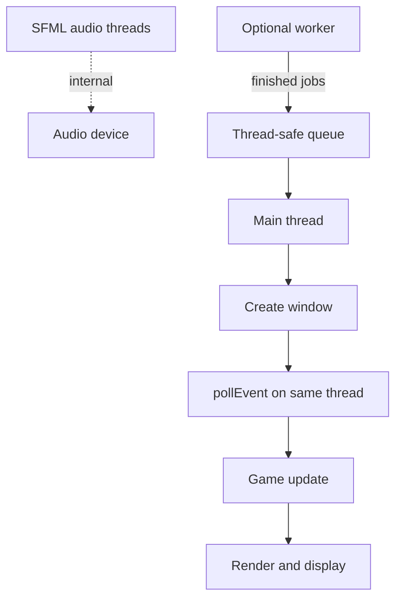

# Multithreading in SFML games

Analysis of when a C++ SFML game should use multiple threads, grounded in SFML’s own rules and typical 2D game workloads. This is a decision guide, not a requirement to parallelize.

## Verdict (typical 2D arcade / menu / board prototype)

**Stay single-threaded** for window events, game update, and rendering on the thread that owns the window.

Add worker threads only after you measure a bottleneck (long asset I/O, expensive pathfinding, compression). Do **not** split “update on thread A, render on thread B” by default — for small object counts the synchronization cost and complexity usually exceed the gain.

SFML already runs **audio streaming** on internal threads; that is not a reason to multithread your gameplay loop.

## Why the default is one thread

A frame on a small 2D game is often: poll a few events, move dozens of entities, draw them. That finishes in a fraction of a 16 ms frame budget on modern CPUs. Multithreading helps when work is:

- **Large and parallel** (many independent jobs), or
- **Latency-hiding** (disk/network wait while the UI stays responsive)

It hurts when you need a **mutex around the whole world** every frame, or when OpenGL/window APIs force serialization anyway.

## SFML and OS constraints

### Window and events

- Create the window on the main thread when possible (OS limitations; SFML docs stress this).
- Call `pollEvent` / `waitEvent` on the **same thread that created the window**.
- Practical split if you insist on threads: **events (+ often logic) on main**, heavy work or carefully activated rendering elsewhere — not the reverse of blocking main with loads while a side thread owns the window (the OS still treats an unresponsive main thread as a hung app).

### OpenGL context

SFML windows carry an OpenGL context. A context can be **active on only one thread at a time**. To render on another thread ([Using OpenGL in an SFML window](https://www.sfml-dev.org/tutorials/3.1/window/opengl/)):

1. `window.setActive(false)` on the current thread
2. Start the render thread
3. `window.setActive(true)` on the render thread before GL/SFML draw/`display`

Graphics-module objects and the window must be used with these rules in mind; casual “call `draw` from two threads” is undefined behavior territory.

Window-less `sf::Context` exists for loading GL resources off the window thread — still not free of synchronization design.

### Audio

`sf::Music` / `sf::SoundStream` play on a **separate SFML thread**. If `onGetData` (or shared buffers) touch data also written by the game thread, protect with a mutex ([Custom audio streams](https://www.sfml-dev.org/tutorials/3.1/audio/streams/)). Prefer “submit play requests from the main thread; let SFML own the stream thread.”

## When multithreading is *not* worth it

| Situation | Why |
|-----------|-----|
| Arkanoid-scale entity counts | Update+draw are tiny vs frame budget |
| “Parallelize collision and render” without profiling | Shared state needs locks; races corrupt gameplay |
| Mutex around entire game state every tick | Serializes threads; often slower |
| Premature job system / thread pool | Weeks of complexity for unused capacity |

## When threads *do* make sense

### 1. Asynchronous asset / level loading (most common win)

- Main thread: keep pumping events + draw a loading or gameplay UI.
- Worker: read files, decode images, build CPU-side data.
- Hand-off: thread-safe queue of “resource ready” messages; **apply** to SFML GPU objects on the thread that owns the active context (often main), unless you deliberately use a background `sf::Context` and understand sharing rules.

### 2. Heavy CPU jobs unrelated to the window

Pathfinding batches, procedural generation, save-game compression, AI planning. Pattern: worker computes a result → queue → main thread integrates into the world between frames or at safe sync points.

### 3. Dedicated render thread (advanced, optional)

Documented SFML pattern: main handles events (and often logic); another thread activates the context and renders. Only pursue if profiling shows main-thread render as the limiter **and** you can define a clear snapshot/double-buffer so the render thread never races gameplay mutation. For most 2D SFML games this is unnecessary.

## Safe patterns

| Pattern | Role |
|---------|------|
| **Job queue** | Workers pull tasks; post results to a mutex/`std::deque` or lock-free queue |
| **Atomics / flags** | “Load complete”, “cancel worker” without heavy locks |
| **Double buffer / snapshot** | Simulate writes buffer A; render reads buffer B; swap at frame boundary |
| **Narrow critical sections** | Lock only the queue or the asset map entry, not the whole game |
| **Join or stop on shutdown** | Workers must exit before destroying the window/resources they touch |

## Anti-patterns

1. **Block main on disk, put the window on a helper thread** so a loading spinner moves — the OS may still mark the process unresponsive; invert it: UI on main, load on worker.
2. **Share `sf::RenderWindow`, sprites, or textures across threads** without a strict ownership and `setActive` protocol.
3. **“More threads = faster game”** without a profiler — context switches and contention often lose.
4. **Gameplay determinism ignored** — parallel updates of interacting entities need ordering rules; fixed-step single-threaded sim is simpler to reason about and test.

## Decision checklist

1. Measure frame time (and, if needed, coarse scopes: events / update / draw / load).
2. Is the hot spot **I/O wait** or **CPU** on a large parallelizable batch?
3. If yes: add a **worker + queue**, keep window/events on main.
4. If no: optimize algorithms, batch draws, reduce loads — stay single-threaded.
5. Revisit a render thread only after (1)–(4) and a clear sync design.

## Summary

| Work | Recommended thread |
|------|--------------------|
| Create window, `pollEvent`, most game logic, `draw`/`display` | Main (window owner) |
| Audio streaming | SFML internal (sync shared data) |
| File decode / heavy prep | Worker → results to main |
| Full multithreaded engine | Not a default for small SFML 2D games |

For structuring the single-threaded loop itself, see [from-scratch.md](./from-scratch.md). Sources: [bibliography.md](./bibliography.md).
