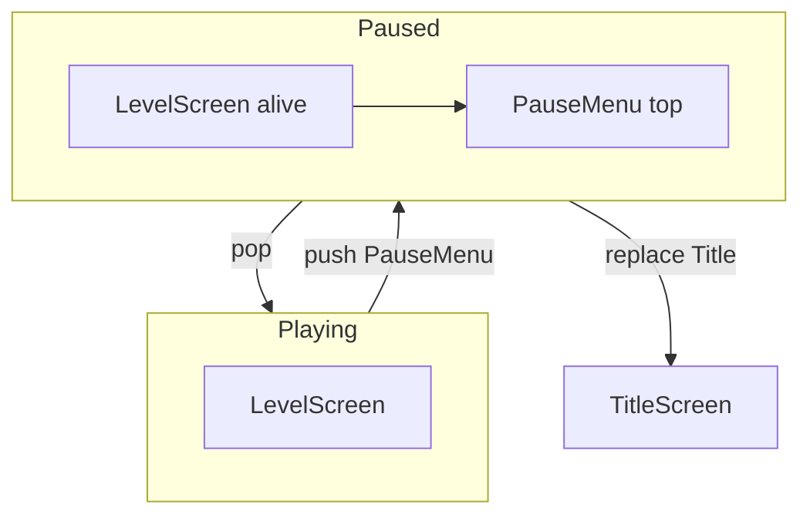

# Overlay screens and pause

Advanced, **repository-agnostic** walkthrough of stacking a pause (or dialog) screen over a living level. Complements the shorter state notes in [from-scratch.md](./from-scratch.md). For how this maps onto one concrete project, see [sfml/screens-pause-levels.md](../sfml/screens-pause-levels.md).

## The idea

Keep the level screen alive under a new overlay:

1. Player presses Escape (or Pause).
2. Engine **pushes** a `PauseMenu` (or similar) onto the scene stack.
3. The level instance stays in memory; its world state is not destroyed.
4. Simulation, AI, and gameplay input on the level stop responding.
5. Every frame still **draws** the stack bottom → top, so the level is visible under a dimmed panel.
6. The pause UI receives input and updates (cursor, button hover, menu navigation).
7. Resume **pops** the pause screen (destroyed); the level is top again and becomes responsive.
8. Quit to title **replaces** the whole stack with the main menu (level is destroyed).

This is the standard **state stack** approach used in *SFML Game Development* and many engines: overlays preserve underlying state; major mode changes replace it.



## Who updates vs who draws

| Layer | Role while paused |
|-------|-------------------|
| **Level (below top)** | Still drawn. Simulation/AI frozen (see models A/B below). |
| **Pause (top)** | Full `update(dt)` + draw. Owns menu interaction. |
| **Controller** | Clears once, draws entire stack bottom → top, presents once. |

```mermaid
sequenceDiagram
  participant Loop as GameLoop
  participant Stack as SceneStack
  participant Level as LevelScreen
  participant Pause as PauseMenu

  Loop->>Stack: update dt
  Note over Stack: Model A: only top.update
  Stack->>Pause: update dt
  Loop->>Stack: display
  Stack->>Level: display
  Stack->>Pause: display
```

## Update models: full freeze vs idle motion

Stopping `update` on every screen below the top is the simple default. It also freezes idle animations (breathing, blinking) — the level looks like a screenshot.

| Model | Sim / AI / gameplay clocks | Idle / cosmetic animation under overlay |
|-------|----------------------------|-----------------------------------------|
| **A — top-only `update`** | Stopped | Stopped (last frame) |
| **B — split update** | Stopped | Continues via a visual-only tick |

**Model A** is enough for arcade games with little or no character idle (e.g. a ball and paddle). Prefer it until cosmetics demand more.

**Model B** matches “the character’s standing animation still plays, but AI does not move and the world does not advance.” Typical API shapes:

```text
// Pseudocode — illustration only
for each screen below top:
    screen.updateVisual(dt)   // animators, particles that are cosmetic
top.update(dt)                // full logic + UI for the overlay
```

or a single `update(dt, UpdateKind::Simulation | UpdateKind::Visual)` filtered by stack position.

Rules for model B:

- **Do not** run physics, AI decisions, spawn timers, or win/lose checks in the visual path.
- **Do** advance sprite frame timers that have no gameplay side effects.
- Keep the split obvious so a future change does not accidentally simulate under pause.

## Input ownership

Freezing `update` on the level does **not** automatically disable input if entities registered global key/mouse callbacks when the level was created. Those handlers can still fire while the pause menu is up.

Pick one strategy and stick to it:

| Strategy | Idea |
|----------|------|
| **Route through top screen** | Only the top screen (or its UI) subscribes to gameplay/menu actions. |
| **Gate in handlers** | Handlers no-op unless their screen is top / “input-active.” |
| **Scoped registration** | Unregister level controls on pause; re-register on resume (RAII helps). |

Window-level actions (`Closed`, resize, optional global mute) may stay outside the stack. Escape policy should be context-aware:

| Context | Escape |
|---------|--------|
| Title | Quit app or ignore |
| Playing | Push pause |
| Pause | Pop (resume) or open “quit?” dialog |
| Nested dialog | Pop dialog only |

## Pause lifecycle (detailed)

### Enter pause

1. Level is top; it handles Escape → `pushScreen(PauseMenu)`.
2. Transition is **deferred** to the start of the next frame if the call happens inside a button/key callback (avoid destroying or reshuffling the stack mid-callback).
3. After push: PauseMenu is top; level remains underneath.

### While paused

- PauseMenu `update`: navigate Resume / Options / Quit.
- Level: no simulation (A) or visual-only (B).
- Draw: level (full scene) then dimmer + pause widgets.
- Gameplay input must not move the player, camera, or AI.

### Exit pause

- **Resume:** `popScreen()` → PauseMenu destroyed; level is top; sim and input resume from the same world state.
- **Quit to title:** `replaceScreen(Title)` → stack cleared; level destroyed (save first if needed).
- **Options:** either swap pause content in place, or `pushScreen(Settings)` on top of pause (another overlay).

## More overlay examples

### Confirm quit

```text
[Level] → push [Pause] → push [ConfirmQuit]
Confirm No  → pop → back to Pause
Confirm Yes → replace Title
```

### Settings over pause

Same as confirm: second push. Pop returns to pause, not straight to the level.

### Result / victory banner

```text
[Level] detects win → push [VictoryOverlay]
Overlay blocks input to the level; may still draw the final board underneath
Continue → replace Title or replace next Level
```

Prefer a short overlay over instantly replacing the level so the player can read the outcome.

### Modal tutorial tip

Push a small tip card; pop on dismiss. Level sim: usually frozen (A) so the tip is readable.

## Anti-patterns

- Scattering `if (paused) return;` through every enemy and system — easy to miss one; prefer stack + input ownership.
- Destroying the level screen to show pause and reconstructing it on resume — loses mid-run state unless you serialize everything.
- Global “Escape always quits the process” after pause exists — fights player expectation of “back.”
- Letting level key handlers stay live under pause — paddle/character moves “through” the menu.
- Running full `update` on all stack layers “so animations work” — AI and physics keep running under the menu.

## Checklist

- [ ] Pause is a **push**, resume is a **pop**, quit-to-title is a **replace**
- [ ] Level stays alive under the overlay
- [ ] Draw order is bottom → top
- [ ] Transitions are deferred if needed
- [ ] Update model A or B chosen deliberately
- [ ] Input cannot reach gameplay systems under the overlay
- [ ] Escape (and similar) behavior depends on stack top

Back to the [game-dev index](./index.md).
