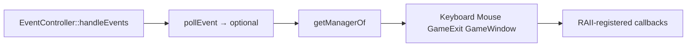

# SFML 3 events and input

Official tutorial: [Events explained](https://www.sfml-dev.org/tutorials/3.1/window/events/).

## Event queue model

The OS delivers input and window messages into a FIFO queue owned by the SFML window. Each frame (or dedicated event thread) you **drain** that queue. Leaving events unread makes the window feel stuck and can delay `Closed` / resize handling.

`sf::WindowBase::pollEvent()` is non-blocking. In SFML 3 it returns `std::optional<sf::Event>`:

- engaged optional → one event to handle
- `std::nullopt` → queue empty for now

Always loop until empty:

```cpp
while (const std::optional event = window.pollEvent())
{
    // handle *event
}
```

`waitEvent()` blocks until an event (or timeout). Useful for a dedicated event thread or tools that idle; game loops almost always use `pollEvent` so update/render keep running.

## Type-safe `sf::Event` (SFML 3)

SFML 2 exposed a C-style union + `type` enum. SFML 3 stores the active alternative in a `std::variant`-based API. Event **subtypes** are nested types such as `sf::Event::Closed`, `sf::Event::KeyPressed`, `sf::Event::Resized`.

### Approach A — `is` / `getIf`

```cpp
while (const std::optional event = window.pollEvent())
{
    if (event->is<sf::Event::Closed>())
    {
        window.close();
    }
    else if (const auto* key = event->getIf<sf::Event::KeyPressed>())
    {
        if (key->scancode == sf::Keyboard::Scancode::Escape)
            window.close();
    }
}
```

- `is<T>()` — true when `T` is the active subtype (good for empty payloads like `Closed`)
- `getIf<T>()` — pointer to payload or `nullptr`

This style fits a central dispatcher that classifies events and forwards them (exactly what a manager registry does).

### Approach B — `handleEvents` (visitation)

```cpp
window.handleEvents(
    [&](const sf::Event::Closed&) { window.close(); },
    [&](const sf::Event::KeyPressed& key) {
        if (key.scancode == sf::Keyboard::Scancode::Escape)
            window.close();
    });
```

SFML invokes the matching callable for each pending event. You need not cover every subtype; unmatched types are ignored. Prefer this when handlers are local to the window loop and the set of types is small and stable.

**When to choose which**

| Prefer `is` / `getIf` + your dispatcher | Prefer `handleEvents` |
|----------------------------------------|------------------------|
| Multiple subsystems register interest | Tiny demo / single translation unit |
| You map event kinds to managers or layers | Handlers are closed over the window only |
| Unit tests inject fake events into the same decode path | Prototype before introducing managers |

## Events vs real-time input

SFML offers two complementary input models:

| Model | API examples | Best for |
|-------|--------------|----------|
| **Events** | `KeyPressed` / `KeyReleased`, mouse buttons, `TextEntered` | UI clicks, “pressed once”, text entry, window lifecycle |
| **Real-time** | `sf::Keyboard::isKeyPressed`, `sf::Mouse::getPosition` | Hold-to-move, analog-style polling every update |

Common pattern: **edge** detection from events (or press/release handlers), **hold** state from real-time queries — or maintain your own “key down” set updated by events if you want testability without calling SFML statics from gameplay code.

Scancodes (`sf::Keyboard::Scancode`) are layout-stable physical keys; `sf::Keyboard::Key` follows the logical key. Prefer scancodes for gameplay controls that should stay on the same keyboard position across layouts.

## Window lifecycle events you should plan for

- **`Closed`** — user clicked the window chrome close control; call `window.close()` or show a confirm UI first.
- **`Resized`** — update `sf::View` / letterboxing so the world does not stretch incorrectly.
- **`FocusLost` / `FocusGained`** — pause simulation or mute audio when the player alt-tabs (especially important on mobile when backgrounding).
- **Mouse enter/leave** — optional UI polish.

Joystick, touch, and sensor events exist for controllers and mobile; ignore them only if you consciously do not support those devices.

## Recommended game-loop placement

```text
while (window.isOpen())
{
    process all pending events   // once per frame is enough
    update simulation (fixed or variable dt)
    render
}
```

Do not interleave `pollEvent` deep inside gameplay systems in an ad hoc way — one choke point keeps ordering and testing predictable.

## In business-game

This project uses **Approach A** behind a thin window port and a typed manager registry — not `window.handleEvents(...)`.



- [`EventCollectorI`](../../../src/window/EventCollectorI.hpp) / `WindowSFML` expose `pollEvent` as `std::optional<sf::Event>`.
- [`EventController`](../../../src/controllers/EventController.cpp) drains the queue and dispatches via `getManagerOf` → `EventManagers`.
- Managers decode with `getIf` / `is` and invoke registered `std::function` handlers.
- Registration returns a move-only RAII `UnRegisterer` (`[[nodiscard]]`) so entities cannot leave dangling callbacks.

Facts and type→manager tables: [event-flow.md](../../reference/event-flow.md). Adding a manager: [add-event-manager.md](../../how-to/add-event-manager.md).

**Escape today:** `main.cpp` registers a keyboard handler that closes the window on Escape release. That is global quit, not pause — see [screens-pause-levels.md](./screens-pause-levels.md) for the recommended pause pattern when you add one.

Next: [Game architecture](./game-architecture.md).
