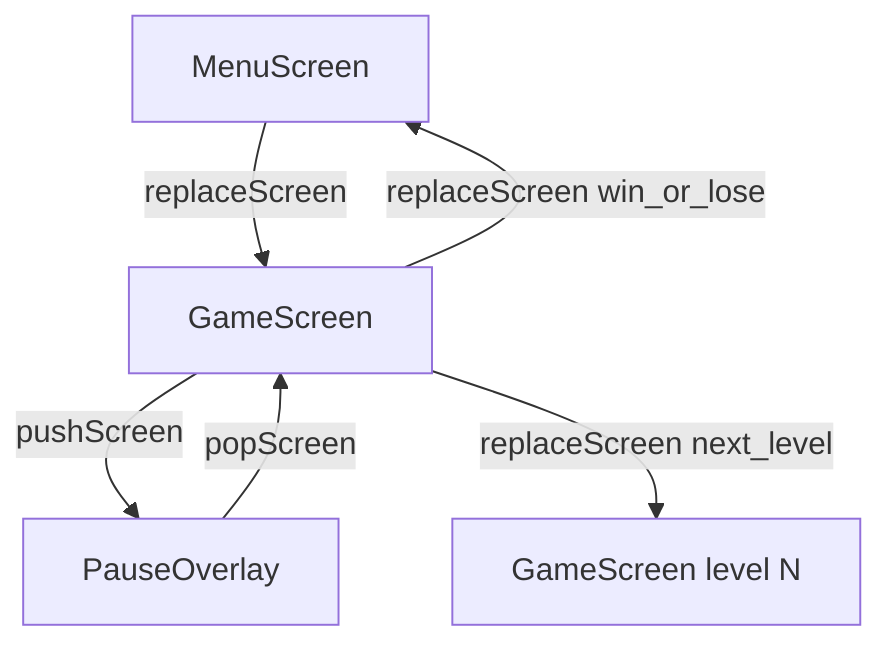

# Screens, pause, and levels

Games change “mode” often: title menu, playing, paused, victory, next stage. SFML has no built-in scene system — you implement one. This page covers the stack model used in business-game and practical recipes for pause and level flow.

## Scene stack model

Keep a stack of screens (bottom = background, top = active):

| Operation | Effect |
|-----------|--------|
| **push** | Place a new screen on top (old screens stay alive underneath) |
| **pop** | Remove the top screen (resume what was below) |
| **replace** | Clear the stack (or swap top) and show a new root/mode |

**Update:** only the **top** screen receives `update(dt)`. That naturally pauses everything below without flags scattered through entities.

**Draw:** render **bottom → top** so overlays sit above the frozen game. Clear and present once per frame at the controller layer, not inside each screen.

**Deferred transitions:** if a button callback calls `replaceScreen` while that screen is still on the call stack, destroying “current” immediately is use-after-free. Queue the transition and apply it at the start of the next `update`.



### Stack vs single “current screen” enum

A single `enum class State { Menu, Game, Pause }` with a switch works for tiny demos. It collapses once pause must **keep** the game world in memory, or when dialogs stack. Prefer a real stack as soon as you need overlays.

### Stack vs full state machine framework

You do not need a hierarchical FSM library for menu → game → pause. Reserve heavier state machines for deep gameplay AI or multi-phase board turns — not for “is the pause UI up.”

## When to push vs replace

| Situation | Prefer |
|-----------|--------|
| Menu → start game | **replace** (menu not needed under the game) |
| Game → pause / settings / confirm quit | **push** overlay, then **pop** to resume |
| Win / game over → back to menu | **replace** (or push a result overlay that then replace→menu) |
| Level 1 → level 2 | **replace** with a new game screen (or reset in place — see below) |
| Modal “are you sure?” over pause | **push** another overlay |

Recipe to add a screen type: [add-screen.md](../../how-to/add-screen.md).

## Pause

### Overlay pause (recommended with a stack)

1. From `GameScreen`, on Pause key / button: `pushScreen(PauseScreen(...))`.
2. `GameScreen::update` stops running because it is no longer top — ball and enemies freeze “for free.”
3. `display` still draws the game under a translucent panel if the controller draws the whole stack.
4. Resume: `popScreen()`. Quit to menu: `replaceScreen(MenuScreen(...))` from the pause UI.

### Focus loss

Also consider auto-pause on `FocusLost` (alt-tab, mobile backgrounding). Resume on `FocusGained` only if that matches your UX (some games stay paused until the player confirms).

### Escape key policy

Decide one policy and stick to it:

| Context | Sensible Escape behavior |
|---------|---------------------------|
| Menu | Quit application (or no-op) |
| Playing | Open pause overlay |
| Pause overlay | Close overlay (pop) or quit to menu |

Avoid a single global “Escape always closes the window” once pause exists — players expect Escape to mean “back,” not “kill process.”

### What not to do

- `bool paused` checked inside every entity — easy to miss one
- Destroying `GameScreen` to show pause and reconstructing it on resume — loses mid-level state unless you serialize everything

## Levels and stage changes

Three practical approaches:

### 1. New screen instance with a level id (good default here)

```cpp
screenUpdater.replaceScreen(
    std::make_unique<GameScreen>(..., LevelId{2}));
```

Constructor (or factory) loads that level’s brick layout / enemy set / paddle rules. Old screen is destroyed; no stale pointers.

**Use when:** levels differ in data but share the same rules screen class.

### 2. Reset in place

Keep one `GameScreen`; call `loadLevel(n)` that rebuilds bricks, resets ball/lives/score, does not touch the scene stack.

**Use when:** transitions are frequent and you want zero stack churn; be careful to unregister/recreate any level-scoped handlers.

### 3. Data-only loader

`LevelDesc` (rows of bricks, speeds, themes) loaded from files; `GameScreen` stays dumb about “what is level 3.” Still combine with (1) or (2) for *when* to advance.

**Use when:** designers edit content without recompiling. Skip until you have more than a handful of hand-built layouts.

Avoid a freestanding `LevelManager` singleton until two or more screens need the same loading pipeline.

### Advancing after clear

Typical flow:

1. Detect win condition in `GameScreen::update`.
2. Either immediately `replaceScreen` next level / menu, or **push** a short “Level clear” overlay that waits for input, then replaces.
3. Same idea for game over (0 lives): result overlay → menu is kinder UX than an instant cut.

## Win / lose and HUD

Minimal HUD (lives, score) can live as `sf::Text` on the game screen via the resource cache. Result screens should be separate stack entries so input mapping (click “Continue”) does not fight the paddle controls.

Keep transition flags (`transitioning`) if a single frame might otherwise double-trigger win after the last brick.

## In business-game

**Implemented today**

- `ScreenController` scene stack: `pushScreen` / `popScreen` / `replaceScreen`, deferred apply, top-only update, bottom-up draw — see [architecture.md](../../reference/architecture.md) and [design-decisions.md](../design-decisions.md).
- `MenuScreen` → `GameScreen` via `replaceScreen` on Start.
- Arkanoid session: 3 lives; 0 lives or 0 bricks → `replaceScreen(MenuScreen)` (no result overlay yet).
- Escape in `main.cpp` closes the window globally (not pause).

**Recommended next steps when polishing**

1. `PauseScreen` pushed from the game; move Escape handling so playing → pause, pause → pop (or quit to menu), menu → exit.
2. Optional `FocusLost` → push pause (or set a paused overlay once).
3. Win/lose overlay before returning to menu.
4. Levels: construct `GameScreen` with a level index / descriptor and rebuild the brick grid; use `replaceScreen` between stages.

Back to the [knowledge base index](./index.md).
