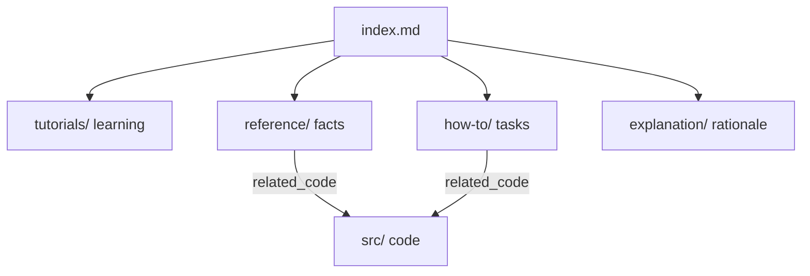

# Documentation map

This directory documents **business-game** following the [Diataxis](https://diataxis.fr/) framework. Every document starts with a YAML front-matter block; agents should search by the `related_code` and `keywords` fields to find the right page.

## How the docs are organized

| Quadrant | When to read | Purpose |
|----------|--------------|---------|
| Tutorials | First time with the repo | Learn by doing, end to end |
| How-to | You have a specific task | Steps to reach a goal |
| Reference | You need a precise fact | Describe what exists, mirrors code |
| Explanation | You want the "why" | Design rationale and direction |

## All documents

| Document | Type | Keywords |
|----------|------|----------|
| [tutorials/getting-started.md](tutorials/getting-started.md) | tutorial | setup, toolchain, build, run, msys2 |
| [how-to/build-and-test.md](how-to/build-and-test.md) | how-to | build, test, ctest, format, presets |
| [how-to/add-entity.md](how-to/add-entity.md) | how-to | entity, EntityI, paddle, draw, update |
| [how-to/add-screen.md](how-to/add-screen.md) | how-to | screen, ScreenI, push/pop/replace, transition |
| [how-to/add-event-manager.md](how-to/add-event-manager.md) | how-to | manager, EventManager, ManagerOf, events |
| [reference/architecture.md](reference/architecture.md) | reference | architecture, game loop, controllers |
| [reference/source-layout.md](reference/source-layout.md) | reference | layout, directories, gameLib, targets |
| [reference/interfaces.md](reference/interfaces.md) | reference | interfaces, EntityI, ScreenI, DrawerI, managers |
| [reference/event-flow.md](reference/event-flow.md) | reference | events, managers, handlers, polling |
| [explanation/design-decisions.md](explanation/design-decisions.md) | explanation | interfaces, DI, ISP, rationale |
| [explanation/roadmap.md](explanation/roadmap.md) | explanation | roadmap, prototype, board game, WIP |
| [explanation/sfml/index.md](explanation/sfml/index.md) | explanation | SFML 3.1 knowledge base map |
| [explanation/sfml/overview-and-platforms.md](explanation/sfml/overview-and-platforms.md) | explanation | SFML modules, platforms, 3.1 features |
| [explanation/sfml/events.md](explanation/sfml/events.md) | explanation | SFML events, pollEvent, input models |
| [explanation/sfml/game-architecture.md](explanation/sfml/game-architecture.md) | explanation | game loop, timestep, layering on SFML |
| [explanation/sfml/screens-pause-levels.md](explanation/sfml/screens-pause-levels.md) | explanation | scene stack, pause, levels |

## SFML knowledge

Conceptual guides for SFML 3.1 and typical 2D game structure live under [explanation/sfml/](explanation/sfml/index.md). They explain the library and common patterns; project-specific facts stay in `reference/` and `how-to/`.

## Maintenance

Documentation currency is enforced by the always-on rule `.cursor/rules/documentation.mdc` and the `update-docs` skill. When code changes, update the docs whose `related_code` lists the touched files, refresh their `last_reviewed`, and keep this table in sync.
