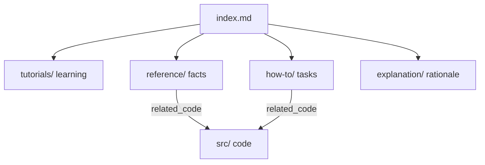

# Documentation map

This directory documents **business-game** following the [Diataxis](https://diataxis.fr/) framework. Every document starts with a YAML front-matter block; agents should search by the `related_code` and `keywords` fields to find the right page.

## How the docs are organized

| Quadrant | When to read | Purpose |
|----------|--------------|---------|
| Tutorials | First time with the repo | Learn by doing, end to end |
| How-to | You have a specific task | Steps to reach a goal |
| Reference | You need a precise fact | Describe what exists, mirrors code |
| Explanation | You want the "why" | Design rationale and direction |

## All documents

| Document | Type | Keywords |
|----------|------|----------|
| [tutorials/getting-started.md](tutorials/getting-started.md) | tutorial | setup, toolchain, build, run, msys2 |
| [how-to/build-and-test.md](how-to/build-and-test.md) | how-to | build, test, ctest, format, presets |
| [reference/source-layout.md](reference/source-layout.md) | reference | layout, directories, gameLib, targets |
| [reference/engine-core.md](reference/engine-core.md) | reference | eng, Vec2, Rect, Handle, Image |
| [reference/engine-input.md](reference/engine-input.md) | reference | InputEvent, ActionMap, InputState |
| [reference/engine-scene.md](reference/engine-scene.md) | reference | SceneStack, SceneRequest, pause |
| [reference/engine-loop.md](reference/engine-loop.md) | reference | FixedStepLoop, App, PlatformI |
| [reference/engine-render.md](reference/engine-render.md) | reference | RenderQueue, SortKey, Projection |
| [reference/engine-collision.md](reference/engine-collision.md) | reference | intersect, sweep, reflect |
| [reference/engine-resources.md](reference/engine-resources.md) | reference | ResourceCache, ResourceError |
| [reference/engine-sfml.md](reference/engine-sfml.md) | reference | SfmlPlatform, EventTranslate, letterbox |
| [reference/arkanoid-sim.md](reference/arkanoid-sim.md) | reference | arkanoid sim, StageId, power-ups |
| [reference/input-and-events.md](reference/input-and-events.md) | reference | Action, InputMapper, SFML events, handleAction |
| [reference/pause-overlay.md](reference/pause-overlay.md) | reference | PauseScreen, overlay, FocusLost, requestPauseOverlay |
| [reference/world-and-levels.md](reference/world-and-levels.md) | reference | World, Paddle, Ball, Brick, Stage1 |
| [reference/power-ups.md](reference/power-ups.md) | reference | PowerUp, PowerUpKind, capsule, Wide, MultiBall |
| [explanation/roadmap.md](explanation/roadmap.md) | explanation | roadmap, skeleton, mvp |
| [explanation/architecture.md](explanation/architecture.md) | explanation | ADR, eng, arkanoid, boundaries, ECS |
| [../mvp/README.md](../mvp/README.md) | design notes (not Diátaxis) | prospective engine plan |
| [../mvp/10-engine-progress.md](../mvp/10-engine-progress.md) | living tracker (not Diátaxis) | WindowI, PauseScreen, World, requestClose, slices |

`mvp/01`–`09` are prospective. Living engine progress is [`mvp/10-engine-progress.md`](../mvp/10-engine-progress.md). Current facts live in the Diátaxis pages above; prefer `src/` over chapter prose if they disagree.

## Maintenance

Documentation currency is enforced by the always-on rule `.cursor/rules/documentation.mdc` and the `update-docs` skill. When code changes, update the docs whose `related_code` lists the touched files, refresh their `last_reviewed`, and keep this table in sync.
