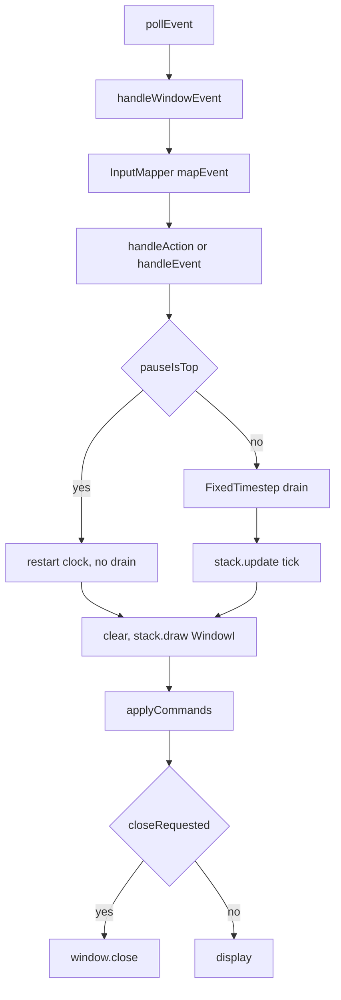

# Application loop

`src/main.cpp` constructs `Game` and calls `run()`, which builds a `WindowSFML` and delegates to `run(WindowI&)`. Clock, mapper, and stack are locals inside `run(WindowI&)`, not `Game` members.

The window is `Game::DESIGN_SIZE` (1280×720), title `"Business game"`, framerate limit 60, key repeat off. Boot queues `requestPush(MainMenuScreen)` and calls `applyCommands()` before the first poll. Unit tests call `Game::run(WindowI&)` with `WindowMock` and must not construct `WindowSFML`.

## Frame order

1. Poll every `sf::Event`.
2. `handleWindowEvent` consumes lifecycle events (see below). If it returns true, skip mapping.
3. Otherwise `InputMapper::mapEvent`: a mapped `Action` goes to `stack.handleAction` only; an unmapped event goes to `stack.handleEvent` only (never both).
4. If `stack.pauseIsTop()`, `clock.restart()` and **do not** call `drain` or `stack.update`. The frame’s `dt` is discarded so resume does not catch up.
5. Else `FixedTimestep::drain(clock.restart())` and `stack.update(FixedTimestep::tick)` once per returned tick.
6. `window.clear()`, `stack.draw(window)` (`WindowI` is a `DrawerI`), `stack.applyCommands()`.
7. If `stack.closeRequested()`, `window.close()`.
8. `window.display()`.

## Window lifecycle

| Event | Effect |
|-------|--------|
| `Closed` | `WindowCloserI::close()` |
| `Resized` | Consumed; no view / letterbox change |
| `FocusLost` | `stack.requestPauseOverlay()` — not mapped to `Action::Pause` |
| `FocusGained` | Consumed; does not resume |

## Fixed timestep

`FixedTimestep` lives in `Game::run`, not on `World`.

- `tick` = 1/60 s
- `accumulatorMax` = 0.25 s (clamp, then drain)
- Remainder stays in `accumulator` for the next unpaused frame
