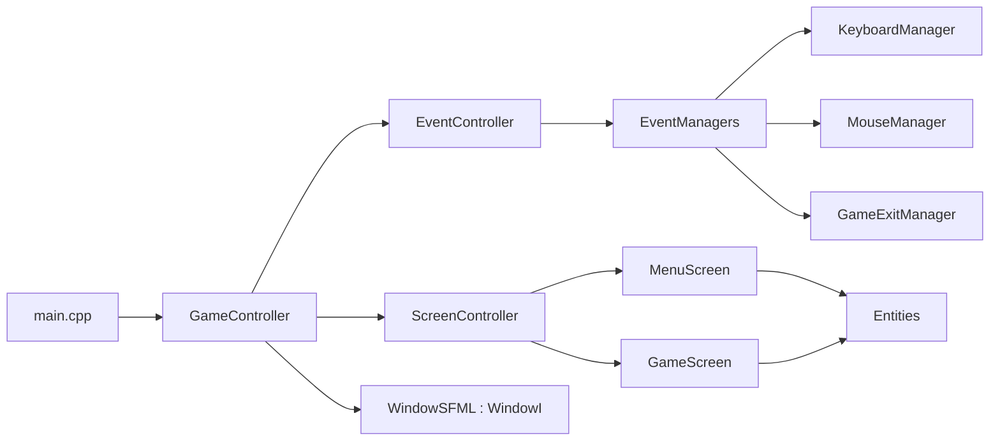

# Architecture reference

business-game is a C++20 SFML 3 prototype built as one static library (`gameLib`) plus a thin executable (`game`). The entry point wires dependencies by hand and hands them to the game loop.

## Component map



## Composition (in `src/main.cpp`)

1. Create `ResourceManager` rooted at `<exe-dir>/resources`.
2. Create `WindowSFML` (implements `WindowI`).
3. Create `EventController` over the window's `EventCollectorI`; it is also a `LordOfEventManagers`.
4. `emplace` exit / game-window / keyboard / mouse managers onto the controller.
5. Register an Escape key handler that closes the window (keep the RAII `UnRegisterer`).
6. Create `ScreenController` with a factory that builds the initial `MenuScreen`.
7. Move window, events, and screens into `GameController` and call `run()`.

## Game loop (in `src/controllers/GameController.cpp`)

```cpp
// Fixed timestep (1/60 s) with accumulator; frame time from sf::Clock (injectable in tests).
while(window->isOpen())
{
    accumulator += clampedFrameTime;
    eventController->handleEvents();
    while(accumulator >= FIXED_DT)
    {
        screenController->update(FIXED_DT);
        accumulator -= FIXED_DT;
    }
    screenController->display();
}
```

- `handleEvents()` polls SFML events and routes each to the matching manager (see [event-flow.md](./event-flow.md)).
- `ScreenController::update(float dt)` applies any pending stack transition, then updates only the top screen with `dt` (seconds).
- `ScreenController::display()` clears once, draws every screen bottom-up, then presents via `ScreenRendererI`.
- Framerate limit on the window is only a render cap; gameplay speed comes from the fixed timestep.

## Scene stack

`ScreenController` implements `ScreenUpdaterI` with `pushScreen` / `popScreen` / `replaceScreen`. Transitions are deferred until the next `update(dt)` so a screen never deletes itself mid-callback. `update` runs only the top screen; `display` clears once, draws every screen bottom-up (for overlays), then presents. The initial screen is injected via a factory — `MenuScreen` is not hardcoded inside the controller. Rationale in [design-decisions.md](../explanation/design-decisions.md).
