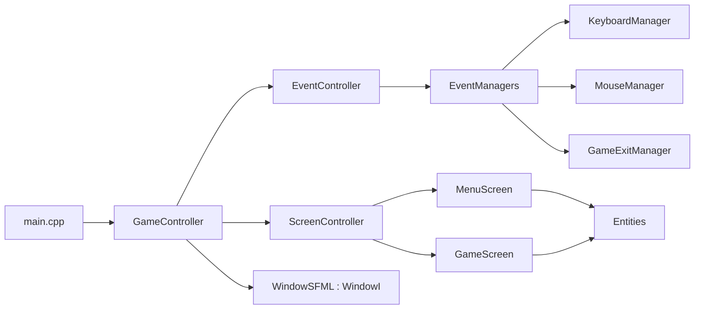

# Architecture reference

business-game is a C++20 SFML 3 prototype built as one static library (`gameLib`) plus a thin executable (`game`). The entry point wires dependencies by hand and hands them to the game loop.

## Component map



## Composition (in `src/main.cpp`)

1. Create `WindowSFML` (implements `WindowI`).
2. Create `EventController` over the window's `EventCollectorI`; it is also a `LordOfEventManagers`.
3. `emplace<GameExitManager>`, `emplace<KeyboardManager>`, `emplace<MouseManager>` onto the controller.
4. Register an Escape key handler that closes the window.
5. Create `ScreenController` (starts on `MenuScreen`).
6. Move all three into `GameController` and call `run()`.

## Game loop (in `src/controllers/GameController.cpp`)

```cpp
while(window->isOpen())
{
    eventController->handleEvents();
    screenController->update();
    screenController->display();
}
```

- `handleEvents()` polls SFML events and routes each to the matching manager (see [event-flow.md](./event-flow.md)).
- `ScreenController::update()` first applies a pending screen swap, then updates the current screen.
- `ScreenController::display()` clears, draws entities, and displays via the `ScreenRendererI`.

## Screen switching

`ScreenController` implements `ScreenUpdaterI`. A screen requests a transition with `setScreen(...)`; the controller stores it in `newScreen` and swaps it in on the next `update()` (deferred swap, so a screen never deletes itself mid-callback). Rationale in [design-decisions.md](../explanation/design-decisions.md).
