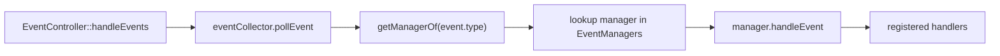

# Event flow reference

## From SFML event to handler

`EventController::handleEvents()` loops `pollEvent`, prints each event via `EventPrinter`, maps `event.type` to a `ManagerOf` with `getManagerOf(...)`, and dispatches to that manager if present. Unmapped types resolve to `ManagerOf::None` and are ignored.

## Event type to manager (`getManagerOf`)

| SFML event types | `ManagerOf` |
|------------------|-------------|
| `Closed` | `GameExit` |
| `LostFocus`, `GainedFocus`, `Resized` | `GameWindow` |
| `KeyPressed`, `KeyReleased`, `TextEntered` | `Keyboard` |
| Mouse move / button / wheel / enter / leave | `Mouse` |
| Joystick events | `Joystick` |
| Touch events | `Touch` |
| `SensorChanged` | `Sensor` |
| anything else | `None` |

Only `GameExit`, `Keyboard`, and `Mouse` managers are installed in `main.cpp`; `GameWindow`, `Joystick`, `Touch`, `Sensor` have enum entries but no manager yet, so those events are dropped.

## Inside a manager

Each manager keeps per-kind `ManagedList`s of `std::function` handlers. `handleEvent` decodes the concrete SFML sub-event (e.g. key + `KeyStatus`) and invokes matching handlers. `registerXxxHandler` returns an `UnRegisterer`; dropping it unregisters.
