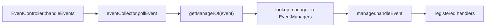

# Event flow reference

How SFML 3 events are classified and dispatched **in this repository**. Conceptual background (`pollEvent`, `getIf` vs `handleEvents`, events vs real-time input): [SFML events](../explanation/sfml/events.md).

## From SFML event to handler

`EventController::handleEvents()` loops `pollEvent()` (returns `std::optional<sf::Event>`; empty ends the loop), maps each event to a `ManagerOf` with `getManagerOf(event)`, and dispatches to that manager if present. SFML 3 events are variants — `getManagerOf` classifies with `event.is<T>()`, and managers decode payloads with `event.getIf<T>()`. Unmapped types resolve to `ManagerOf::None` and are ignored.

## Event type to manager (`getManagerOf`)

| SFML event subtypes | `ManagerOf` |
|---------------------|-------------|
| `Closed` | `GameExit` |
| `FocusLost`, `FocusGained`, `Resized` | `GameWindow` |
| `KeyPressed`, `KeyReleased`, `TextEntered` | `Keyboard` |
| Mouse move / button / wheel / enter / leave | `Mouse` |
| Joystick events | `Joystick` |
| Touch events | `Touch` |
| `SensorChanged` | `Sensor` |
| anything else | `None` |

`GameExit`, `GameWindow`, `Keyboard`, and `Mouse` managers are installed in `main.cpp`. `Joystick`, `Touch`, and `Sensor` remain reserved enum values with no manager — those events are dropped.

## Inside a manager

Each manager keeps per-kind `ManagedList`s of `std::function` handlers. `handleEvent` decodes the concrete SFML subtype (e.g. `sf::Event::KeyPressed` + `KeyStatus`) and invokes matching handlers. Pressed/released pairs share one handler signature: the released subtype is converted to the pressed one, which acts as the canonical payload (`sf::Event::KeyPressed`, `sf::Event::MouseButtonPressed`). `registerXxxHandler` is `[[nodiscard]]` and returns a move-only RAII `UnRegisterer`; destroying the handle (or moving from it) unregisters.
