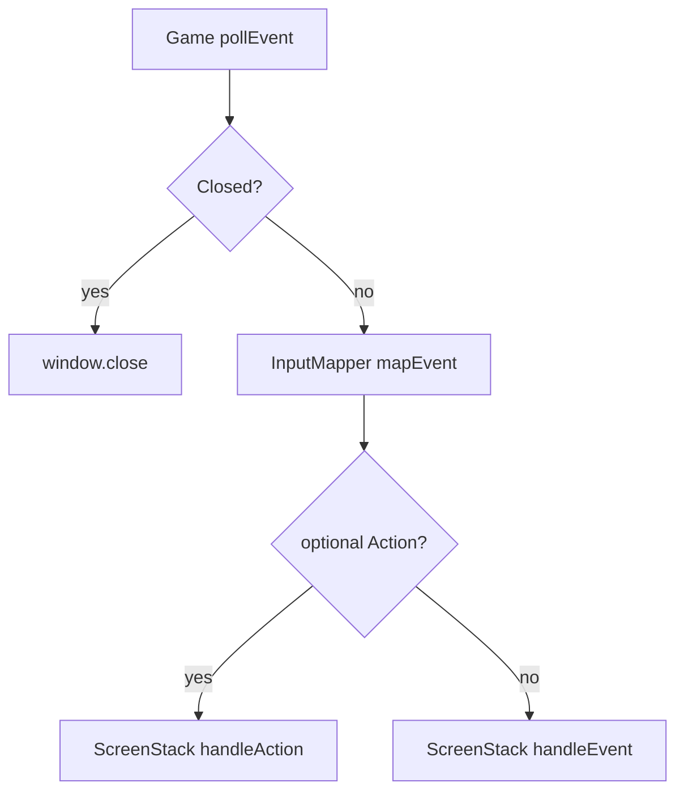

# Input and events

Facts about the running tree. Prospective design (FocusLost pause, hold axes, player remap UI) stays in [`mvp/03-events-and-input.md`](../../mvp/03-events-and-input.md).

## SFML 3 event model

`sf::Event` is a **variant**: one subtype is active. Drain with `window.pollEvent()` → `std::optional<sf::Event>`. Inspect with `event->is<T>()` or `event->getIf<T>()`. Do not use `window.waitEvent()`: the loop must keep drawing while simulation is blocked.

`WindowSFML` calls `setKeyRepeatEnabled(false)` so a held key does not spam `KeyPressed`.

### Subtypes (SFML 3.1)

| Subtype | In this tree |
|---------|----------------|
| `Closed` | `Game` calls `window.close()`. Not an `Action`. Not “quit to menu”. |
| `KeyPressed` | `InputMapper::mapEvent` if the key is bound; else `handleEvent` |
| `KeyReleased` | `handleEvent` (mapper returns `nullopt`) |
| `Resized`, `FocusLost`, `FocusGained` | Fall through to `handleEvent` today. Later `Game` will consume them (letterbox / pause overlay). Not remappable. |
| `TextEntered` | Ignored. For typing, not gameplay binds. |
| `MouseMoved`, `MouseMovedRaw`, `MouseButtonPressed` / `Released`, `MouseWheelScrolled`, `MouseEntered` / `Left` | `handleEvent`. Not mapped to global `Confirm`. |
| `Joystick*`, `Touch*`, `SensorChanged` | `handleEvent` / ignored. Later bind rows can use joystick buttons. |

Official list: [sf::Event 3.1](https://www.sfml-dev.org/documentation/3.1.0/classsf_1_1Event.html). Tutorial: [Events explained](https://www.sfml-dev.org/tutorials/3.1/window/events/).

### `Key` vs `Scancode`

`KeyPressed` carries both:

- **`code` (`sf::Keyboard::Key`)** — layout label (Enter, Escape, the letter “W” on the current locale). UI binds use this.
- **`scancode` (`sf::Keyboard::Scancode`)** — physical key position. Future movement hold (WASD) should use this so layout changes do not move “W”.

The mapper today reads **`code` only**.

### Edge vs hold

Menus react to **edges** (`KeyPressed` → `Action`). Hold is **not** an `Action`. Continuous axes would be polled (`sf::Keyboard::isKeyPressed` / scancode) from `GameplayScreen::update` later; a pause overlay that blocks `update` then stops hold automatically. Do not mix `isKeyPressed` and `KeyPressed` for the same logical button.

## Pump

Every `pollEvent` result goes into **exactly one** bucket.



`InputMapper` is a value member of `Game`. Screens never call `pollEvent` and never `close()` the window.

## `Action` and the binding table

```cpp
enum class Action { Confirm, Cancel, Pause };
```

| Physical input | Result |
|----------------|--------|
| `Enter` | `Confirm` (SFML 3 `Key::Enter` is the labeled Enter/Return; physical numpad Enter is `Scancode::NumpadEnter`, unused here) |
| `Escape` | `Pause` |
| anything else | `nullopt` → `handleEvent` |

`Cancel` is in the enum and **unbound**. `GameplayScreen::handleAction` returns `false` (pause overlay is a later slice). `MainMenuScreen::handleAction(Confirm)` `replace`s with `GameplayScreen`.

`mapEvent` only unwraps `KeyPressed` and delegates to `mapKeyPressed`. Lifecycle events passed in by mistake yield `nullopt`.

## Consume

`handleAction` / `handleEvent` return `true` when the top (or a lower) screen handled the input; the walk stops. `handleAction` walks **top first** and stops **only** on `true`. `blocksUpdate` does **not** cut the action walk (an overlay must still see Escape later).

`handleAction` and `handleEvent` are mutually exclusive **for one SFML event**. If `mapEvent` returns an `Action`, `Game` does not also call `handleEvent`.

Stack `push` / `pop` / `replace` from `handleAction` stay deferred while a walk is in progress; they apply after `draw`, same as `handleEvent`.

## Player remap (later, same seam)

Screens see **intent** (`Action`), not `Key::Enter`. The mapper owns the physical → logical table. A future settings screen would rewrite that table (and persist it). Capture-the-next-key belongs on `handleEvent`, not `handleAction`, so Enter during rebind does not start the game.

Do not remap `Closed`, `Resized`, or focus: those are window/OS, not player binds. Do not map “click anywhere” to `Confirm`; a screen hit-tests its own widgets in `handleEvent`.
