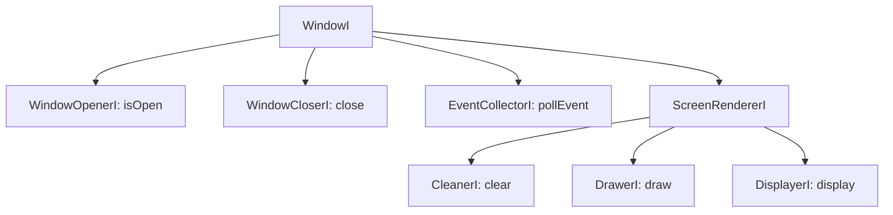

# Interfaces reference

Interfaces use the `*I` suffix and are usually `struct`s with a virtual destructor and pure virtual methods. No namespaces. Prefer depending on these over concrete SFML types.

## Entities and screens

| Interface | Methods | Notes |
|-----------|---------|-------|
| `EntityI` | `update(float dt)`, `draw(DrawerI&) const` | Base for all game objects; `dt` in seconds |
| `ScreenI` | `update(float dt)`, `display()` | Base for screens |
| `ScreenUpdaterI` | `setScreen(unique_ptr<ScreenI>&&)` | Implemented by `ScreenController`; screens request transitions through it |

## Window (interface segregation)

`WindowI` is composed from small role interfaces; `WindowSFML` implements all of them.

Screens receive a `ScreenRendererI&` (clear + draw + display); entities receive only a `DrawerI&`.

## Event managers

`EventManagerI` has `handleEvent(const sf::Event&)`. Concrete managers are template specializations of `EventManager<ManagerOf>` and expose a static `MANAGER_TYPE`.

| Alias | `ManagerOf` | Registration methods |
|-------|-------------|----------------------|
| `KeyboardManagerI` | `Keyboard` | `registerKeyHandler(key, handler)`, `registerTextHandler(handler)` |
| `MouseManagerI` | `Mouse` | `registerMoveHandler`, `registerButtonHandler(button, handler)`, `registerScrollHandler`, `registerStatusHandler` |
| `GameExitManagerI` | `GameExit` | `registerExitHandler(handler)`; also a `WindowCloserI` |

Handler registration is `[[nodiscard]]` and returns a move-only `UnRegisterer` (from `ManagedList`) that removes the handler in its destructor — store it as a member (see `Paddle`, `OnClickHandler`).

`EventManagers` resolves managers by type: `get<ManagerOf::Keyboard>()` returns the typed manager or throws if missing. `LordOfEventManagers` adds `emplace<T>()` to install a manager (throws on duplicate). Both are constrained by the `IsBaseOfEventManager` concept.

## Handlers

- `OnClickHandler(MouseManagerI&, sf::Mouse::Button)` — `onClick()`, `onUnClick(bool isHovered)`.
- `OnHoverHandler` — `onHover()`, `onHoverOut()`.
- Both refine `IsHoverHandlerI::isHover(x, y)`. `Button` composes both.
