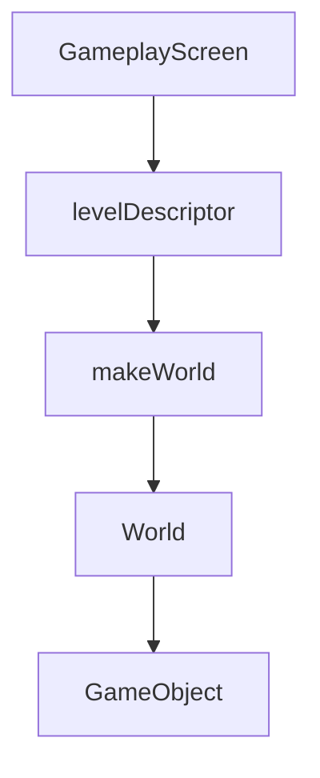

# World, objects, and levels

Facts about the running tree. Prospective extras (despawn, player steering, file levels, ECS) stay in [`mvp/06`](../../mvp/06-world-and-objects.md) and [`mvp/07`](../../mvp/07-levels.md).

## Ownership

`GameplayScreen` owns one `World` (by value). `World` owns `GameObject` instances in `std::vector<std::unique_ptr<GameObject>>`. Menu and pause do not own a world. `World` does not see `Action`, `ScreenStack`, or the window.

`GameObject` is **concrete** (the dummy). Not `Entity`, not an abstract base, not ECS.

## Time

`GameplayScreen::update` forwards the time it received — `Game` already passes `FixedTimestep::tick` — to `World::fixedUpdate`. `World` has no `paused` flag and no `timeScale`. Pause works because the overlay blocks `GameplayScreen::update`, so `fixedUpdate` is not called. Pose and `tickCount` freeze together.

`tickCount()` on the screen is `World::tickCount()` (how many `fixedUpdate` calls ran).

`spawn` applies immediately outside a tick (construction, tests). During `fixedUpdate` it queues; new objects append **after** the object loop and do not step on the spawn tick.

## Dummy motion

Design space is `Game::DESIGN_SIZE` (1280×720). The dummy is a 40×40 rectangle, start `{0, 340}`, velocity `{240, 0}` px/s → **4 px per tick**. Integration uses `(velocity / 60) * (tick / FixedTimestep::tick)` so one application tick is exactly 4 px; `tick.asSeconds()` is 16666 µs and would drift (`3.99984`). Origin (shape position) wraps with while-add/subtract into `[0, 1280) × [0, 720)`. Not bounce, not collision.

`GameObject` does not know `Action`. No `MoveDummy`.

Draw goes through `DrawerI&`, not `sf::RenderTarget&` / `sf::RenderWindow&`.

## Levels as data

`LevelId::Sandbox` selects a static `LevelDescriptor` (`levelDescriptor`). `makeWorld` spawns from `SpawnSpec` rows. No JSON, no `LevelManager`, no `SandboxScreen`. `MainMenuScreen` passes `LevelId::Sandbox` into `GameplayScreen`; it does not know coordinates.

`World` does not know `LevelId`. Adding a second level later is another table row, not another screen class.
