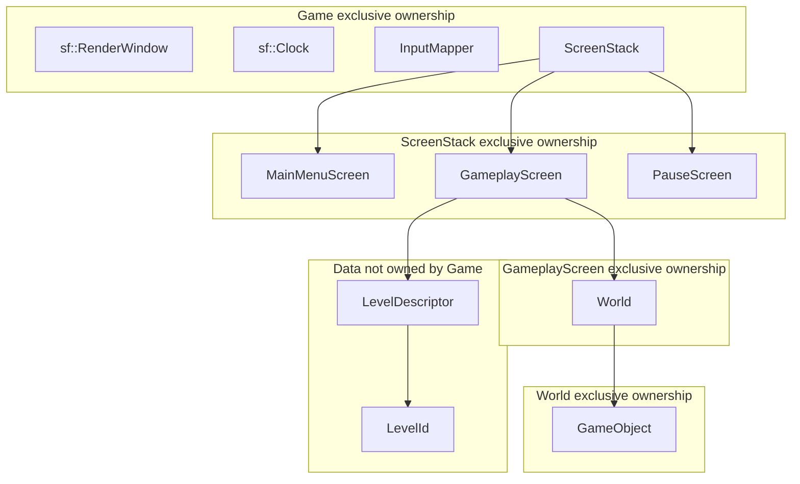
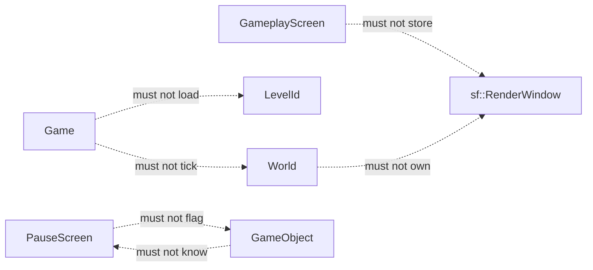
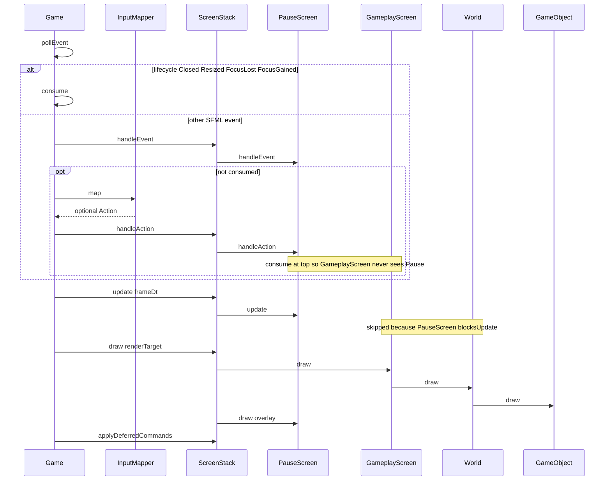

# Four layers and ownership

This chapter is the **target design** for how the first engine slice will be layered. It is **not** a description of the tree on `main` today. Today [`src/Game.hpp`](../src/Game.hpp) exposes `DESIGN_SIZE` and `run()`; [`src/Game.cpp`](../src/Game.cpp) constructs a local 1280×720 `sf::RenderWindow`, polls `sf::Event::Closed`, clears, and displays. There is no `ScreenStack`, no `World`, and no pause.

The target is four layers with strict ownership:

1. **`Game`** — process, window, clock, event pump, `InputMapper`, `ScreenStack`.
2. **Screen** — `IScreen` implementations on a `ScreenStack` (`MainMenuScreen`, `GameplayScreen`, `PauseScreen`).
3. **`World`** — fixed-timestep simulation owned by `GameplayScreen`.
4. **`GameObject`** — spawnable simulation members owned by `World`.

`LevelId` and `LevelDescriptor` are **data**, not a fifth runtime layer and not a screen subclass. They tell `GameplayScreen` what to spawn into `World`. They do not sit on `Game`.

## Purpose and non-goals

**Purpose.** Fix who owns the window, who owns simulation time, who may request a screen change, and which call directions are legal **before** any of those types are added to `gameLib`. The playable slice in [08-playable-slice.md](08-playable-slice.md) (menu → empty gameplay → pause overlay → resume or quit to menu, with one dummy moving shape) will only be testable if these boundaries hold.

**Non-goals for this chapter.** Frame-order details and catch-up limits ([02-application-loop.md](02-application-loop.md)); SFML 3 event variants and key-binding tables ([03-events-and-input.md](03-events-and-input.md)); the exact deferred-command queue API ([04-screen-stack.md](04-screen-stack.md)); overlay vs time-scale policy write-up ([05-pause.md](05-pause.md)); dummy-shape kinematics ([06-world-and-objects.md](06-world-and-objects.md)); descriptor fields ([07-levels.md](07-levels.md)); player-visible acceptance ([08-playable-slice.md](08-playable-slice.md)); file-by-file rollout ([09-rollout.md](09-rollout.md)).

**Non-goals for the plan as a whole** (from [README.md](README.md)): ECS, audio, networking, a product-grade resource manager, level editor, scripting, an `engine/` vs `game/` directory split, and any commercial genre. Do not introduce Arkanoid, board-game, or business-domain types. Do not copy `v0.1-arkanoid`.

**Naming lock.** Use `Game`, `ScreenStack`, `IScreen`, `MainMenuScreen`, `GameplayScreen`, `PauseScreen`, `InputMapper`, `Action`, `World`, `GameObject`, `LevelId`, `LevelDescriptor`. Do not synonymize (`Scene`, `StateMachine`, `Entity`, `IManager`, `GameState`).

## Extending today's empty `Game::run()`

[`src/main.cpp`](../src/main.cpp) will keep constructing `Game` and calling `run()`. The executable model does not change. `Game::DESIGN_SIZE` (1280×720) and the window title used today stay.

What **will** change is the body of `run()` and the members `Game` needs in order to own the session:

| Today (`main`) | Target design |
| --- | --- |
| `sf::RenderWindow` is a **local** in `run()`. | `Game` will **own** the window for the lifetime of `run()` (member or local that outlives `ScreenStack`). No other type stores it. |
| Poll loop handles only `sf::Event::Closed`. | `Game` will consume `Closed`, `Resized`, `FocusLost`, and `FocusGained`. Remaining events go to the stack and/or `InputMapper`. |
| No clock. | `Game` will own `sf::Clock` and pass **frame** `sf::Time` into `ScreenStack::update`. |
| `window.clear(); window.display();` with nothing in between. | `clear` → `ScreenStack::draw(window)` as `sf::RenderTarget&` → `display`. |
| No screens. | `run()` will construct `ScreenStack`, push `MainMenuScreen`, then loop. |
| Framerate limit 60 on the window. | Keep a display cap so the window is not starved; **world** time is a **fixed** 1/60 s tick inside `World`, not a substitute for polling. |

The scaffold already matches the ownership rule in spirit: only `Game::run()` touches the window. The target design **extends** that exclusivity. It does not move the window onto a screen, and it does not replace `main` with a different bootstrap.

SFML remains 3.1.0 via [`cmake/FetchSFML.cmake`](../cmake/FetchSFML.cmake): Graphics / Window / System only (`SFML_BUILD_AUDIO` and `SFML_BUILD_NETWORK` off). Draw signatures will take `sf::RenderTarget&`, never `sf::RenderWindow&`. Headers will use `#pragma once`. No namespaces. C++23.

## Layer 1 — `Game`

**Owns**

- `sf::RenderWindow` (create with `sf::VideoMode{DESIGN_SIZE}`, `setFramerateLimit` as today).
- `sf::Clock` for frame delta.
- `InputMapper`.
- `ScreenStack` (exclusive).
- The event pump: `pollEvent` every frame while `window.isOpen()`, including while gameplay is frozen under `PauseScreen`.

**May do**

- Consume window lifecycle events (`Closed` → `window.close()`; `Resized` → view/letterbox policy in [02-application-loop.md](02-application-loop.md); `FocusLost` / `FocusGained` → policy in [05-pause.md](05-pause.md), which may **request** a stack command, not set a flag on `World`).
- Ask `InputMapper` to map an unconsumed event to `Action`.
- Call `ScreenStack` `handleEvent` / `handleAction` / `update` / `draw` / apply-deferred.
- Clear and display the window.

**Must not**

- Know `LevelId` or load a `LevelDescriptor`.
- Construct, tick, or inspect `World` or `GameObject`.
- Encode pause as `if (!paused)` around simulation. Pause is a `PauseScreen` overlay (`blocksUpdate == true`).
- Draw sprites, menus, or the dummy shape itself.
- Store a pointer to the top `IScreen` besides what `ScreenStack` already owns.
- Open audio or network modules.

`Game` is the **composition root** for the process, not a gameplay façade.

## Layer 2 — `IScreen` and `ScreenStack`

`ScreenStack` **owns** an ordered sequence of `std::unique_ptr<IScreen>` (bottom = first pushed, top = last). It **queues** `push` / `pop` / `replace` during `handleAction` / `update` / `handleEvent` and **applies** those commands **after** update **and** draw of the current frame (deferred command; see [04-screen-stack.md](04-screen-stack.md)). That prevents destroying or inserting a screen while its `update` is on the stack.

**`IScreen` will declare** `handleEvent`, `handleAction`, `update(dt)`, `draw(target)`, `blocksUpdate()`, `blocksDraw()`. Concrete screens:

| Type | Owns | Role in the slice | `blocksUpdate` | `blocksDraw` |
| --- | --- | --- | --- | --- |
| `MainMenuScreen` | Menu widgets / selection only | Start → `push` or `replace` with `GameplayScreen`; quit → close request or empty the stack so `Game` closes | `true` (nothing live underneath in the slice) | `true` |
| `GameplayScreen` | `World` (exclusive) | Load `LevelDescriptor` into `World`; request `PauseScreen` on `Action::Pause` | `false` | `false` |
| `PauseScreen` | Overlay widgets only | Resume → `pop`; quit to menu → `replace`/`pop` toward `MainMenuScreen` | **`true`** | **`false`** |

**Screens must not own `sf::RenderWindow`.** They must not store `sf::RenderWindow*`, `sf::RenderWindow&`, or a `Game*`. `draw` receives `sf::RenderTarget&` **as an argument** and must not retain it after return.

**Screens must not** tick `World` unless they are `GameplayScreen`. `PauseScreen` and `MainMenuScreen` have no `World`. `PauseScreen` must not walk `GameObject`s or set a `paused` field on them.

**`ScreenStack` must not** own the window, know `LevelId`, or call `World`. It is an ordered list plus a command queue. It will walk **from the top** for events and actions (first consumer wins). It will walk **from the top** for `update`, skipping lower screens once a screen returns `blocksUpdate() == true`. It will walk **from the bottom** for `draw`, skipping a screen (and those below it, depending on the rule in [04-screen-stack.md](04-screen-stack.md)) when a higher screen returns `blocksDraw() == true`. For the slice, `PauseScreen` lets `GameplayScreen` keep drawing the frozen world.

Screens will need a **non-owning** way to request stack commands. Target design: pass `ScreenStack&` into screen constructors (or a nested command sink owned by `ScreenStack`). That is a reference, not ownership. Do not invent an `IManager`.

## Layer 3 — `World`

**Owns** the list of `GameObject` (exclusive `std::unique_ptr`), the fixed-timestep accumulator, and spawn/despawn.

**May** accept a `LevelDescriptor` **once** (or be filled by `GameplayScreen` via `spawn`) and step simulation when `GameplayScreen::update` runs.

**Must not**

- Own or store `sf::RenderWindow`.
- Own a pause flag, time-scale flag, or “gameplay frozen” boolean. If `GameplayScreen::update` is not called, the accumulator does not advance. That **is** pause.
- Know `Action`, `ScreenStack`, or which overlay is on top.
- Decide resume vs quit to menu.
- Be a screen subclass.

Optional later **time scale** (slow-mo) would be a multiplier on how much simulated time `World` consumes per frame. It is **distinct** from pause. The slice will not implement time scale. See [05-pause.md](05-pause.md).

Target fixed tick: **1/60 s**. `World` may run zero, one, or several `GameObject::fixedUpdate(tick)` calls per **frame** depending on the accumulator. Render may happen at a different rate. Spiral-of-death / max-catch-up belongs in [02-application-loop.md](02-application-loop.md) and [06-world-and-objects.md](06-world-and-objects.md), not in `Game`.

## Layer 4 — `GameObject`

**Owns** its own simulation state (pose, dummy velocity, whatever the single moving shape needs).

**May** implement `fixedUpdate(tick)` and `draw(sf::RenderTarget&)`. Composition over deep inheritance: the slice may use `GameObject` itself as the dummy, not a genre taxonomy.

**Must not**

- Know pause, `PauseScreen`, `Action::Pause`, or `blocksUpdate`.
- Receive or store `sf::RenderWindow&`.
- Call `ScreenStack`, close the window, or load levels.
- Implement gameplay rules beyond “translate a shape so the player can see that time is moving or frozen.”

If the dummy later becomes player-steered, [README.md](README.md) allows adding `Action::MoveDummy` only. That mapping stays in `InputMapper` / `GameplayScreen`; the object still does not subscribe to pause.

## `LevelId` and `LevelDescriptor` (data, not a layer)

- `LevelId` is a cheap identifier.
- `LevelDescriptor` is **data**: what to spawn, not an `IScreen` subclass and not a `World` subclass.

`GameplayScreen` will choose a `LevelId`, obtain the matching `LevelDescriptor` (table or function specified in [07-levels.md](07-levels.md)), and give spawn data to `World`. **`Game` never switches on `LevelId`.** `World` does not own “which level the product is on”; it owns objects. The playable slice needs **one** descriptor: an otherwise empty world plus one dummy moving shape.

## Ownership graph

Exclusive ownership is downward. References used for commands or drawing are **non-owning** and must not outlive the owner.



Forbidden ownership and call edges (these will not exist):



## Data flow

### Events and actions

`Game` always polls. Lifecycle events never become `Action`. Everything else is either consumed by a screen as a raw event, mapped to `Action`, or ignored. The top screen may **consume** an action so screens below never see it ([03-events-and-input.md](03-events-and-input.md)).



### Time

- **Frame delta** originates in `Game` and is legal for screen UI (`MainMenuScreen`, `PauseScreen`).
- **Fixed tick** exists only inside `World`. `GameplayScreen::update(frameDt)` will call `World::update(frameDt)`, which accumulates and invokes `GameObject::fixedUpdate(tick)`.
- Under `PauseScreen`, `GameplayScreen::update` is **not** called, so the accumulator does not move. `GameObject` needs no pause branch.

### Draw

Objects and screens draw into the `sf::RenderTarget&` supplied that frame (`Game` passes the window). `window.clear` and `window.display` stay in `Game`. No object calls `display()`.

### Stack commands

`MainMenuScreen` / `GameplayScreen` / `PauseScreen` record `push` / `pop` / `replace` on `ScreenStack`. Application happens after draw so no destructor runs mid-`update`. One-frame delay before a newly pushed `PauseScreen` appears is acceptable; see pitfalls and [04-screen-stack.md](04-screen-stack.md).

## C++ signatures (target design)

These are **declarations only**. They are not present in the tree today. When implemented later, each primary type will live in its own `src/*.hpp` + `src/*.cpp` pair, listed in [`src/CMakeLists.txt`](../src/CMakeLists.txt) `gameLib` ([09-rollout.md](09-rollout.md)). Includes from `src/` will use angle brackets. Pointers and references are left-aligned. No namespaces.

```cpp
#pragma once

#include <SFML/Graphics/RenderTarget.hpp>
#include <SFML/Graphics/RenderWindow.hpp>
#include <SFML/System/Clock.hpp>
#include <SFML/System/Time.hpp>
#include <SFML/System/Vector2.hpp>
#include <SFML/Window/Event.hpp>

#include <memory>
#include <optional>
#include <vector>

enum class Action
{
    Confirm,
    Cancel,
    Pause,
};

class InputMapper
{
public:
    [[nodiscard]] std::optional<Action> mapEvent(const sf::Event& event) const;
    [[nodiscard]] std::optional<Action> mapPolled() const;
};

class IScreen
{
public:
    virtual ~IScreen() = default;

    virtual bool handleEvent(const sf::Event& event) = 0;
    virtual bool handleAction(Action action) = 0;
    virtual void update(sf::Time dt) = 0;
    virtual void draw(sf::RenderTarget& target) = 0;
    [[nodiscard]] virtual bool blocksUpdate() const = 0;
    [[nodiscard]] virtual bool blocksDraw() const = 0;
};

class ScreenStack
{
public:
    ScreenStack() = default;
    ScreenStack(const ScreenStack&) = delete;
    ScreenStack& operator=(const ScreenStack&) = delete;

    void push(std::unique_ptr<IScreen> screen);
    void pop();
    void replace(std::unique_ptr<IScreen> screen);

    bool handleEvent(const sf::Event& event);
    bool handleAction(Action action);
    void update(sf::Time dt);
    void draw(sf::RenderTarget& target);
    void applyDeferredCommands();

    [[nodiscard]] bool empty() const;
    [[nodiscard]] std::size_t size() const;
};

class GameObject
{
public:
    virtual ~GameObject() = default;

    virtual void fixedUpdate(sf::Time tick) = 0;
    virtual void draw(sf::RenderTarget& target) = 0;
};

enum class LevelId : std::uint8_t
{
    PlayableSlice = 0,
};

struct LevelDescriptor
{
    LevelId id{LevelId::PlayableSlice};
};

class World
{
public:
    static constexpr sf::Time TICK{sf::seconds(1.f / 60.f)};

    void load(const LevelDescriptor& descriptor);
    void spawn(std::unique_ptr<GameObject> object);
    void update(sf::Time frameDt);
    void draw(sf::RenderTarget& target);

private:
    sf::Time m_accumulator{};
    std::vector<std::unique_ptr<GameObject>> m_objects;
};

class MainMenuScreen : public IScreen
{
public:
    explicit MainMenuScreen(ScreenStack& screens, sf::RenderWindow& windowCloser) = delete;
    explicit MainMenuScreen(ScreenStack& screens);

    bool handleEvent(const sf::Event& event) override;
    bool handleAction(Action action) override;
    void update(sf::Time dt) override;
    void draw(sf::RenderTarget& target) override;
    [[nodiscard]] bool blocksUpdate() const override;
    [[nodiscard]] bool blocksDraw() const override;

private:
    ScreenStack& m_screens;
};

class GameplayScreen : public IScreen
{
public:
    GameplayScreen(ScreenStack& screens, LevelId levelId);

    bool handleEvent(const sf::Event& event) override;
    bool handleAction(Action action) override;
    void update(sf::Time dt) override;
    void draw(sf::RenderTarget& target) override;
    [[nodiscard]] bool blocksUpdate() const override;
    [[nodiscard]] bool blocksDraw() const override;

private:
    ScreenStack& m_screens;
    World m_world;
};

class PauseScreen : public IScreen
{
public:
    explicit PauseScreen(ScreenStack& screens);

    bool handleEvent(const sf::Event& event) override;
    bool handleAction(Action action) override;
    void update(sf::Time dt) override;
    void draw(sf::RenderTarget& target) override;
    [[nodiscard]] bool blocksUpdate() const override;
    [[nodiscard]] bool blocksDraw() const override;

private:
    ScreenStack& m_screens;
};

class Game
{
public:
    static constexpr sf::Vector2u DESIGN_SIZE{1280u, 720u};

    void run();

private:
    void processEvents();
    void update(sf::Time dt);
    void render();

    // Target members; today none of these exist on Game except DESIGN_SIZE and run().
    sf::RenderWindow m_window;
    sf::Clock m_clock;
    InputMapper m_inputMapper;
    ScreenStack m_screens;
};
```

Notes on the signatures:

- `handleEvent` / `handleAction` returning `bool` is the **consume** signal (`true` = rest of the stack must not see it). [03-events-and-input.md](03-events-and-input.md) and [04-screen-stack.md](04-screen-stack.md) will pin walk order.
- `MainMenuScreen` must not take `sf::RenderWindow&` to draw. Quit-to-desktop can be a deferred “request close” on `Game` or emptying the stack; [04-screen-stack.md](04-screen-stack.md) / [02-application-loop.md](02-application-loop.md) will choose one. The deleted overload above documents the **forbidden** window-closer constructor.
- `GameplayScreen` stores `World` by value (exclusive ownership). It does not store the window.
- `PauseScreen` stores only `ScreenStack&`. No `World&`.
- `LevelDescriptor` fields beyond `id` belong in [07-levels.md](07-levels.md).
- `Action` has no movement enumerators in the slice unless the dummy is player-steered (`MoveDummy` only, per [README.md](README.md)).
- `Game::run()` remains the only public entry used by `main`.

## Interaction with other chapters

| Sibling | What this chapter defers |
| --- | --- |
| [README.md](README.md) | Locked names, pause = overlay, draw target, playable slice, wording. |
| [02-application-loop.md](02-application-loop.md) | Exact `run()` loop, clock, resize/view, always-poll-while-paused, when `applyDeferredCommands` runs relative to `display`. |
| [03-events-and-input.md](03-events-and-input.md) | SFML 3 `std::optional` poll, `event->is<T>()`, consume rules, `InputMapper` bindings, polled keys. |
| [04-screen-stack.md](04-screen-stack.md) | Queue representation, `blocksUpdate`/`blocksDraw` combinatorics, how screens obtain `ScreenStack&`. |
| [05-pause.md](05-pause.md) | Why overlay ≠ `GameObject` flags ≠ `World` time scale; FocusLost → pause request. |
| [06-world-and-objects.md](06-world-and-objects.md) | Accumulator, dummy motion, spawn/despawn, `draw` of the shape. |
| [07-levels.md](07-levels.md) | `LevelDescriptor` payload; lookup by `LevelId`; still not a screen type. |
| [08-playable-slice.md](08-playable-slice.md) | Player-visible path and acceptance. |
| [09-rollout.md](09-rollout.md) | Which `.cpp` files join `gameLib`, Debug tests, order of landing. |

Call-direction summary used by those chapters:

- `Game` → `InputMapper`, `ScreenStack`, window, clock only.
- `ScreenStack` → `IScreen` only.
- `GameplayScreen` → `World`, `LevelDescriptor` / `LevelId`, `ScreenStack` commands.
- `World` → `GameObject` only.
- `PauseScreen` → `ScreenStack` commands only.

## Playable-slice implications

The slice in [08-playable-slice.md](08-playable-slice.md) is **MainMenuScreen → GameplayScreen → PauseScreen → resume (`pop`) or quit to menu**. Architecture constraints that make that slice prove the engine:

1. **Menu does not own a world.** Starting play is a stack command, not `Game` switching on a genre enum.
2. **Empty gameplay is still a `World`.** One dummy `GameObject` translating across the design view is enough. No bricks, boards, or companies.
3. **Pause is a fourth object on the stack, not a flag.** With `PauseScreen` on top (`blocksUpdate == true`, `blocksDraw == false`), the dummy **freezes** because `World::update` is not called, and **stays visible** because `GameplayScreen::draw` still runs.
4. **Resume** is `pop` of `PauseScreen`. The same `World` instance continues; it was never reset and never asked to unpause.
5. **Quit to menu** destroys `GameplayScreen` (and therefore `World` and the dummy) via stack replace/pop. That is ownership doing the teardown, not an entity `destroy()` from the pause overlay.
6. **`Game` stays genre-blind.** If the dummy moves while unpaused and stops under the overlay, the four layers are wired correctly.

## Windowless test ideas

Tests stay Debug-only (`build_ut` / `ctest --preset debug`). They should **not** construct `sf::RenderWindow` unless a display is required ([README.md](README.md)). `smoke_test` already asserts `Game::DESIGN_SIZE` without opening a window; new suites should follow that pattern (`*Should` fixtures).

Ideas that exercise this chapter without a window:

- **`ScreenStack` deferred commands.** `push` during `update` does not change `size()` until `applyDeferredCommands()`. Destroying the top screen mid-`update` must be impossible if clients only use the public queue.
- **`blocksUpdate` / `blocksDraw`.** With `GameplayScreen` under `PauseScreen`, a fake `World` counter (or a test double `IScreen`) must show `update` skipped and `draw` still invoked.
- **Consume.** Top `IScreen` returns `true` from `handleAction(Action::Pause)`; a screen below must not record that action.
- **`World` fixed timestep.** Feed `update` with `2 * World::TICK` and expect two `fixedUpdate` calls on a dummy `GameObject`; feed `TICK / 2` and expect zero. No pause member to set.
- **`GameObject` ignorance of pause.** The dummy type has no `setPaused`. Freeze is proven only by **not calling** `World::update`.
- **`LevelDescriptor` as data.** `World::load` spawns exactly one object for the playable-slice descriptor; `Game` is not referenced from the test.
- **`InputMapper`.** Given a synthetic `sf::Event` (constructed without a window), `mapEvent` yields `Action::Pause` / `Confirm` / `Cancel` or `std::nullopt`.
- **Ownership compile checks (documentation for [09-rollout.md](09-rollout.md)).** `GameplayScreen` has a `World` member; `PauseScreen` does not. No screen method takes `sf::RenderWindow&` for drawing.

Use `sf::RenderTexture` (an `sf::RenderTarget`) only if a draw test is worth it; prefer counting `draw` calls on a fake target stub if SFML target construction is heavy. Do not boot the real `Game::run()` loop in unit tests.

## Pitfalls

- **Claiming this architecture already exists.** `Game::run()` today is still the empty poll/clear/display loop. Wording must stay prospective (`will`, `target design`).
- **Pause as an entity flag.** `if (!m_paused)` inside `GameObject::fixedUpdate` duplicates `PauseScreen` and breaks the “overlay blocks update” rule. Slow-mo later is `World` time scale, not that flag either ([05-pause.md](05-pause.md)).
- **Screens owning the window.** Storing `sf::RenderWindow*` for convenience (close, mouse coords, `setView`) leaks process ownership into UI. Mouse mapping and close policy stay in `Game` / [02-application-loop.md](02-application-loop.md). `draw(sf::RenderWindow&)` is a contract break even if it compiles (`RenderWindow` is a `RenderTarget`).
- **`World` owning the window or a view.** Simulation then cannot be ticked in windowless tests and cannot freeze solely by skipping `GameplayScreen::update`.
- **`Game` loading levels.** A `switch (levelId)` in `Game` makes every new descriptor a core-loop change. `GameplayScreen` + [07-levels.md](07-levels.md) own that data.
- **Applying stack commands mid-frame.** `pop` during `PauseScreen::handleAction` would destroy `PauseScreen` while `handleAction` is running. Queue, then `applyDeferredCommands` after draw.
- **Starving the event pump while paused.** Skipping `pollEvent` because `blocksUpdate` is true will delay `Closed` and focus events. `Game` always polls ([02-application-loop.md](02-application-loop.md)).
- **Passing frame dt into `GameObject` as if it were a tick.** Variable frame time would make the dummy stutter and make pause/unpause hard to assert. Only `World` converts frame dt into fixed ticks.
- **Deep `GameObject` hierarchies or ECS “for later.”** The slice is one dummy shape. Composition; no `Entity`.
- **Synonyms.** `Scene`, `State`, `StateMachine`, `Entity`, `IManager`, `ScreenI` (the locked interface name is `IScreen`), `paused` on `World`.
- **Genre leakage.** Names and types from Arkanoid, board games, or the product domain do not belong in these four layers.
- **Audio/Network.** [`cmake/FetchSFML.cmake`](../cmake/FetchSFML.cmake) forces them off; do not add `SFML::Audio` to `gameLib` for this slice.
- **Forgetting `gameLib`.** New `.cpp` files that appear in [09-rollout.md](09-rollout.md) must be listed in [`src/CMakeLists.txt`](../src/CMakeLists.txt) or they will never compile.
- **Namespaces and include guards.** Target headers stay `#pragma once` with types in the global namespace, matching [`src/Game.hpp`](../src/Game.hpp).
- **`PauseScreen` holding `World&`.** Resume/quit then looks like a simulation API. Teardown is stack ownership; freeze is `blocksUpdate`.
- **Drawing from `GameObject` with a stored target.** The target is valid only for the current `draw` call.

## Success criteria for this chapter

Implementation (later) will match this chapter when:

- `main` still only constructs `Game` and calls `run()`.
- Only `Game` owns `sf::RenderWindow`.
- Only `GameplayScreen` owns `World`; only `World` owns `GameObject`.
- `PauseScreen` freezes the dummy **without** a pause field on `World` or `GameObject`.
- `Game` has no `#include` of level tables and no loop over objects.
- Debug tests can prove stack, consume, and fixed timestep without opening a window.
