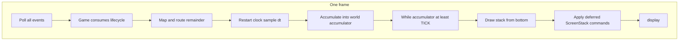
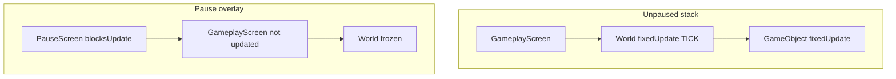
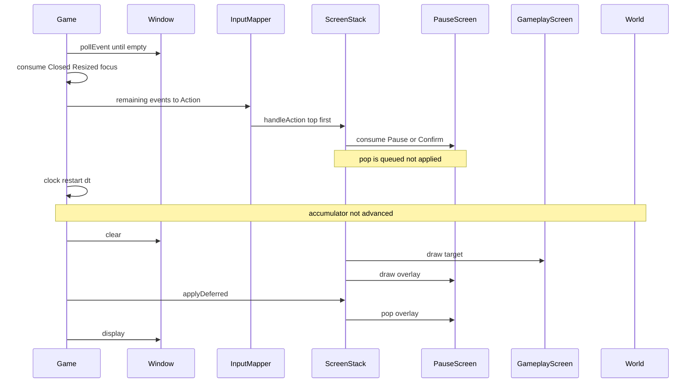

# Application loop and time

This chapter is the **target design** for `Game::run()` and the clock that will drive it. It is not a description of the tree on `main` today. The empty scaffold loop stays the **starting point to extend**: same executable model (`main` constructs `Game` and calls `run()`), same `DESIGN_SIZE`, same SFML 3 event poll. The body of `run()` will grow around that skeleton.

Locked names used here: `Game`, `ScreenStack`, `IScreen`, `MainMenuScreen`, `GameplayScreen`, `PauseScreen`, `InputMapper`, `Action`, `World`, `GameObject`, `LevelId`, `LevelDescriptor`. Do not substitute `Scene`, `StateMachine`, or a pause boolean on `GameObject`.

## Purpose and non-goals

**Purpose.** Specify how `Game` will own the window, clock, event pump, and `ScreenStack`; how one frame will proceed from poll to `display`; how a fixed 1/60 s tick will step `World` while UI is allowed to use frame delta; how pause will freeze simulation without starving the window; and **when** deferred `push` / `pop` / `replace` will take effect (end of frame only).

**Non-goals.** This chapter will not design event-to-`Action` mapping (see [03-events-and-input.md](03-events-and-input.md)), `IScreen` lifetime rules beyond the apply-at-end-of-frame contract (see [04-screen-stack.md](04-screen-stack.md)), overlay semantics beyond `blocksUpdate` (see [05-pause.md](05-pause.md)), spawn lists or dummy motion (see [06-world-and-objects.md](06-world-and-objects.md) and [07-levels.md](07-levels.md)), player-facing acceptance (see [08-playable-slice.md](08-playable-slice.md)), or file/CMake phasing (see [09-rollout.md](09-rollout.md)). It will not add interpolation, a variable-rate physics integrator, audio callbacks, a second thread, vsync policy beyond today’s framerate cap, or any genre simulation.

## Starting point: today’s loop

Today [`src/Game.hpp`](../src/Game.hpp) exposes `Game::DESIGN_SIZE` (`1280u × 720u`) and `run()`. [`src/Game.cpp`](../src/Game.cpp) constructs a **local** `sf::RenderWindow`, caps the render rate, polls until empty, handles only `sf::Event::Closed`, then `clear` / `display`:

```cpp
sf::RenderWindow window{sf::VideoMode{DESIGN_SIZE}, "Business game"};
window.setFramerateLimit(60);

while(window.isOpen())
{
    while(const std::optional event = window.pollEvent())
    {
        if(event->is<sf::Event::Closed>())
        {
            window.close();
        }
    }

    window.clear();
    window.display();
}
```

That shape is the contract to **extend**, not replace:

| Today (`main`) | Target design |
| --- | --- |
| Window is a local in `run()` | `Game` **owns** `sf::RenderWindow` as a member (still `VideoMode{DESIGN_SIZE}`, title unchanged) |
| `setFramerateLimit(60)` only | Keep the render cap; add a **separate** fixed tick for `World` |
| Drain `pollEvent` (SFML 3 `std::optional`) | Same drain, every frame, including while paused |
| Consume `Closed` only | `Game` also consumes `Resized`, `FocusLost`, `FocusGained`; remainder is mapped/routed |
| No clock | `Game` owns `sf::Clock` and an accumulator |
| No screens | `Game` owns `ScreenStack`; draw bottom-up into `sf::RenderTarget&` |
| `clear` then `display` | `clear` → draw stack → apply deferred stack commands → `display` |

SFML is fetched at **3.1.0** with Audio and Network off ([`cmake/FetchSFML.cmake`](../cmake/FetchSFML.cmake)). The loop will keep using Graphics / Window / System only. Event polling will stay on the SFML 3 form `while(const std::optional event = window.pollEvent())`, not the SFML 2 `pollEvent(event)` out-parameter.

Layer ownership that this loop assumes is defined in [01-architecture.md](01-architecture.md): `Game` is the process-level owner; `GameplayScreen` owns `World`; objects never receive `sf::RenderWindow&`.

## Ownership inside `Game`

`Game` will own:

1. **`sf::RenderWindow`** — created at `DESIGN_SIZE` (1280×720). The window is the only `sf::RenderTarget` the loop will pass into `IScreen::draw` / `GameObject::draw`. Screens and objects will not store a window pointer.
2. **`sf::Clock` plus accumulator** — wall time for the frame; accumulator for fixed `World` ticks.
3. **Event pump** — drain the queue, consume window-lifecycle events, hand the rest to `InputMapper` and `ScreenStack` (routing rules in [03-events-and-input.md](03-events-and-input.md)).
4. **`ScreenStack`** — ordered `IScreen` instances. `MainMenuScreen`, `GameplayScreen`, and `PauseScreen` will live on that stack. `LevelId` / `LevelDescriptor` will not be ticked by `Game`; they are data `GameplayScreen` / `World` will consume later ([07-levels.md](07-levels.md)).

`InputMapper` will sit on the pump path (owned by `Game` or constructed next to it — ownership is [01-architecture.md](01-architecture.md)). The loop only requires that mapping happens **after** lifecycle consumption and **before** the tick loop, so this frame’s `Action` values are visible to `update`.

## One frame (target)

Every iteration of `while(m_window.isOpen())` will do **exactly this**, in order. No step will be skipped because a screen is paused.



1. **Poll all events.** Drain `m_window.pollEvent()` until the optional is empty. Always. A blocking overlay, a minimized window, or `FocusLost` will not bypass this drain.
2. **Map / route.** `Game` consumes `Closed` (close the window), `Resized`, `FocusLost`, and `FocusGained`. Remaining events become `Action` values via `InputMapper`, or are ignored. `IScreen::handleEvent` / `handleAction` run on the stack per [03-events-and-input.md](03-events-and-input.md). A screen that **consumes** an `Action` hides it from screens below. These handlers may **queue** `push` / `pop` / `replace` but will not mutate the live stack yet.
3. **Accumulate `dt`.** `sf::Time dt = m_clock.restart()`. This sample is the **frame delta** (render period). It is not the simulation tick.
4. **Fixed ticks.** If simulation is allowed this frame (no overlay with `blocksUpdate()` covering `GameplayScreen`), add `dt` to `m_accumulator`, clamp it, then `while(m_accumulator >= TICK)`: update every screen that is **not blocked**, subtract `TICK`. `GameplayScreen` will forward that constant `TICK` into `World` / `GameObject::fixedUpdate`. Details below.
5. **Draw from the bottom of the stack.** `clear`, then for each screen from index 0 upward: skip a screen only if a screen **above** it `blocksDraw()`; otherwise `screen->draw(m_window)` as `sf::RenderTarget&`. `PauseScreen` will use `blocksDraw() == false`, so `GameplayScreen` still draws underneath the overlay ([05-pause.md](05-pause.md)).
6. **Apply deferred `ScreenStack` commands.** `push` / `pop` / `replace` recorded during this frame’s handlers or `update` become real here — **after** update and draw of the current stack, **before** `display` returns to the next poll. See [04-screen-stack.md](04-screen-stack.md).
7. **`display`.** Present the back buffer that was just drawn. Commands applied in step 6 do **not** redraw this frame; the new top screen appears on the **next** frame.

`LevelDescriptor` loading, dummy spawns, and `Action::MoveDummy` (if the slice uses it) will run *inside* those `update` / `handleAction` calls. They will not get their own stage in `Game::run()`.

## Fixed timestep vs frame delta vs framerate limit

Three clocks will coexist. Mixing them is the usual source of “pause stutter” and “physics explosion” bugs; the target keeps them distinct.

| Mechanism | Role | Owned by | Typical period |
| --- | --- | --- | --- |
| `window.setFramerateLimit(60)` | Cap **render** / loop iterations (already in `Game.cpp`) | `sf::RenderWindow` | ~16.7 ms sleep after `display` when the machine is fast |
| `TICK` (`1/60` s) | Constant **simulation** step for `World` / `GameObject::fixedUpdate` | `Game` constant | Exactly `sf::seconds(1.f / 60.f)` every tick |
| Frame `dt` (`m_clock.restart()`) | Wall time since last frame; UI **may** use it | `Game` clock | Whatever the limit, vsync, and hitching produce |

**Framerate limit is not the tick.** Today’s `setFramerateLimit(60)` will remain a *render* governor so an empty menu does not spin at thousands of FPS. If a frame takes 8 ms, the limit sleeps; if a frame takes 30 ms, there is no sleep and the next `dt` is ~30 ms. The accumulator will convert that 30 ms into **one or more** `TICK`s. If the machine renders at 60 Hz and `TICK` is 1/60 s, the common case is one tick per frame with a small remainder. That coincidence is not a contract: dropping the limit, enabling vsync, or a hitch must not change how far the dummy `GameObject` moves per second of **unpaused** world time.

**`World` will only ever see `TICK`.** Variable `dt` will not be passed into `GameObject::fixedUpdate`. That keeps motion stable and keeps pause/resume from injecting a 400 ms step.

**UI may use frame `dt`.** `IScreen` will keep a single `update(sf::Time dt)` (no second virtual). The inner loop will call `update(TICK)` on unblocked screens. `GameplayScreen` will treat that argument as the world step. `MainMenuScreen` and `PauseScreen` may ignore `dt`, treat `TICK` as “one UI step”, or sample their **own** `sf::Clock` / the frame delta `Game` already measured if a later animation needs it. The playable slice does not require UI animation; the permission is so the loop does not force menu code onto the physics integrator.

**Clock restart while paused.** `m_clock.restart()` will run **every** frame, including under `PauseScreen`. If the clock were left running across a ten-second pause, the first unpaused `dt` would be ten seconds and the accumulator would try to catch up. Restarting discards that wall time. Combined with “do not add `dt` to the world accumulator while updates are blocked”, resume will continue from the leftover sub-tick remainder with **no burst**.

## Accumulator, inner loop, and spiral-of-death clamp

Target constants (signatures below): `TICK = 1/60` s; `ACCUMULATOR_MAX` long enough to absorb a hitch (0.25 s is a conventional cap: at most fifteen ticks in one frame) but short enough that a stalled frame cannot enqueue seconds of simulation.

```text
if simulationAllowed:
    accumulator += dt
    if accumulator > ACCUMULATOR_MAX:
        accumulator = ACCUMULATOR_MAX
    while accumulator >= TICK:
        updateUnblockedScreens(TICK)
        accumulator -= TICK
else:
    // do not add dt; leave remainder as-is
```

**Why clamp.** If `update` (or a driver hitch) lasts longer than `TICK`, each frame adds more time than it can consume. Unbounded, `accumulator` grows without limit: more ticks → longer frames → more ticks. That is the spiral of death. Clamping **drops** simulation time under load (the dummy lags wall-clock briefly) instead of freezing the event pump. The window will still poll, draw the overlay, and apply `pop` so the player can unpause or quit.

**Why a `while`, not “one tick per frame”.** A 30 ms frame with `TICK ≈ 16.7` ms must run two ticks (remainder ~0 ms) or the dummy slows down whenever rendering hiccups. Conversely, a fast frame with `dt < TICK` will run **zero** ticks and keep the remainder. Drawing still happens (possibly the same world pose twice). The slice will not interpolate the leftover fraction; leftover exists only so the *next* tick stays aligned.

**Blocked screens and the inner loop.** “Update screens that are not blocked” means: walk from the **top** of `ScreenStack` downward. If a screen returns `blocksUpdate() == true`, it still receives `update(TICK)` if the design wants the overlay itself to tick (the slice overlay can no-op), and **every screen below is skipped** for that tick. `PauseScreen` will be that blocker (`blocksUpdate == true`, `blocksDraw == false`). `GameplayScreen` will therefore not call `World::fixedUpdate` while the overlay is up. `World` will have **no pause flag**.



When the overlay is present, `Game` will also **not** add this frame’s `dt` to `m_accumulator` (see above). The inner `while` may still be skipped entirely for world purposes. Poll, route, draw, deferred apply, and `display` still run.

## Deferred `push` / `pop` / `replace`: end of frame only

`ScreenStack` will **queue** commands during `handleEvent`, `handleAction`, and `update`. It will **apply** them once per frame, after draw, before `display` — never in the middle of the tick `while`, never during a `draw` walk, never from a destructor of the screen being popped.

Consequences:

- The stack iterated for this frame’s ticks and draws is the stack that existed at the **start** of the frame (plus any screens that were already there). A `Confirm` on `MainMenuScreen` that queues replace-with-`GameplayScreen` will still draw the menu this frame; gameplay’s first tick is the **next** frame.
- A `Confirm` / resume on `PauseScreen` that queues `pop` will still draw the overlay this frame, then remove it, then `display` that last overlay frame. The following frame, `GameplayScreen` is unblocked and the accumulator starts accepting `dt` again.
- Destroying `PauseScreen` cannot happen while `PauseScreen::handleAction` is on the call stack.
- Multiple commands in one frame will apply in queue order as defined in [04-screen-stack.md](04-screen-stack.md) (for example pause-then-quit-to-menu). `Game` will not interpret those commands itself.

`display` after apply is intentional: apply is a **data-structure** mutation, not a second render. Skipping a redraw avoids calling `draw` on a screen that has just been constructed and has not yet seen a poll/`update`, which matters when `GameplayScreen` will load a `LevelDescriptor` on first tick rather than in a constructor side effect.

## Draw contract

Every drawable in this plan will take `sf::RenderTarget&`, not `sf::RenderWindow&`:

- `IScreen::draw(sf::RenderTarget& target)`
- `GameObject::draw(sf::RenderTarget& target)`

`Game` will pass `m_window`. Tests and later off-screen captures can pass an `sf::RenderTexture` without changing screens or objects. `clear` / `display` remain window operations inside `Game::run()` only.

Walk order is **bottom to top** so overlays compose. Walk order for **update** is **top to bottom** with a `blocksUpdate` cut. Those two walks are not the same loop.

## Contrast sequence: empty scaffold vs paused gameplay frame



Today’s frame is the same poll/`clear`/`display` envelope with the middle empty. The target fills that envelope; it does not replace `main` or the `game` executable.

## C++ signatures only

Prospective surface. Bodies, member names, and exact `ScreenStack` query helpers will land in later implementation ([09-rollout.md](09-rollout.md)). Pointers follow this repo’s `PointerAlignment: Left`. No namespaces. `#pragma once`.

```cpp
class Game
{
public:
    static constexpr sf::Vector2u DESIGN_SIZE{1280u, 720u};
    static constexpr sf::Time TICK{sf::seconds(1.f / 60.f)};
    static constexpr sf::Time ACCUMULATOR_MAX{sf::seconds(0.25f)};

    void run();

private:
    sf::RenderWindow m_window;
    sf::Clock m_clock;
    sf::Time m_accumulator;
    ScreenStack m_screens;
    InputMapper m_inputMapper;

    void pollAndRoute();
    bool consumeWindowEvent(const sf::Event& event);
    bool simulationAllowed() const;
    void accumulateAndTick(sf::Time dt);
    void updateUnblockedScreens(sf::Time tick);
    void drawStack();
};

class IScreen
{
public:
    virtual ~IScreen() = default;

    virtual bool handleEvent(const sf::Event& event) = 0;
    virtual bool handleAction(Action action) = 0;
    virtual void update(sf::Time dt) = 0;
    virtual void draw(sf::RenderTarget& target) = 0;
    virtual bool blocksUpdate() const = 0;
    virtual bool blocksDraw() const = 0;
};

class ScreenStack
{
public:
    void push(std::unique_ptr<IScreen> screen);
    void pop();
    void replace(std::unique_ptr<IScreen> screen);
    void applyDeferred();
};

enum class Action
{
    Confirm,
    Cancel,
    Pause
};

class World
{
public:
    void fixedUpdate(sf::Time tick);
    void draw(sf::RenderTarget& target) const;
};

class GameObject
{
public:
    virtual ~GameObject() = default;
    virtual void fixedUpdate(sf::Time tick) = 0;
    virtual void draw(sf::RenderTarget& target) const = 0;
};
```

`MainMenuScreen`, `GameplayScreen`, and `PauseScreen` will implement `IScreen`. `GameplayScreen` will own `World` and call `World::fixedUpdate(dt)` from `update` only when `Game` invoked that `update` with `TICK` from the inner loop. `PauseScreen::blocksUpdate()` will return `true`; `blocksDraw()` will return `false`. `LevelId` and `LevelDescriptor` have no methods in this chapter; they will not be referenced from `Game::run()`.

`simulationAllowed()` is a query on the live stack (top-most `blocksUpdate` covering world-owning screens), not a boolean stored on `World`.

Accumulator arithmetic will stay a `Game` responsibility (private helpers above). Do not introduce a parallel `TimeManager` type; it is not in the locked name list.

## Interaction with other layers

- [README.md](README.md) — locked names, consume / deferred command / overlay / fixed tick glossary, “always poll even when paused”.
- [01-architecture.md](01-architecture.md) — who owns the window vs `World`; four layers this loop stitches together.
- [03-events-and-input.md](03-events-and-input.md) — which events `Game` consumes, how `InputMapper` produces `Action`, consume rules on the stack. This chapter only fixes the **when** (all events, before ticks, every frame).
- [04-screen-stack.md](04-screen-stack.md) — queue representation, replace vs push, iteration helpers. This chapter only fixes the **when** (`applyDeferred` after draw, before `display`).
- [05-pause.md](05-pause.md) — overlay policy, resume/quit-to-menu. This chapter only requires `blocksUpdate` to skip `World` ticks and to freeze the accumulator.
- [06-world-and-objects.md](06-world-and-objects.md) — `fixedUpdate(TICK)` on dummy `GameObject`; no pause flag on the object.
- [07-levels.md](07-levels.md) — descriptors are data; the loop never switches on `LevelId`.
- [08-playable-slice.md](08-playable-slice.md) — player-visible proof that the dummy moves only while unpaused.
- [09-rollout.md](09-rollout.md) — when `Game.cpp` grows, new `.cpp` files must be listed in [`src/CMakeLists.txt`](../src/CMakeLists.txt) (`gameLib`).

## Playable-slice implications

The slice is **MainMenu → empty Gameplay → Pause overlay → resume or quit to menu**, with one dummy `GameObject` as the motion proof ([08-playable-slice.md](08-playable-slice.md)). The loop chapter implies:

- Boot: `run()` will still open 1280×720, still cap FPS, still drain `pollEvent`. The first screen will be `MainMenuScreen` on `ScreenStack` (how it is pushed is [04-screen-stack.md](04-screen-stack.md) / [09-rollout.md](09-rollout.md)).
- On the menu, the inner tick loop may run or no-op; there is no `World` yet. Polling must still be live so Start / Quit (`Action::Confirm` / `Cancel`) work.
- After replace/push to `GameplayScreen`, the dummy will advance **only** on `TICK`s that reach `GameplayScreen::update`. Wall-clock time while the window is open is not enough.
- Opening `PauseScreen` will freeze the dummy **without** skipping poll/draw/`display`. Resume (`pop` at end of frame) will not fling the dummy forward.
- Closing the window (`sf::Event::Closed`) will remain available on every screen, including pause, because `Game` consumes it before routing.
- No Arkanoid paddles, board spaces, or business-domain clocks. The dummy translating in the design view is enough to prove the accumulator.

## Windowless test ideas

Tests stay Debug-only and should not open a window ([README.md](README.md)). `DESIGN_SIZE` is already asserted by `smoke_test`. The clock/accumulator policy is the next unit-testable slice: it is arithmetic plus a boolean `simulationAllowed`, not pixels.

Ideas that do not construct `sf::RenderWindow`:

- **Exact tick.** Accumulator 0, add `TICK` → inner loop runs once, remainder 0.
- **Remainder.** Add `1.5 * TICK` → one tick, remainder `0.5 * TICK`; next add `0.5 * TICK` → second tick.
- **Sub-tick frame.** Add `TICK / 2` twice with `simulationAllowed == true` → zero ticks, then one tick on the second add.
- **Clamp / spiral cap.** Add `10` seconds in one sample → tick count equals `floor(ACCUMULATOR_MAX / TICK)`, remainder `< TICK`, accumulator never exceeds `ACCUMULATOR_MAX` after clamp.
- **Blocked simulation.** `simulationAllowed == false`: adding 1 s does not change accumulator and produces zero ticks (pause must not catch up).
- **Resume without burst.** After a blocked interval, one unblocked `dt == TICK / 3` ticks zero times if remainder was 0 — not `floor(pauseDuration / TICK)` times.
- **`TICK` identity.** `World` / a dummy `GameObject` test double records the `sf::Time` it received; it must equal `Game::TICK`, never the raw frame `dt` from a simulated hitch.

Those tests can exercise private-logic-equivalent helpers (free functions in a `.cpp` used by `Game`, or a test-visible function in the unit-test target) **without** a new public engine type. Do not instantiate `MainMenuScreen` against a real window here. Stack apply-order tests belong with [04-screen-stack.md](04-screen-stack.md) and also do not need a display.

## Pitfalls

- **Treating `setFramerateLimit(60)` as fixed timestep.** Under load the limit does nothing; `World` would then step with huge `dt` unless the accumulator exists.
- **Passing frame `dt` into `World::fixedUpdate`.** One hitch becomes a teleport. Pause/resume becomes a teleport if the clock was not restarted.
- **Not restarting `sf::Clock` while paused.** First unpaused frame absorbs the entire pause duration.
- **Adding `dt` to the accumulator while `PauseScreen` blocks updates.** Unpause replays the pause as catch-up ticks; the dummy jumps. Freeze accumulation; keep the sub-tick remainder.
- **Skipping `pollEvent` when paused or when the inner `while` runs many ticks.** The window goes “Not Responding”, `Closed` is delayed, and `Action::Confirm` on the overlay never arrives. Poll **once per frame, before** ticks, always.
- **Applying `pop` inside `PauseScreen::handleAction`.** Use-after-free / mid-walk invalidation. Queue only; `applyDeferred` after draw.
- **Applying deferred commands between ticks in the same frame.** A replace could destroy `GameplayScreen` while `World::fixedUpdate` is running.
- **Redrawing after `applyDeferred` in the same frame.** Newly pushed screens would draw without a prior poll/`update`. Target: draw old stack, apply, `display`, next frame starts clean.
- **Walking update bottom-up (or draw top-down without a below-draw).** Overlays would either tick the world anyway or hide gameplay. Update: top-down with `blocksUpdate` cut. Draw: bottom-up; `PauseScreen` does not `blocksDraw`.
- **`if(!paused)` inside `GameObject`.** Violates the overlay rule; `World` stays unaware of pause ([05-pause.md](05-pause.md)).
- **`draw(sf::RenderWindow&)`.** Couples objects to the real window and blocks windowless tests / render textures.
- **SFML 2 event loop copy-paste.** This tree already uses `std::optional` + `event->is<sf::Event::Closed>()`. Stay on that API (`GIT_TAG 3.1.0`).
- **No clamp.** A breakpoint or laptop sleep can deliver a multi-second `dt` and stall the next frame in the tick `while` (true spiral). Clamp to `ACCUMULATOR_MAX`.
- **Interpolation scope creep.** Leftover / `TICK` is enough for the dummy. Do not add render interpolation in this slice.
- **Inventing a time manager.** Accumulator state belongs on `Game`. Extra types are out of the locked set and out of [01-architecture.md](01-architecture.md).
- **Forgetting `gameLib`.** When this loop is implemented, new `.cpp` files must be listed in [`src/CMakeLists.txt`](../src/CMakeLists.txt). Tests remain Debug-only (`build_ut` / `ctest --preset debug`).
