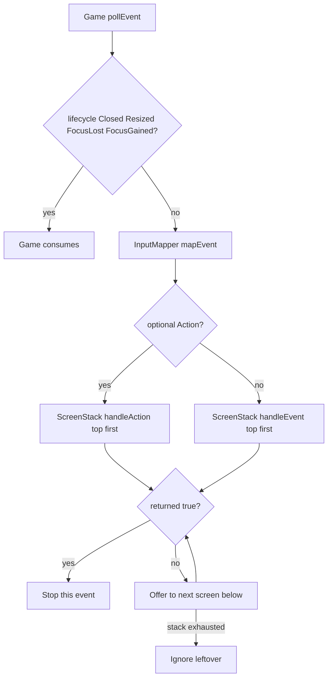
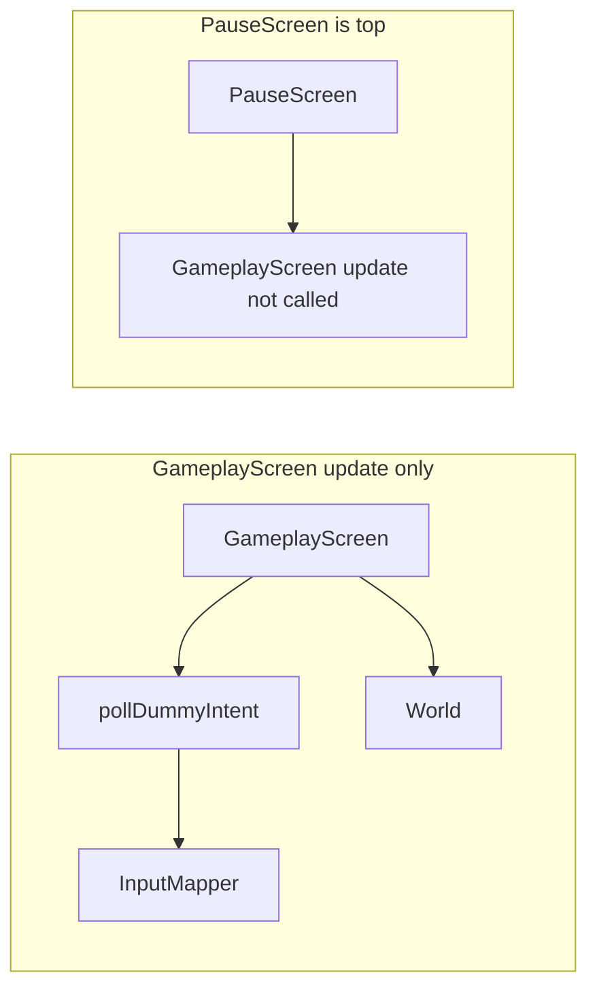
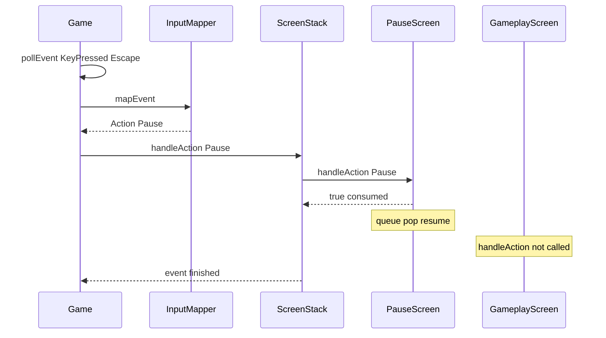

# Events and input

This chapter is **prospective**. What landed (`Action`, `InputMapper`, Closed \| map \| `handleEvent`) is in [10-engine-progress.md](10-engine-progress.md) and [`docs/reference/input-and-events.md`](../docs/reference/input-and-events.md). The target design below still describes FocusLost pause, hold poll, and remap UI that are **not** in the tree.

SFML is fetched at `GIT_TAG 3.1.0` ([`cmake/FetchSFML.cmake`](../cmake/FetchSFML.cmake)). Graphics, Window, and System only; no Audio or Network. Joystick, sensor, and text-entry events exist on the Window module and will be ignored for this slice.

## Purpose and non-goals

**Purpose.** Define a single, window-thread event path so the playable slice can start from `MainMenuScreen`, pause and resume `GameplayScreen`, and confirm a quit without double-firing Escape, without a global event bus, and without screens touching `sf::RenderWindow`.

Concretely this chapter will lock:

- How `Game` will poll SFML 3 events (`std::optional`, `is<T>()`, `getIf<T>()`).
- Which subtypes `Game` will always consume (`Closed`, `Resized`, `FocusLost`, `FocusGained`).
- How `InputMapper` will translate remaining keyboard edges into `Action`.
- How `IScreen::handleAction` / `handleEvent` consume from the top of `ScreenStack`.
- The **edge vs hold** policy (chosen below, not left open).
- Windowless tests for mapper tables and consume flags.

**Non-goals** (this chapter and this slice):

- No C++ implementation in `src/` as part of this document.
- No copy of `v0.1-arkanoid` input, and no genre-specific actions (no bricks, pieces, companies, or domain verbs).
- No global `EventBus`, signal slot, or observer list for UI clicks.
- No RAII helper that registers window callbacks in a constructor and unregisters in a destructor. SFML 3 also offers `sf::WindowBase::handleEvents` with lambdas; this slice will **not** use it. `Game` will keep an explicit `pollEvent` loop (same shape as the scaffold, extended).
- No rebindable controls UI, config file, or scancode remapper.
- No `TextEntered` / IME, clipboard, drag-and-drop, or joystick mapping.
- Pause overlay vs world time scale: named here only as a handoff; the contract lives in [05-pause.md](05-pause.md).
- View / letterbox math on `Resized`: `Game` will consume the event; the size policy lives in [02-application-loop.md](02-application-loop.md).
- `World` / `GameObject` will never receive SFML events or `Action`. Simulation stays on the fixed tick ([06-world-and-objects.md](06-world-and-objects.md)). `LevelDescriptor` is data, not an input listener ([07-levels.md](07-levels.md)).

## Chosen policies

Two decisions are fixed for every later chapter that mentions input.

### 1. Discrete UI is event-edge; hold is polled and not an `Action`

Menus and pause will react only to **edges** produced from `sf::Event::KeyPressed` (and, for pointer, from `handleEvent` hit-tests). `Confirm`, `Cancel`, and `Pause` will never be sampled with `sf::Keyboard::isKeyPressed`.

If a later dummy is player-steered, **continuous hold will be polled inside `InputMapper`**, and **only `GameplayScreen::update` will call that poll**. `InputMapper` will keep the key codes; screens will not call `sf::Keyboard::isKeyPressed` themselves. Hold intent will be a small vector (or equivalent), not `Action::Confirm` / `Pause`, and not four extra enum enumerators unless the slice actually steers the dummy.

Rationale: one table owns bindings; `PauseScreen` blocking `GameplayScreen::update` automatically stops hold sampling; mixing `isKeyPressed` with `KeyPressed` for the same logical button is a documented pitfall (see below).

### 2. Escape maps to exactly one `Action`: `Pause`

`InputMapper` is context-free. A physical Escape press will become `Action::Pause` and nothing else. `Cancel` stays in the enum; the playable slice will not bind a key to it. On `PauseScreen`, `Action::Pause` (and `Cancel` if delivered) **resumes** (`pop`). `Action::Confirm` on the overlay **quits to menu** (`pop` then `replace(MainMenuScreen)`). There is no highlighted dual-purpose Confirm row in this slice.

`FocusLost` will **not** be synthesized as `Action::Pause` from the mapper. `Game` will request a pause overlay through the handoff described in [05-pause.md](05-pause.md), so OS focus and the Escape key remain distinct causes.

## Event taxonomy

Every `pollEvent` result falls into exactly one of three buckets. A single event is never processed in two buckets.

| Bucket | Subtypes | Who handles | Screens see it? |
| --- | --- | --- | --- |
| Window lifecycle | `Closed`, `Resized`, `FocusLost`, `FocusGained` | `Game` always | No |
| Mapped action | `KeyPressed` that hits the binding table | `InputMapper` then `IScreen::handleAction` | Top-down until consumed |
| Raw remainder | anything else (`KeyReleased`, `MouseMoved`, `MouseButtonPressed`, unmapped keys, wheel, …) | `IScreen::handleEvent` | Top-down until consumed |

`Game` will drain the queue **every frame**, including while `PauseScreen` is top. Pausing must not starve the OS event loop ([02-application-loop.md](02-application-loop.md)).

### Lifecycle details

**`Closed`.** Same meaning as the scaffold: the player used the window chrome. `Game` will call `window.close()`. That is not `Action::Cancel` and not “quit to menu”. In-game quit is a `Confirm` on `MainMenuScreen` or `PauseScreen`.

**`Resized`.** `Game` will read `event->getIf<sf::Event::Resized>()->size` and update whatever view / letterbox [02-application-loop.md](02-application-loop.md) defines. Screens draw to `sf::RenderTarget&`; they will not each listen for resize.

**`FocusLost`.** `Game` will record unfocused state and **request a pause overlay** if gameplay is showing and `PauseScreen` is not already top. Overlay rules, `blocksUpdate`, and “do not auto-resume on focus gain” belong in [05-pause.md](05-pause.md). This chapter only requires that the request does not go through `InputMapper`.

**`FocusGained`.** `Game` will record focused state. It will not pop `PauseScreen` by itself.

## Pump (target)

The inner loop will stay the SFML 3.1 shape already in the scaffold:

```cpp
while (const std::optional event = window.pollEvent())
{
    // Game: Closed / Resized / FocusLost / FocusGained
    // else InputMapper::mapEvent → ScreenStack::handleAction
    // else ScreenStack::handleEvent
}
```

Implementation will match `.clang-format` (`while(`, four spaces). `window.waitEvent` will not be used: the loop must keep rendering and polling even when simulation is blocked.

`Game` will call `window.setKeyRepeatEnabled(false)` once when the window is created. Repeat would otherwise turn a held Enter into many `Confirm` actions and a held Escape into pause/resume chatter.

## Routing



`World`, `GameObject`, and `LevelDescriptor` are not on this graph. `GameplayScreen` may later poll hold intent during `update`, which is **not** an event-pump path:



When `PauseScreen` is top, `blocksUpdate() == true` on that overlay ([04-screen-stack.md](04-screen-stack.md), [05-pause.md](05-pause.md)). `GameplayScreen::update` will not run, so hold polling will not run either. Keyboard **edges** still reach `PauseScreen` through the event pump.

## Sequence: Escape while `PauseScreen` is top

This is the critical consume path for the playable slice. Escape is `Action::Pause` only. `PauseScreen` consumes it (deferred `pop` = resume). `GameplayScreen` must not see that action; if it did, it would request another overlay on the same frame’s end-of-frame commands.



Contrast, for the same key, when `GameplayScreen` is top and no overlay exists: `GameplayScreen::handleAction(Action::Pause)` will consume and queue **push** `PauseScreen`. `MainMenuScreen` is not on the stack then, so it never sees the action.

## Consume rules

“Consume” means: this screen handled the action or event, and **screens below must not see it** ([README.md](README.md) glossary).

| Top screen | Input | Returns | Below |
| --- | --- | --- | --- |
| `PauseScreen` | `Action::Pause` (Escape) | `true` (resume / `pop`) | `GameplayScreen` does not see Pause |
| `PauseScreen` | `Action::Confirm` | `true` (activate highlighted Resume or Quit) | same |
| `PauseScreen` | `MouseButtonPressed` on overlay | `true` from `handleEvent` | gameplay does not receive the click |
| `GameplayScreen` | `Action::Pause` | `true` (request overlay) | nothing below that should pause |
| `GameplayScreen` | unmapped `MouseMoved` | `false` or `true` (slice may ignore pointer) | n/a if stack depth is 1 |
| `MainMenuScreen` | `Action::Confirm` | `true` (Start or Quit, depending on selection) | none |
| `MainMenuScreen` | `Action::Pause` | `false` (ignore) | none; menu does not pause |

Stack walk is **top first** (reverse of draw order). A `false` return continues below. There is no bubbling back up.

`handleAction` and `handleEvent` are mutually exclusive **for one SFML event**. If `mapEvent` returns an `Action`, `Game` will not also call `handleEvent` for that `KeyPressed`. That is the other half of “do not double-handle Escape”.

Stack mutations (`push` / `pop` / `replace`) stay **deferred until after update and draw** of the current frame ([02-application-loop.md](02-application-loop.md), [04-screen-stack.md](04-screen-stack.md)). `handleAction` will only queue a command; it will not destroy `PauseScreen` while `handleAction` is still on the stack.

## Pointer input without an EventBus

Mouse motion and buttons will not become global `Confirm` clicks.

- `InputMapper` will **not** map `MouseButtonPressed` to `Action::Confirm` for the whole window. A click on empty client area must not start the game or confirm quit.
- The top `IScreen` will receive those events via `handleEvent`, hit-test its own widgets, and run the **same code path** it uses for `handleAction(Action::Confirm)` on the focused row.
- No bus, no `connect(ButtonId)`, no multicast to every screen.

Keyboard remains the playable-slice acceptance path (Enter / Escape). Pointer is allowed as a convenience on the same widgets, owned by the screen that drew them.

## Default bindings (playable slice)

| Physical input | Produces | Notes |
| --- | --- | --- |
| `sf::Keyboard::Key::Enter` | `Action::Confirm` | Also `NumpadEnter` |
| `sf::Keyboard::Key::Escape` | `Action::Pause` | Never also `Cancel` |
| Unmapped `KeyPressed` | `std::nullopt` | Falls through to `handleEvent` (usually ignored) |
| `KeyReleased` | `std::nullopt` | Must not toggle pause on release |
| No key | `Action::Cancel` | Unbound until a later menu needs it |

Semantic keys (`Key::Enter`, `Key::Escape`) are the right table for UI. If `MoveDummy` steering is added later, **hold directions will use `sf::Keyboard::Scancode`** (physical WASD / arrows) so layout changes do not move “W”. That split is intentional: UI follows labels, movement follows keycaps.

`Action::MoveDummy` is **not** in the slice enum. Add it only if the dummy is player-steered ([README.md](README.md)). Auto-translating dummy needs no hold poll.

## C++ signatures (not bodies)

Locked names, no namespaces, `#pragma once`, one primary type per pair under `src/` when implemented later. `IScreen` is the locked interface name (not `ScreenI`).

```cpp
enum class Action
{
    Confirm,
    Cancel,
    Pause
};

class InputMapper
{
public:
    [[nodiscard]] std::optional<Action> mapEvent(const sf::Event& event) const;
    [[nodiscard]] std::optional<Action> mapKeyPressed(sf::Keyboard::Key key) const;

    struct DummyIntent
    {
        sf::Vector2f axes{};
    };

    [[nodiscard]] DummyIntent pollDummyIntent() const;
};

class IScreen
{
public:
    virtual ~IScreen() = default;

    [[nodiscard]] virtual bool handleEvent(const sf::Event& event) = 0;
    [[nodiscard]] virtual bool handleAction(Action action) = 0;

    virtual void update(sf::Time dt) = 0;
    virtual void draw(sf::RenderTarget& target) const = 0;

    [[nodiscard]] virtual bool blocksUpdate() const = 0;
    [[nodiscard]] virtual bool blocksDraw() const = 0;
};
```

`mapEvent` will:

1. Return `std::nullopt` for lifecycle subtypes if they are ever passed (defense in depth; `Game` will not pass them).
2. Use `event.getIf<sf::Event::KeyPressed>()` and delegate to `mapKeyPressed(keyPressed->code)`.
3. Ignore `KeyReleased`, mouse, wheel, and focus.

`pollDummyIntent` will call `sf::Keyboard::isKeyPressed` (scancodes) and return a clamped 2D axis. The playable slice may leave it unused. **Menus will never call it.**

`handleAction` / `handleEvent` return `true` when consumed. `ScreenStack` (signatures in [04-screen-stack.md](04-screen-stack.md)) will walk from the top:

```cpp
class ScreenStack
{
public:
    bool handleEvent(const sf::Event& event);
    bool handleAction(Action action);
};
```

`Game` remains the owner of `sf::RenderWindow` and the pump ([01-architecture.md](01-architecture.md)):

```cpp
class Game
{
public:
    static constexpr sf::Vector2u DESIGN_SIZE{1280u, 720u};
    void run();

private:
    bool handleWindowEvent(const sf::Event& event);
};
```

`handleWindowEvent` returns `true` if the event was a lifecycle subtype and must not reach the mapper. `FocusLost` will call into the pause request described by [05-pause.md](05-pause.md), not into `InputMapper`.

`InputMapper` will be a value member of `Game` (or constructed next to the pump), not a process-wide singleton.

## Sibling links

| File | Why this chapter depends on it |
| --- | --- |
| [README.md](README.md) | Locked names, consume glossary, pause-as-overlay rule, playable-slice scope |
| [01-architecture.md](01-architecture.md) | `Game` owns the window and pump; screens do not |
| [02-application-loop.md](02-application-loop.md) | Drain events every frame; deferred stack commands; `Resized` / view; fixed tick vs UI `dt` |
| [04-screen-stack.md](04-screen-stack.md) | Top-first dispatch, `blocksUpdate` / `blocksDraw`, push/pop/replace queue |
| [05-pause.md](05-pause.md) | `FocusLost` overlay request; Escape resume; `PauseScreen` consume; world does not pause itself |
| [06-world-and-objects.md](06-world-and-objects.md) | Dummy motion is simulation; no event handlers on `GameObject` |
| [07-levels.md](07-levels.md) | `LevelId` / `LevelDescriptor` are data; no input map per level |
| [08-playable-slice.md](08-playable-slice.md) | Enter to start, Escape pause/resume, confirm quit |
| [09-rollout.md](09-rollout.md) | `InputMapper` / `Action` files on `gameLib`; Debug tests without a window |

## Playable-slice implications

Visible keyboard contract ([08-playable-slice.md](08-playable-slice.md)):

1. **Enter to start.** On `MainMenuScreen`, `Action::Confirm` will queue **`replace`** with `GameplayScreen{LevelId::Sandbox}`. Window chrome still uses `Closed` in `Game`; it is not `Action::Cancel`.
2. **Escape pause.** On `GameplayScreen`, `Action::Pause` will queue push of `PauseScreen`. Simulation freeze comes from `blocksUpdate`, not from dropping the event pump.
3. **Escape resume.** On `PauseScreen`, the same `Action::Pause` will be **consumed** and queue `pop`. `GameplayScreen` will not receive a second Pause.
4. **Confirm quit** from pause. `Action::Confirm` is consumed and queues **`pop` then `replace(MainMenuScreen)`** ([05-pause.md](05-pause.md)).
5. Window **X** still uses `Closed` in `Game`; it will not walk the menu.

If the dummy only auto-moves, no hold poll is required to accept the slice. If it is steered, axes come from `InputMapper::pollDummyIntent` during unpaused `GameplayScreen::update` only.

## Windowless tests

Tests stay Debug-only and must not open a window unless a display is required ([README.md](README.md)). `InputMapper` and a test double of `IScreen` are enough.

### Mapper tables

Construct `InputMapper` and assert `mapKeyPressed`:

| Key | Expected |
| --- | --- |
| `Enter` | `Action::Confirm` |
| `NumpadEnter` | `Action::Confirm` |
| `Escape` | `Action::Pause` |
| `A`, `Space`, `Unknown` | `std::nullopt` |

Also:

- `mapEvent` on a `KeyPressed` Escape equals `mapKeyPressed(Escape)`.
- `mapEvent` on `KeyReleased` Escape is `std::nullopt` (release must not resume/pause).
- `mapEvent` on `Closed` / `Resized` / `FocusLost` / `FocusGained` is `std::nullopt` so a mistaken call cannot invent `Pause`.

Prefer the `mapKeyPressed` seam so tests do not depend on how `sf::Event` is constructed.

### Consume flags

A tiny fake stack (or the real `ScreenStack` once it exists) with two screens:

1. Top returns `true` for `Action::Pause` → below’s `handleAction` call count stays 0.
2. Top returns `false` for `Action::Pause` → below is called once.
3. After a mapped `KeyPressed`, `handleEvent` on the top screen is **not** called for that same event.
4. `PauseScreen` fake: `handleAction(Pause) == true`; `GameplayScreen` fake must not record that Pause (sequence above).
5. `MainMenuScreen` fake: `handleAction(Confirm) == true`, `handleAction(Pause) == false`.

Hold poll, if tested: `pollDummyIntent` with no keys down returns a zero vector. Do not assert `isKeyPressed` for Enter as `Confirm`; that mixing is forbidden by policy and should fail a review, not a green test.

`Game::DESIGN_SIZE` smoke test remains unrelated to input.

## Pitfalls

**Double-handling Escape.** Two failure modes:

1. Mapper emits `Pause` **and** `Cancel` for one key, or `Game` both maps the event and forwards `handleEvent`.
2. `PauseScreen` returns `false` for `Pause`, so `GameplayScreen` pushes a second overlay while the first is popping.

Fix: one Action per Escape; exclusive map-or-raw routing; overlay always consumes Pause.

**Mixing `isKeyPressed` and `KeyPressed` for the same logical button.** If Enter is both an edge `Confirm` and sampled as held, menus will fire on the press frame and then again every update. Policy: `Confirm` / `Cancel` / `Pause` are edges only. `isKeyPressed` exists solely inside `InputMapper::pollDummyIntent`.

**Key repeat.** Default SFML repeat would spam `KeyPressed`. `setKeyRepeatEnabled(false)` is required for this slice.

**Toggling on press and release.** Handling both `KeyPressed` and `KeyReleased` for Escape will pause and immediately resume. Map press only.

**Synthesizing `Action::Pause` from `FocusLost`.** That reuses the Escape path and can fight with an overlay that is already top, or resume logic that treats Pause as a toggle. Keep OS focus on `Game`’s lifecycle branch; overlay request is [05-pause.md](05-pause.md).

**Global EventBus for clicks.** A click is spatially owned by the top screen’s widgets. A bus reintroduces broadcast, ordering bugs, and “who consumed this?” ambiguity. Use `handleEvent` hit-tests.

**RAII window callbacks / `handleEvents`.** A listener object whose destructor unhooks the window is unnecessary and easy to use-after-move next to `sf::RenderWindow`. The scaffold’s `pollEvent` loop is the API for this slice.

**Starving the queue while paused.** Skipping `pollEvent` because `blocksUpdate` is true will freeze resize/close/focus and can mark the app as unresponsive. Always poll; only simulation is blocked.

**Screens closing the window.** Only `Game` handles `Closed` and owns `sf::RenderWindow`. `MainMenuScreen` quit will ask `Game` (or queue a command `Game` applies), not call `window.close()` on a borrowed reference.

**Forwarding events into `World`.** Objects will not implement `handleAction`. A paused world freezes because it is not ticked, not because input is gated inside `GameObject`.

**Mapper depending on the stack.** Bindings stay context-free. “Escape means Cancel in menus and Pause in gameplay” belongs in screen consume rules, not in `InputMapper` ifs. This slice goes further and binds Escape only to `Pause`.
