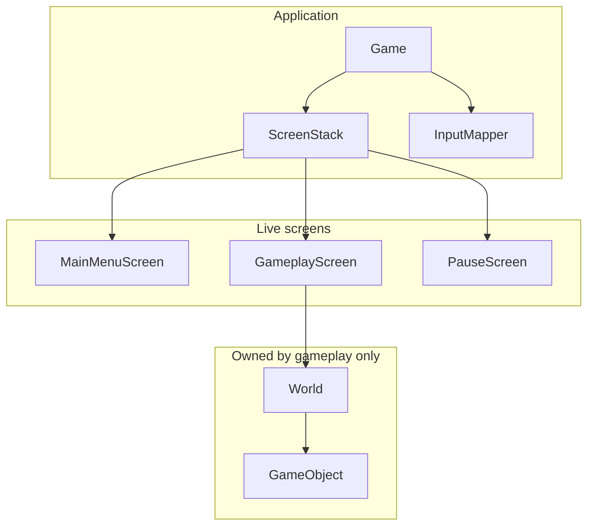
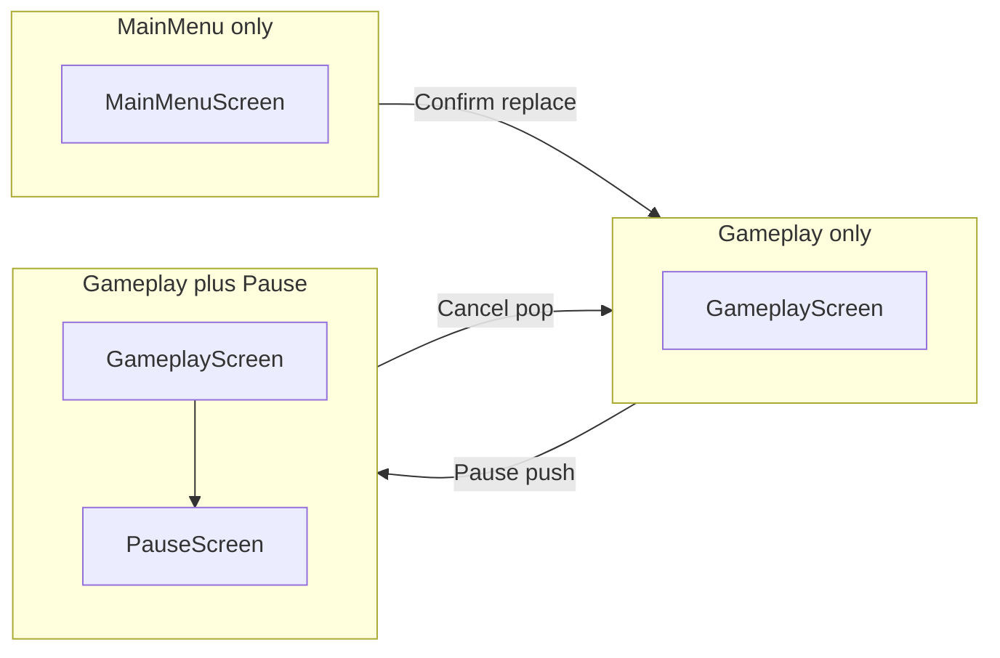
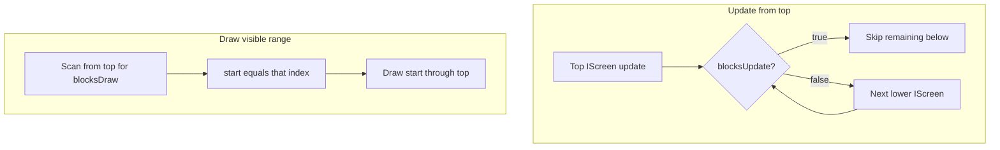
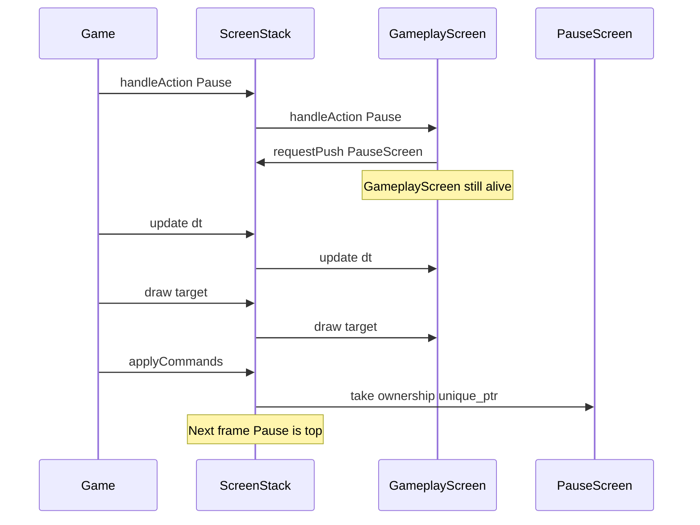

# ScreenStack and IScreen

This chapter is **target design**. Today [`src/Game.cpp`](../src/Game.cpp) polls `sf::Event::Closed`, clears, and displays. There is no `ScreenStack`, no `IScreen`, and no menu/gameplay/pause types in the tree.

The first engine slice will give `Game` an ordered stack of screens so the application can move **MainMenu → empty Gameplay → Pause overlay → resume or quit to menu** without encoding those modes as an enum inside `Game::run()`.

## Purpose

`ScreenStack` will be the only owner of live `IScreen` instances. `Game` will own the stack. Screens will request transitions (`requestPush` / `requestPop` / `requestReplace`); they will never delete siblings, never hold `unique_ptr` to another screen, and never close the window themselves.

The stack exists to answer three questions every frame:

1. Which screens receive `update` (simulation and UI time).
2. Which screens `draw` (and in which order).
3. When it is safe to create or destroy a screen (never during that screen’s own `handleEvent` / `handleAction` / `update` / `draw`).

`PauseScreen` will prove the model: it **blocks update** of `GameplayScreen` (so `World` is not ticked) and **does not block draw** (so the frozen gameplay still renders underneath). That overlay rule is specified here and used by [05-pause.md](05-pause.md); it is not an `if(!paused)` flag on `GameObject`.

## Non-goals

- **Not an enum state machine in `Game.cpp`.** `Game` will not grow `enum class Mode { MainMenu, Gameplay, Pause }` and a `switch` that constructs/destroys worlds. Modes are stack shapes, not a central enumerator.
- **Not a scene graph, ECS, or `IManager`.** One stack, one interface, three concrete screens for the slice.
- **Not `Scene`, `StateMachine`, or `StateStack` as type names.** The locked name is `ScreenStack`.
- **Not `ScreenI`.** Project C++ convention prefers a `FooI` suffix; this plan locks **`IScreen`**. Use that identifier.
- **Not immediate stack mutation.** No `push`/`pop` that runs during iteration. Commands apply in `applyCommands()` at end of frame only.
- **Not window ownership.** Screens draw to `sf::RenderTarget&`. `Game` owns `sf::RenderWindow` (SFML 3.1, Graphics / Window / System only).
- **Not genre screens, boards, or product flows.** No types beyond the locked names. `LevelDescriptor` is data, not a screen subclass ([07-levels.md](07-levels.md)).
- **Not `onEnter` / `onExit` / `requestClear` / `requestQuit`.** The slice does not need extra lifecycle hooks. Quit-to-desktop stays `Game` calling `sf::RenderWindow::close()`. Quit-to-menu is a **command sequence** (pop overlay, then replace gameplay).
- **Not world time scale.** Slow-mo, if ever added, is a `World` concern ([06-world-and-objects.md](06-world-and-objects.md)). Pause is “do not call `update` on screens below.”

## Ownership



- `Game` owns `ScreenStack`, the window, the clock, and `InputMapper`.
- `ScreenStack` owns `std::vector<std::unique_ptr<IScreen>>` (bottom at index `0`, top at `back()`).
- `GameplayScreen` owns `World`. `PauseScreen` and `MainMenuScreen` do not touch `World`.
- Concrete screens may store `ScreenStack&` (the `Game` member is stable) in order to enqueue commands. They must not store pointers to sibling `IScreen` objects: those pointers die when the sibling is popped or replaced.

`Game` is the only type that will call `window.close()`. `MainMenuScreen` quit-to-desktop will take a `std::function<void()>` (or equivalent) injected by `Game`. That callback is not a new named manager.

## IScreen contract

Every live screen will implement:

| Method | Role |
|--------|------|
| `handleEvent` | Leftover `sf::Event` after `Game` consumes `Closed`, `Resized`, `FocusLost`, `FocusGained` ([03-events-and-input.md](03-events-and-input.md)). Slice screens may return `false` and rely on `Action`. |
| `handleAction` | `Confirm`, `Cancel`, `Pause` (and later optional `MoveDummy` only if the dummy is player-steered). |
| `update(dt)` | Frame delta for UI. `GameplayScreen` will drive `World` fixed ticks from this call ([02-application-loop.md](02-application-loop.md)). |
| `draw(sf::RenderTarget&)` | Issue draw calls. Never take `sf::RenderWindow&`. |
| `blocksUpdate()` | If `true`, screens **below** this one are not updated this frame. |
| `blocksDraw()` | If `true`, screens **below** this one are not drawn this frame. |

`handleEvent` and `handleAction` will return `bool`: **`true` means consumed** — lower screens must not see that event or action ([README.md](README.md) glossary).

`blocksUpdate()` is also an **input barrier** after the blocking screen has been given a chance to handle the event/action. That prevents a forgetful `PauseScreen` from leaking `Pause` or movement into `GameplayScreen`. Consume still matters when two non-blocking screens are stacked (the slice does not need that shape).

Flags for the three slice screens:

| Type | `blocksUpdate` | `blocksDraw` | Why |
|------|----------------|--------------|-----|
| `MainMenuScreen` | `true` | `true` | Sole occupant; nothing below. |
| `GameplayScreen` | `true` | `true` | Full scene; opaque. |
| `PauseScreen` | `true` | `false` | Freeze `World`; keep drawing gameplay underneath. |

No other combination is required for the playable slice. A future loading curtain (`blocksUpdate == false`, `blocksDraw == true`) is out of scope.

`IScreen` will be a header-only interface: virtual destructor, protected default constructor, copy deleted. It is the exception to “one `.hpp` / `.cpp` pair” because there is no implementation file to list in `gameLib`.

## ScreenStack

Public mutation is **request-only**. The vector does not change until `applyCommands()`.

| Method | Queued effect |
|--------|----------------|
| `requestPush(std::unique_ptr<IScreen>)` | After the frame: `screens.push_back`. |
| `requestPop()` | After the frame: destroy `screens.back()` if the stack is non-empty. |
| `requestReplace(std::unique_ptr<IScreen>)` | After the frame: destroy top, then push the new screen (replace **top only**). |
| `applyCommands()` | Drain the queue in FIFO order. Called once at **end of frame**, after update and draw. |

`requestPush(nullptr)` and `requestReplace(nullptr)` will be Debug asserts and no-ops in the queue.

`replace` never reaches through an overlay to swap `GameplayScreen` while `PauseScreen` is on top. Quit-to-menu is two commands, not one replace of the overlay (see [Pitfalls](#pitfalls)).

### Command queue

Commands recorded during `handleAction` / `update` (and theoretically `draw`, which the slice will not use for transitions) sit in a `std::vector` of `{ type, payload }` until `applyCommands()`. Push and replace carry the `unique_ptr`; pop carries none.

Properties the tests will lock:

- `size()` is unchanged by `requestPush` / `requestPop` / `requestReplace` until `applyCommands()`.
- Several commands in one frame apply left-to-right.
- A screen that queued `requestPop` on itself remains valid until `applyCommands()` returns from destroying it.
- The queue is cleared even if a command is rejected (pop on empty).

`Game` will seed the stack **before** the first iterated frame:

1. `requestPush(std::make_unique<MainMenuScreen>(...))`
2. `applyCommands()` once so the first poll/update/draw is not an empty stack

Empty stack after `applyCommands()` is a contract violation for a running game (see [Empty stack guard](#empty-stack-guard)).

## Typical stacks

The playable slice will only produce these three shapes. Bottom is listed first.



| Shape | How it is reached |
|-------|-------------------|
| `[MainMenuScreen]` | Startup; also after quit-to-menu. |
| `[GameplayScreen]` | `MainMenuScreen` **replaces** itself (menu is not kept underneath). |
| `[GameplayScreen, PauseScreen]` | `GameplayScreen` **pushes** pause. Resume **pops** pause. |

Keeping `MainMenuScreen` under gameplay (`[MainMenu, Gameplay, Pause]`) is **not** a slice stack. Quit-to-menu constructs a **new** `MainMenuScreen` via replace after the overlay is popped. That matches the locked table: `[MainMenu]`, `[Gameplay]`, `[Gameplay, Pause]`.

## Traversal

Index `0` is the bottom of the stack; `size() - 1` is the top.

### Update (top toward bottom)

```text
for i from top down to 0:
    screens[i]->update(dt)
    if screens[i]->blocksUpdate():
        break
```

Screens below a `blocksUpdate` screen are **not called**. `GameplayScreen::update` is the only call that advances `World`. Under `PauseScreen`, that call is skipped, so dummy `GameObject` instances stay put without a pause flag on `World`.

### Draw (bottom toward top, after a cutoff)

```text
start = 0
for i from top down to 0:
    if screens[i]->blocksDraw():
        start = i
        break
for i from start to top:
    screens[i]->draw(target)
```

`PauseScreen` has `blocksDraw() == false`, so the search continues to `GameplayScreen`, which is `true`. Draw order is **gameplay then pause**: the world is visible, the overlay is on top.

If an opaque screen is on top (`blocksDraw() == true`), everything below is skipped. That is `MainMenuScreen` and unpaused `GameplayScreen`.



### Events and actions (top toward bottom)

Same cutoff as update, plus consume:

```text
for i from top down to 0:
    consumed = screens[i]->handleAction(action)  // or handleEvent
    if consumed or screens[i]->blocksUpdate():
        break
```

`Game` never forwards lifecycle events into the stack ([03-events-and-input.md](03-events-and-input.md)). `InputMapper` produces `Action` values from what remains. The top screen may consume an action so screens below never see it.

`PauseScreen` will consume `Pause` / `Cancel` (resume) and `Confirm` only if the slice uses confirm for a menu item. It will not forward into `GameplayScreen`.

## Frame order and lifetime

[02-application-loop.md](02-application-loop.md) will own the exact loop. Relative to the stack, one frame is:

1. Poll events. `Game` consumes window lifecycle.
2. Map leftovers to `Action` where needed; dispatch `handleEvent` / `handleAction` on the **current** vector.
3. `ScreenStack::update(dt)` on the **current** vector.
4. `ScreenStack::draw(target)` on the **current** vector.
5. **`applyCommands()`** — create/destroy screens only here.
6. `window.display()`.

A screen pushed this frame does not update or draw until the **next** frame. One-frame overlay delay is accepted.



**Never destroy a screen during its own `update` / `handleAction` / `handleEvent` / `draw`.** Immediate `pop` inside those methods would run a destructor under an active vtable call and invalidate the stack’s iteration. Deferred commands exist for that reason.

## C++ signatures

Prospective surfaces only. Headers will use `#pragma once`, no namespaces, `CamelCase` types, `camelCase` methods. Includes from `src/` use angle brackets. SFML 3.1 (`GIT_TAG 3.1.0`).

```cpp
#pragma once

#include <Action.hpp>

#include <SFML/Graphics/RenderTarget.hpp>
#include <SFML/System/Time.hpp>
#include <SFML/Window/Event.hpp>

class IScreen
{
public:
    virtual ~IScreen() = default;

    IScreen(const IScreen&) = delete;
    IScreen& operator=(const IScreen&) = delete;

    virtual bool handleEvent(const sf::Event& event) = 0;
    virtual bool handleAction(Action action) = 0;
    virtual void update(sf::Time dt) = 0;
    virtual void draw(sf::RenderTarget& target) = 0;
    [[nodiscard]] virtual bool blocksUpdate() const = 0;
    [[nodiscard]] virtual bool blocksDraw() const = 0;

protected:
    IScreen() = default;
};
```

```cpp
#pragma once

#include <IScreen.hpp>

#include <SFML/Graphics/RenderTarget.hpp>
#include <SFML/System/Time.hpp>
#include <SFML/Window/Event.hpp>

#include <cstddef>
#include <memory>

class ScreenStack
{
public:
    ScreenStack() = default;
    ScreenStack(const ScreenStack&) = delete;
    ScreenStack& operator=(const ScreenStack&) = delete;

    void requestPush(std::unique_ptr<IScreen> screen);
    void requestPop();
    void requestReplace(std::unique_ptr<IScreen> screen);
    void applyCommands();

    bool handleEvent(const sf::Event& event);
    bool handleAction(Action action);
    void update(sf::Time dt);
    void draw(sf::RenderTarget& target);

    [[nodiscard]] bool empty() const;
    [[nodiscard]] std::size_t size() const;

private:
    enum class CommandType
    {
        Push,
        Pop,
        Replace
    };

    struct Command
    {
        CommandType type{CommandType::Pop};
        std::unique_ptr<IScreen> screen{};
    };

    std::vector<std::unique_ptr<IScreen>> m_screens;
    std::vector<Command> m_commands;
};
```

Slice screens (constructors take `ScreenStack&`; gameplay also takes level data):

```cpp
class MainMenuScreen : public IScreen
{
public:
    MainMenuScreen(ScreenStack& stack, std::function<void()> quitToDesktop);

    bool handleEvent(const sf::Event& event) override;
    bool handleAction(Action action) override;
    void update(sf::Time dt) override;
    void draw(sf::RenderTarget& target) override;
    [[nodiscard]] bool blocksUpdate() const override;
    [[nodiscard]] bool blocksDraw() const override;
};

class GameplayScreen : public IScreen
{
public:
    GameplayScreen(ScreenStack& stack, LevelDescriptor descriptor);

    bool handleEvent(const sf::Event& event) override;
    bool handleAction(Action action) override;
    void update(sf::Time dt) override;
    void draw(sf::RenderTarget& target) override;
    [[nodiscard]] bool blocksUpdate() const override;
    [[nodiscard]] bool blocksDraw() const override;
};

class PauseScreen : public IScreen
{
public:
    explicit PauseScreen(ScreenStack& stack);

    bool handleEvent(const sf::Event& event) override;
    bool handleAction(Action action) override;
    void update(sf::Time dt) override;
    void draw(sf::RenderTarget& target) override;
    [[nodiscard]] bool blocksUpdate() const override;
    [[nodiscard]] bool blocksDraw() const override;
};
```

`Game` will gain a `ScreenStack` member when the loop is extended. It will not gain a mode enum. `LevelId` may identify which `LevelDescriptor` `MainMenuScreen` passes into `GameplayScreen`; neither identifier is a screen.

Intended files when implemented later (listed in [`src/CMakeLists.txt`](../src/CMakeLists.txt) `gameLib`, except header-only `IScreen.hpp`): `IScreen.hpp`, `ScreenStack.hpp` / `ScreenStack.cpp`, `MainMenuScreen.hpp` / `MainMenuScreen.cpp`, `GameplayScreen.hpp` / `GameplayScreen.cpp`, `PauseScreen.hpp` / `PauseScreen.cpp`. Rollout order is [09-rollout.md](09-rollout.md).

## Concrete screens — stack responsibilities only

### `MainMenuScreen`

- `Confirm` → `requestReplace(std::make_unique<GameplayScreen>(stack, descriptor))`. Menu is destroyed at end of frame; stack becomes `[Gameplay]`.
- Quit-to-desktop → injected callback; `Game` closes the window. **Not** `requestPop()` of the last screen.
- `update` may be a no-op. `draw` fills the design view (1280×720).

### `GameplayScreen`

- Owns `World` populated from `LevelDescriptor` ([06-world-and-objects.md](06-world-and-objects.md), [07-levels.md](07-levels.md)).
- `Pause` → `requestPush(std::make_unique<PauseScreen>(stack))`. **Never** `requestReplace` with pause (that would destroy `World`).
- `update` accumulates frame `dt` and runs fixed ticks. When this method is not called, the dummy `GameObject` does not move.
- `draw` draws `World` into the target. Still invoked under pause because `PauseScreen::blocksDraw()` is `false`.

### `PauseScreen`

- Resume: `Cancel` or `Pause` → `requestPop()`.
- Quit to menu: `requestPop()` then `requestReplace(std::make_unique<MainMenuScreen>(...))` **in that order** in the same frame. FIFO `applyCommands` pops pause, then replaces the new top (`GameplayScreen`) with a fresh menu. Stack never goes empty if both commands are queued together.
- `blocksUpdate() == true`, `blocksDraw() == false`.

## Interaction with other layers

| Layer | File | Contract with this chapter |
|-------|------|------------------------------|
| Names, rules, non-goals | [README.md](README.md) | Locked identifiers; deferred commands; overlay pause; no genre types. |
| Four layers and ownership | [01-architecture.md](01-architecture.md) | `Game` → `ScreenStack` → screens; only `GameplayScreen` → `World`. |
| Window, clock, tick | [02-application-loop.md](02-application-loop.md) | Always poll even when paused; `applyCommands` after update and draw; world fixed step lives under `GameplayScreen::update`. |
| SFML 3 events, consume, `Action` | [03-events-and-input.md](03-events-and-input.md) | `Game` eats lifecycle events; `InputMapper` produces `Action`; top screen may consume. |
| Overlay vs time scale | [05-pause.md](05-pause.md) | Pause **is** this stack shape plus flags; not a `World` boolean. |
| Simulation | [06-world-and-objects.md](06-world-and-objects.md) | `World` has no pause flag; it simply is not ticked when `GameplayScreen::update` is skipped. |
| Level data | [07-levels.md](07-levels.md) | `LevelDescriptor` / `LevelId` construct gameplay; they are not `IScreen` subclasses. |
| Player-visible slice | [08-playable-slice.md](08-playable-slice.md) | The three stack shapes above are the acceptance path. |
| Files and `gameLib` | [09-rollout.md](09-rollout.md) | New `.cpp` files go on `gameLib`; tests Debug-only. |

`Action` remains `enum class`: `Confirm`, `Cancel`, `Pause`. Movement actions are not required for the stack itself.

## Playable-slice implications

The slice is proven when a player can:

1. See `[MainMenuScreen]` and start (`replace` → `[GameplayScreen]`).
2. See a dummy `GameObject` move while unpaused (`GameplayScreen::update` running).
3. Open pause (`push` → `[Gameplay, Pause]`): dummy **freezes**, gameplay **still draws**, overlay on top.
4. Resume (`pop` → `[Gameplay]`): dummy moves again from the **same** `World` (not a newly constructed level).
5. Quit to menu from pause (pop + replace): back to `[MainMenuScreen]`; old `World` is gone because `GameplayScreen` was replaced **after** pause was popped.

If pause were implemented as `requestReplace(PauseScreen)`, step 4 would spawn a new empty world. That fails the slice even if the overlay looks correct.

Window size stays `Game::DESIGN_SIZE` (1280×720). The empty loop is extended, not replaced: `src/main.cpp` still constructs `Game` and calls `run()`.

## Windowless tests

Tests stay Debug-only (`build_ut` + `ctest --preset debug`) and **must not** open `sf::RenderWindow`. `IScreen::draw` needs an `sf::RenderTarget&`; do **not** require GPU `draw` tests for the stack. Cover traversal with `update` / `handleAction` spies. Flag getters (`blocksUpdate` / `blocksDraw`) are ordinary `const` calls.

Use a test `IScreen` that records call counts and destructor counts. `ScreenStack` methods under test: `request*`, `applyCommands`, `update`, `handleAction`, `empty`, `size`.

### Command queue

- `requestPush` then `size() == 0` until `applyCommands()`; after apply, `size() == 1`.
- Two pushes, one apply → size 2, bottom then top order (first pushed is index `0`).
- `requestPop` without apply leaves size unchanged; after apply, size decreases by one.
- `requestReplace` without apply leaves the old top alive (destructor count 0); after apply, old top destroyed and size unchanged if the stack had one screen.
- FIFO: `requestPop` + `requestPush(menu)` on `[Gameplay, Pause]` becomes `[Gameplay, MainMenu]` — **wrong** for quit-to-menu; the **correct** sequence `requestPop` + `requestReplace(menu)` becomes `[MainMenu]`. Both sequences should be tested so the product code cannot confuse them.
- `requestPush(nullptr)` does not change size after apply.

### Flag combinations

Spy screens with explicit flags; `update` records which ids were called.

| Top flags | Below flags | Expected `update` calls |
|-----------|-------------|-------------------------|
| `blocksUpdate true` (pause) | gameplay | top only |
| `blocksUpdate true` (gameplay alone) | — | that screen only |
| `blocksUpdate false` (if used in a spy) | below | top then below |

`PauseScreen` (or a spy with the same flags): `blocksUpdate() == true`, `blocksDraw() == false`.

`handleAction` on `[gameplay, pause]`: pause sees `Action::Pause` and returns `true` (consumed); gameplay call count stays 0. `blocksUpdate` is **not** the action cutoff — it only skips `update` on screens below.

### Empty stack guard

- `update` / `handleAction` / `handleEvent` / `draw` on an empty stack are no-ops (no crash, no UB).
- `requestPop` + `applyCommands` on empty: size stays 0; no erase of `back()`.
- `requestReplace` on empty: treat as **push** of the payload **or** reject; pick one and test it. Preferred: **reject** (Debug assert, no-op) so startup must `requestPush`, not sneak in through replace.
- After `applyCommands`, a running `Game` must not observe `empty() == true`. Pop of the **last** screen is a Debug assert / no-op: quit-to-desktop is `window.close()`, not pop-until-empty.
- Seed rule: `Game` applies the initial `MainMenuScreen` push before the main loop so the first frame is never empty.

### Lifetime spy

A screen whose `handleAction` calls `requestPop` on the stack: its destructor must run **after** `handleAction` returns, i.e. during `applyCommands`, not from inside `handleAction`. The same for `update`.

## Pitfalls

**Mutating the stack while iterating.** `applyCommands()` inside `ScreenStack::update` / `handleAction` invalidates the vector and can destroy the `IScreen` currently executing. Symptoms: use-after-free, skipped screens, double-destroy. The rule is mechanical: **queue during the frame, apply once at the end.**

**Replacing gameplay instead of pushing pause.** `requestReplace(PauseScreen)` destroys `GameplayScreen` and its `World`. Resume then has nothing to pop back to except an empty stack or a new gameplay. Pause **must** be `requestPush`. Replace is for **MainMenu ↔ Gameplay**, not for overlay.

**Replace-on-pause for quit-to-menu.** `PauseScreen` calling only `requestReplace(MainMenuScreen)` yields `[GameplayScreen, MainMenuScreen]` — menu on top of a still-living world. Correct: `requestPop()` then `requestReplace(MainMenuScreen)` so FIFO pops pause, then swaps gameplay for menu.

**Pop-pop-push emptying the stack mid-queue.** `requestPop()` twice then `requestPush(menu)` is valid **if** `applyCommands` applies all three before anyone observes the stack. A guard that forbids empty **between** commands would break this. Prefer pop + replace (never empty). If pop-pop-push is used, the empty-after-**all**-commands rule is what matters, not emptiness between individual commands.

**Large `dt` on resume.** While paused, `GameplayScreen::update` is skipped but wall time still passes ([02-application-loop.md](02-application-loop.md)). The first unpaused `update` must not catch up the entire pause duration as extra `World` ticks. Clamp the accumulator / cap `dt`. The dummy should resume from rest, not teleport.

**Key-repeat double push.** If `InputMapper` treats `Pause` as level (held) rather than edge, one hold queues many `PauseScreen` instances. Edge-trigger `Pause` ([03-events-and-input.md](03-events-and-input.md)). `blocksUpdate` on the first pause still freezes gameplay, but stacked pauses require extra pops to resume.

**Calling `World` from `PauseScreen` or `Game`.** Freeze is skip-`update`, not `world.setPaused(true)`. Do not add a pause boolean on `GameObject`.

**`draw(sf::RenderWindow&)`.** Objects and screens take `sf::RenderTarget&` so tests and future render textures stay possible. The window stays in `Game`.

**Event starve while paused.** The window must still be polled every frame. Pause does not stop `Game`’s event pump ([02-application-loop.md](02-application-loop.md)).

**Storing sibling pointers.** `PauseScreen` must not keep `GameplayScreen*` to unpause the world. Unpause is `requestPop()`. A sibling pointer dangles after replace/pop.

**Applying commands before draw of the requesting frame.** Then a newly pushed pause would draw without having updated, and gameplay would not get its last unpaused draw pairing. The locked order is update → draw → `applyCommands`. Do not “snappily” apply between update and draw.

**Enum in `Game.cpp` as a shortcut.** A `switch(m_mode)` duplicates the stack, desyncs with overlays, and makes `[Gameplay, Pause]` a boolean instead of a push. If `Game` needs to know “are we paused?”, query stack flags / size — do not copy the mode out into `Game`.

**Copying `IScreen`.** Deleted copy; ownership is `unique_ptr` in the stack only.

**Forgetting `gameLib`.** When this design is implemented, every new `.cpp` must be listed in [`src/CMakeLists.txt`](../src/CMakeLists.txt). That is a later change; this file does not implement it.
