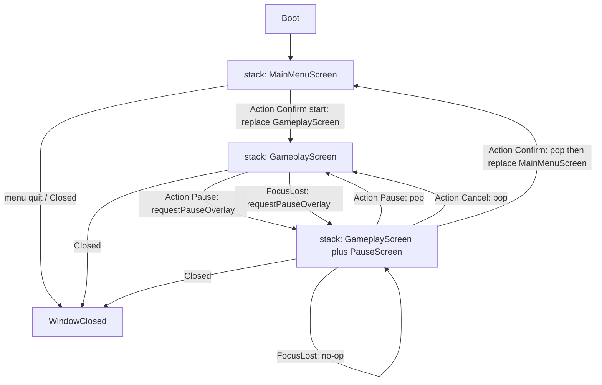
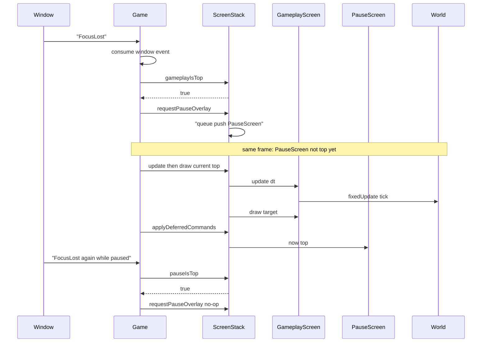

# Pause as overlay

This chapter is **prospective**. What landed (`PauseScreen`, `requestPauseOverlay`, FocusLost) is in [10-engine-progress.md](10-engine-progress.md) and [`docs/reference/pause-overlay.md`](../docs/reference/pause-overlay.md). World freeze and selectable pause rows are **not** in the tree.

Pause will be a **stack overlay**: `PauseScreen` sits on top of `GameplayScreen`, freezes simulation by blocking updates, and still lets gameplay draw underneath. It is not a boolean on `GameObject`, and it is not `World` `timeScale = 0`.

## Purpose and non-goals

### Purpose

- Define `PauseScreen` as an overlay (`blocksUpdate() == true`, `blocksDraw() == false`) so the dummy object freezes while the last gameplay frame remains visible.
- Give `GameplayScreen` and `Game` a **single** way to request that overlay: deferred `push` of `PauseScreen`, never two pause screens.
- Map `Action` and `sf::Event::FocusLost` onto resume vs quit-to-menu without destroying screens mid-frame.
- Separate **UI pause** (stack does not call `World::fixedUpdate`) from a later optional **simulation time scale** (slow-mo).
- Keep the window alive: `Game` always polls events, including `Closed`, while paused.

### Non-goals

- Implement C++ in this repository in this chapter.
- Copy pause, scenes, or entities from `v0.1-arkanoid`.
- Genre rules, score, lives, or business-domain types.
- A selectable pause menu with focus rows, animation, or audio ducking (the slice uses a **hard** `Action` map; see below).
- Auto-resume on `FocusGained`.
- Putting a `paused` flag on `World`, `GameObject`, `LevelDescriptor`, or `LevelId`.
- Using `timeScale = 0` as the pause mechanism.
- Stopping `sf::RenderWindow` polling, sleeping the process, or skipping the event pump because the overlay is up.

## Overlay model

`PauseScreen` is an `IScreen`. It is never a mode flag inside `GameplayScreen`. The visible pause state **is** “`PauseScreen` is top of `ScreenStack`”.

| `IScreen` query | `PauseScreen` | Meaning |
| --- | --- | --- |
| `blocksUpdate()` | `true` | `ScreenStack` updates the overlay and **stops**. `GameplayScreen::update` does not run, so it must not call `World::fixedUpdate`. |
| `blocksDraw()` | `false` | `ScreenStack` still draws screens below. Gameplay (and the dummy `GameObject`) remain visible under a dim/label overlay. |

`GameplayScreen` will own `World`. `World` will own `GameObject` instances. Neither type will know that a pause overlay exists. Frozen motion is a **consequence** of not being ticked, not of reading UI state.

### Why UI pause is not `timeScale = 0`

A later optional `World` field such as `timeScale` (slow-mo, fast-forward) is a **simulation** knob: `World::fixedUpdate` still runs; it scales how far objects integrate in that tick. Overlay pause is a **stack** knob: `World::fixedUpdate` is **not called**.

| | Overlay pause (`PauseScreen`) | Later optional `World` time scale |
| --- | --- | --- |
| Who owns it | `ScreenStack` / `IScreen` flags | `World` |
| `World::fixedUpdate` | Not invoked | Invoked every tick |
| `GameObject::fixedUpdate` | Not invoked | Invoked; may see scaled `tick` |
| UI (`PauseScreen::update`) | May still run on frame or tick dt | Independent; overlay need not exist |
| Typical use | Halt play, keep picture, wait for resume/quit | Slow-mo while the world is still “live” |
| Input | Top overlay consumes `Action` | Gameplay still the top screen |

`timeScale = 0` is a tempting alias for pause and will be treated as a **pitfall**, not as this slice’s design. A zero scale still implies the world update path is running (spawn, timers, “did we tick?”, debug HUD). It also cannot express “draw gameplay, do not update it” without a second channel. The overlay **is** that channel.

If both exist later: overlay pause remains authoritative for Halt. `timeScale` must not be set to `0` merely because `PauseScreen` is top. Slow-mo under an unpaused `GameplayScreen` is a different feature.

### Why `GameObject` must not check a paused bool

- **Wrong owner.** Pause is a screen-stack fact. `GameObject` is a simulation object. Reading UI from every object inverts the layers in [01-architecture.md](01-architecture.md) and [06-world-and-objects.md](06-world-and-objects.md).
- **Incomplete by construction.** Every new `GameObject` (or helper that moves a shape) must remember the check. One missed `if (!paused)` and something still slides under the overlay.
- **Duplicate sources.** `Action::Pause` and `FocusLost` would each have to set the same flag, plus resume/quit would have to clear it. The stack already has one source of truth: what is top.
- **False ticks.** `World::fixedUpdate` would still run, calling into objects that no-op. Timers, spawn, and “tick count” would silently disagree with what the player sees.
- **Unpause catch-up.** A bool is easy to combine with a wall-clock accumulator so the dummy jumps after alt-tab. Not calling `fixedUpdate` avoids inventing that bug in objects.
- **Tests.** Windowless tests should assert stack commands and “`fixedUpdate` call count is unchanged while paused”, not that each dummy type honored a flag.

The dummy will freeze because `GameplayScreen` is not updated, therefore `World::fixedUpdate` is not called, therefore `GameObject::fixedUpdate` is not called. The object keeps its last position. Resume continues from that state.

## Locked `Action` map

`InputMapper` (see [03-events-and-input.md](03-events-and-input.md)) produces `Action`. Only the **top** `IScreen` receives `handleAction` and **consumes** it. Screens below never see that action.

This slice uses a **hard** mapping (no focused menu row). On-screen text may label the keys; Confirm does not mean “activate highlighted item”.

| `Action` | Top is `GameplayScreen` | Top is `PauseScreen` | Top is `MainMenuScreen` |
| --- | --- | --- | --- |
| `Pause` | Request overlay: deferred `push` of `PauseScreen` | Resume: deferred `pop` | Ignore (do not push pause over the menu) |
| `Cancel` | Ignore | Resume: deferred `pop` | Menu-defined (typically quit app or noop; not this chapter) |
| `Confirm` | Ignore | **Quit to menu** (see deferred sequence below) | Menu-defined (start: `replace` with `GameplayScreen`) |

Rationale:

- `Pause` **toggles** when gameplay is involved: push overlay if playing, pop overlay if already paused. The same physical key will not stack a second `PauseScreen` because a paused stack does not deliver `Pause` to `GameplayScreen`.
- `Cancel` is “close overlay” / Esc-equivalent. It never pauses from gameplay (pause is explicit: `Action::Pause` or `FocusLost`).
- `Confirm` on the overlay is **quit to menu**, not resume. Resume already has two bindings (`Pause` and `Cancel`). That split makes windowless tests unambiguous: Confirm vs Pause/Cancel.

A later selectable list (Resume / Quit) may reinterpret `Confirm` as “activate focused row” without changing `Pause`/`Cancel` as always-resume. Do not do that in the first slice.

`GameplayScreen` must not treat `Confirm` as pause. `PauseScreen` must not treat `Confirm` as resume.

## Deferred commands

`ScreenStack` records `push` / `pop` / `replace` during `handleAction` / `update` / `Game`’s `FocusLost` handling and applies them **after** update and draw of the current frame ([02-application-loop.md](02-application-loop.md), [04-screen-stack.md](04-screen-stack.md)). No `IScreen` destructor runs in the middle of `handleAction`.

### Slice convention: replace-on-start

`MainMenuScreen` start will **replace** itself with `GameplayScreen` (not leave the menu under the play screen). Then:

| Player step | Stack after deferred apply | Commands queued |
| --- | --- | --- |
| Boot / return | `[MainMenuScreen]` | — |
| Start | `[GameplayScreen]` | `replace(GameplayScreen)` from the menu |
| Pause (`Action::Pause` or `FocusLost`) | `[GameplayScreen, PauseScreen]` | `push(PauseScreen)` via `requestPauseOverlay()` |
| Resume (`Action::Pause` or `Action::Cancel`) | `[GameplayScreen]` | single `pop` |
| Quit to menu (`Action::Confirm` on overlay) | `[MainMenuScreen]` | `pop` then `replace(MainMenuScreen)` (FIFO) |

Quit-to-menu **must** remove both the overlay and gameplay. FIFO apply:

1. `pop` → `[GameplayScreen]` (`PauseScreen` destroyed after the frame).
2. `replace(MainMenuScreen)` → `[MainMenuScreen]` (`GameplayScreen` and its `World` destroyed).

Do not queue only `pop` (that resumes). Do not queue only `replace(MainMenuScreen)` while `PauseScreen` is top (that would replace the overlay and leave `GameplayScreen` underneath, still simulating on the next unblocked update). Do not `push(MainMenuScreen)` on top of pause.

`requestPauseOverlay()` is the only enqueue path for `PauseScreen`. It no-ops when:

- top is already `PauseScreen`, or
- a `push` of `PauseScreen` is already queued this frame, or
- top is not `GameplayScreen` (e.g. `MainMenuScreen`).

`Game` and `GameplayScreen` both call that method. They never `push` a pause screen ad hoc.

### Resume vs quit (who queues what)

- Resume: **only** `PauseScreen` queues `pop`. `Game` does not pop on `Action::Pause`.
- Quit: **only** `PauseScreen` queues `pop` + `replace(MainMenuScreen)`.
- Pause from play: **only** `requestPauseOverlay()`.

If start were implemented as `push(GameplayScreen)` instead of `replace`, quit would be `pop` + `pop` to uncover `MainMenuScreen`. **Do not mix** the two start models. This chapter locks **replace-on-start** so quit is `pop` + `replace`.

## Window, focus, and the dummy

`Game` owns `sf::RenderWindow` and the event pump ([02-application-loop.md](02-application-loop.md)). Pause does **not** freeze the process.

- Every frame, including overlay frames, `Game` polls until the queue is empty.
- `sf::Event::Closed` still closes the window (consumed by `Game`, not by `PauseScreen`).
- `sf::Event::Resized` remains a `Game` concern (viewport / letterbox); the overlay does not own the window.
- `sf::Event::FocusLost` is consumed by `Game`. If `gameplayIsTop()`, `Game` calls `requestPauseOverlay()`. If `pauseIsTop()`, it does nothing (no second overlay).
- `sf::Event::FocusGained` is consumed by `Game` and does **not** pop. The player returns to an already-paused picture and must resume with `Action::Pause` or `Action::Cancel`.
- Frame delta and the fixed-tick accumulator still advance enough to drain scheduled `IScreen::update` calls on the overlay. `World::fixedUpdate` is not part of that drain.

The dummy `GameObject` freezes **only** because its `fixedUpdate` is not called. It is still drawn: `PauseScreen::blocksDraw()` is false, so `GameplayScreen::draw` still walks `World` → `GameObject::draw(sf::RenderTarget&)`.

## Stack states

Node ids have no spaces. This is the replace-on-start slice.



Update vs draw while the overlay is top:

```mermaid
flowchart TD
    subgraph UpdateWalk [Update walk top-down]
        UPause["PauseScreen.update dt"]
        UStop["blocksUpdate true: stop"]
        UPlay["GameplayScreen.update not called"]
        UWorld["World.fixedUpdate not called"]
        UObj["GameObject.fixedUpdate not called"]
        UPause --> UStop
        UStop --> UPlay
        UPlay --> UWorld
        UWorld --> UObj
    end
    subgraph DrawWalk [Draw walk: overlay does not block]
        DPlay["GameplayScreen.draw target"]
        DWorld["World draws dummy"]
        DObj["GameObject.draw target"]
        DPause["PauseScreen.draw overlay"]
        DPlay --> DWorld
        DWorld --> DObj
        DObj --> DPause
    end
```



## FocusLost sequence

`Game` consumes the window event before `InputMapper`. Overlay request is deferred; apply happens after the frame’s update and draw.



Same-frame collision: key that maps to `Action::Pause` and `FocusLost` in one pump. Both callers use `requestPauseOverlay()`; the second enqueue is a no-op. Apply still pushes **one** `PauseScreen`.

## C++ signatures only

Target surface for this chapter. No function bodies. Names match the locked set in [README.md](README.md). Headers will use `#pragma once`, no namespaces, SFML 3.1 types. `draw` takes `sf::RenderTarget&`, never `sf::RenderWindow&`.

```cpp
enum class Action
{
    Confirm,
    Cancel,
    Pause,
};

class IScreen
{
public:
    virtual ~IScreen() = default;

    virtual bool handleEvent(const sf::Event& event) = 0;
    virtual bool handleAction(Action action) = 0;
    virtual void update(sf::Time dt) = 0;
    virtual void draw(sf::RenderTarget& target) const = 0;
    [[nodiscard]] virtual bool blocksUpdate() const = 0;
    [[nodiscard]] virtual bool blocksDraw() const = 0;
};

class ScreenStack
{
public:
    void requestPush(std::unique_ptr<IScreen> screen);
    void requestPop();
    void requestReplace(std::unique_ptr<IScreen> screen);
    void requestPauseOverlay();
    void applyDeferredCommands();

    bool handleEvent(const sf::Event& event);
    bool handleAction(Action action);
    void update(sf::Time dt);
    void draw(sf::RenderTarget& target) const;

    [[nodiscard]] IScreen* top() const;
    [[nodiscard]] bool gameplayIsTop() const;
    [[nodiscard]] bool pauseIsTop() const;
};

class PauseScreen : public IScreen
{
public:
    explicit PauseScreen(ScreenStack& stack);

    bool handleEvent(const sf::Event& event) override;
    bool handleAction(Action action) override;
    void update(sf::Time dt) override;
    void draw(sf::RenderTarget& target) const override;
    [[nodiscard]] bool blocksUpdate() const override;
    [[nodiscard]] bool blocksDraw() const override;
};

class GameplayScreen : public IScreen
{
public:
    GameplayScreen(ScreenStack& stack, LevelId levelId);

    bool handleAction(Action action) override;
    // handleEvent, update, draw, blocksUpdate, blocksDraw as on IScreen
};

class Game
{
public:
    static constexpr sf::Vector2u DESIGN_SIZE{1280u, 720u};

    void run();

private:
    void handleWindowEvent(const sf::Event& event);
    void onFocusLost();
};

class World
{
public:
    void fixedUpdate(sf::Time tick);
    void draw(sf::RenderTarget& target) const;
    // no paused flag, no timeScale in this slice
};

class GameObject
{
public:
    virtual ~GameObject() = default;
    virtual void fixedUpdate(sf::Time tick) = 0;
    virtual void draw(sf::RenderTarget& target) const = 0;
    // no paused flag
};
```

Intended contracts (still not bodies):

- `PauseScreen::blocksUpdate()` returns `true`; `blocksDraw()` returns `false`.
- `PauseScreen::handleAction`: `Pause` and `Cancel` → `requestPop()`; `Confirm` → `requestPop()` then `requestReplace` of `MainMenuScreen`.
- `PauseScreen::handleEvent` ignores raw SFML input; window lifecycle never arrives here.
- `GameplayScreen::handleAction`: `Action::Pause` → `m_stack.requestPauseOverlay()`; other actions ignored in this slice unless a later dummy-steer `MoveDummy` is added.
- `Game::onFocusLost`: `m_stack.requestPauseOverlay()` (method already no-ops when not playing).
- `World` / `GameObject`: no `setPaused`, no `isPaused`, no `timeScale` in the slice.

`LevelId` / `LevelDescriptor` identify what `GameplayScreen` spawned into `World`. `PauseScreen` does not read them. Quitting to menu drops the current `GameplayScreen`; a later start constructs a new `GameplayScreen` from a `LevelDescriptor` again ([07-levels.md](07-levels.md)).

## Interaction with other layers

- [README.md](README.md) — locked names, overlay definition, “do not starve the window”, dummy freeze as proof of pause.
- [01-architecture.md](01-architecture.md) — `Game` owns the window and `ScreenStack`; `GameplayScreen` owns `World`; pause is not a fifth layer.
- [02-application-loop.md](02-application-loop.md) — poll every frame; fixed tick; **deferred** stack commands after update and draw; accumulator must drain on overlay `update` (or be clamped) so resume does not dump wall-clock catch-up into `World`.
- [03-events-and-input.md](03-events-and-input.md) — `Game` consumes `Closed`, `Resized`, `FocusLost`, `FocusGained`; remainder → `InputMapper` → `Action`; top screen consumes the action.
- [04-screen-stack.md](04-screen-stack.md) — `IScreen` flags, push/pop/replace queue, top-only `handleAction`, draw walk that respects `blocksDraw`.
- [06-world-and-objects.md](06-world-and-objects.md) — `World::fixedUpdate` is the only simulation pump; objects do not poll pause; draw still happens from `GameplayScreen` under the overlay.
- [07-levels.md](07-levels.md) — pause is independent of which `LevelDescriptor` is loaded; quit-to-menu does not mutate descriptors.
- [08-playable-slice.md](08-playable-slice.md) — player-visible halt/resume/quit; dummy motion is the oracle.
- [09-rollout.md](09-rollout.md) — `PauseScreen` sources join `gameLib` in [`src/CMakeLists.txt`](../src/CMakeLists.txt); Debug tests stay windowless unless a display is required.

Current scaffold facts this plan **extends**, not replaces: `Game::DESIGN_SIZE` is 1280×720; `Game::run()` remains the executable loop; SFML 3.1.0 via [`cmake/FetchSFML.cmake`](../cmake/FetchSFML.cmake) with audio and network off.

## Playable-slice implications

The slice is **MainMenu → empty Gameplay → Pause overlay → resume or quit to menu**.

- One dummy `GameObject` (a shape translating in the 1280×720 design view) is enough. While `GameplayScreen` is top, it moves on fixed ticks. While `PauseScreen` is top, it is drawn at the last position and does not move.
- The overlay should dim or label without hiding gameplay entirely (`blocksDraw == false`). If gameplay goes black, the flag is wrong or the draw walk is wrong.
- Resume (`pop`) must **not** respawn the level: same `World`, same dummy pose. Quit (`pop` + `replace`) **must** destroy that `World`; starting again is a fresh `GameplayScreen`.
- Alt-tab (`FocusLost`) must produce the **same** overlay as `Action::Pause`, including the same `Action` map once focused again.
- Returning focus must not by itself start the dummy moving.
- The window remains closable from the overlay.
- No Arkanoid paddle, bricks, or board-game chrome: the overlay is pause, not a genre screen.

## Windowless tests

Tests live under `tests/unit_tests/` (Debug `build_ut` / `ctest --preset debug`). They should construct a `ScreenStack` and fake or real `IScreen` types **without** `sf::RenderWindow`, matching [README.md](README.md) (“should not open a window unless a display is required”).

Suggested cases (names illustrative):

1. **Cannot double-push pause.** Arrange top = `GameplayScreen`. Call `requestPauseOverlay()` twice before `applyDeferredCommands()`. After apply, depth is 2, `pauseIsTop()` is true, and the screen under the top is still the same `GameplayScreen` (not `PauseScreen` on `PauseScreen`). Repeat `requestPauseOverlay()` after apply; stack unchanged.
2. **FocusLost policy without a window.** Simulate `Game::onFocusLost` (or call `requestPauseOverlay()` under the same rules): when `gameplayIsTop()`, one overlay appears; when `pauseIsTop()`, no extra push; when `MainMenuScreen` is top, stack unchanged.
3. **Resume pops once.** Stack `[Gameplay, Pause]`. Deliver `Action::Pause` (and a second test with `Action::Cancel`) to the stack. After one `applyDeferredCommands()`, top is `GameplayScreen` and depth is 1. A second apply with an empty queue does not pop gameplay.
4. **Quit lands on menu.** Stack `[Gameplay, Pause]`. Deliver `Action::Confirm`. After apply, depth is 1 and top is `MainMenuScreen`. `GameplayScreen` is gone (no lingering `World`). Confirm did not leave `[Gameplay]` (that would be a single `pop` / resume).
5. **Gameplay does not see overlay actions.** With pause top, `GameplayScreen::handleAction` call count stays 0 for `Pause` / `Cancel` / `Confirm`.
6. **World tick count.** Drive `ScreenStack::update` with a stub `World` / dummy: N ticks while gameplay is top increment `fixedUpdate` count; the same number of `update` calls while pause is top leave the count unchanged. Resume then increments again.
7. **Same-frame enqueue.** `requestPauseOverlay()` from a fake `GameplayScreen::handleAction` and from a fake `onFocusLost` in one frame; still a single `PauseScreen` after apply.

These tests lock the deferred FIFO and the hard `Action` map. They do not require rendering the dim quad.

## Pitfalls

- **`GameObject` or `World` `paused` bool.** Duplicates the stack, misses new objects, still calls `fixedUpdate`. The overlay already stops the pump.
- **`timeScale = 0` as pause.** That is a later simulation feature, not Halt. UI pause is “do not call `World::fixedUpdate`”.
- **Stacking two `PauseScreen`s.** Caused by `push` from both `Action::Pause` and `FocusLost`, or by pushing without `requestPauseOverlay()`’s no-op rules. Resume would then need two pops to play.
- **Stopping the event pump** because the game is paused. `Closed` would hang; `FocusGained` would never arrive. Always `pollEvent`.
- **Skipping the fixed-update loop** while paused and still adding wall-clock dt to an accumulator. On resume the dummy jumps. Drain overlay `update` or clamp/reset the accumulator; never dump pause duration into `World`.
- **Applying `pop`/`replace` inside `handleAction`.** `PauseScreen` would destroy itself (and possibly `GameplayScreen`) mid-call. Defer until after draw.
- **Quit as a single `pop`.** That is resume. Quit is `pop` then `replace(MainMenuScreen)` under replace-on-start.
- **Quit as `replace(MainMenuScreen)` while pause is top.** Replaces the overlay, gameplay keeps ticking underneath.
- **`Confirm` as resume** (or a hidden focus row defaulting to Resume). Breaks the table above and the quit test. `Pause`/`Cancel` resume; `Confirm` quits.
- **`Cancel` on gameplay pausing.** Esc would fight “Cancel means close overlay”. Only `Action::Pause` and `FocusLost` open the overlay.
- **Auto-resume on `FocusGained`.** A click-away then becomes an accidental unpause.
- **Pause over `MainMenuScreen`.** `requestPauseOverlay()` must no-op.
- **`GameplayScreen::update` calling `World::fixedUpdate` from `draw` or `handleEvent`.** Overlay would freeze logic in one path and still move the dummy in another.
- **Passing `sf::RenderWindow&` into `PauseScreen::draw`.** Draw targets stay `sf::RenderTarget&`.
- **Mixing push-on-start with this quit sequence.** `pop` + `replace` assumes the menu is **not** under gameplay. Lock replace-on-start for the slice.
- **Copying `v0.1-arkanoid` pause** or inventing `Scene` / `StateMachine` / `Entity` synonyms. Use `PauseScreen` on `ScreenStack`.
- **Genre screens** (bricks, board, company sim) masquerading as pause. The overlay only resumes or returns to `MainMenuScreen`.
