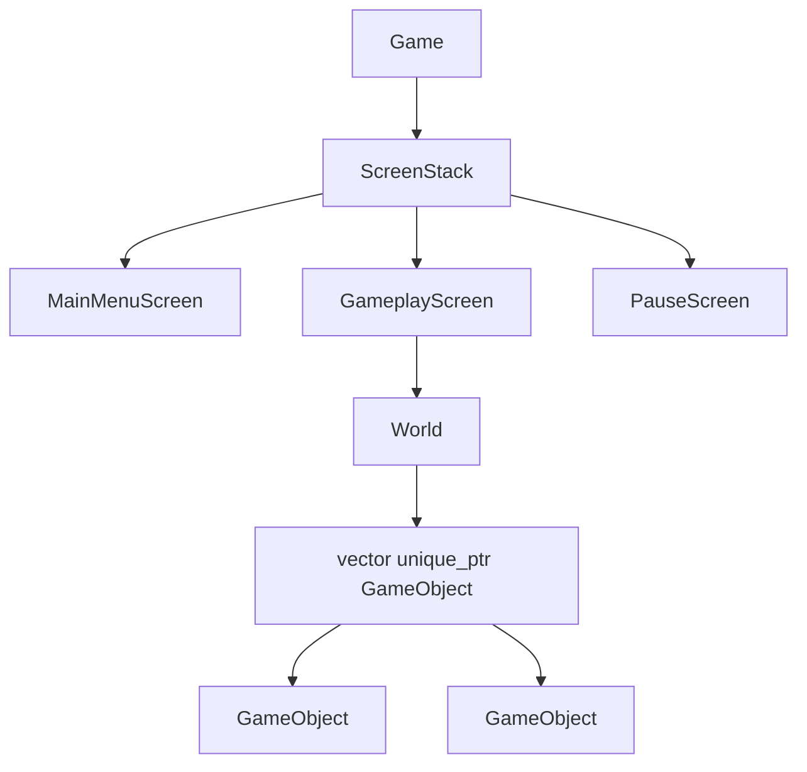
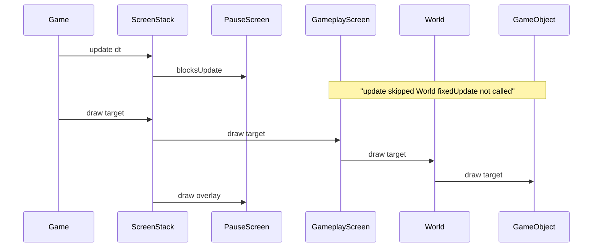
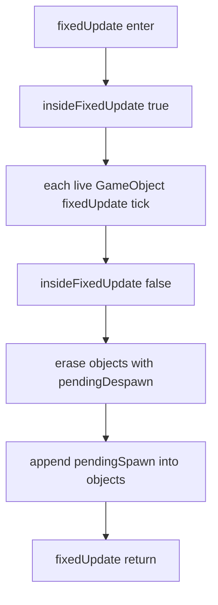

# World and GameObject

Target design. Nothing in this chapter describes types that exist on `main` today. The running tree still has only `Game` opening a 1280×720 window. When this slice is implemented later, `GameplayScreen` will own a `World`, and `World` will own `GameObject` instances.

Use the locked names from [README.md](README.md). Do not introduce `Scene`, `Entity`, `Actor`, `DummyObject`, `IManager`, or an ECS `Registry`.

## Purpose and non-goals

**Purpose.** Give gameplay a small, testable simulation that is independent of the window and of pause UI.

- `GameplayScreen` owns exactly one `World`.
- `World` owns zero or more `GameObject` instances in a `std::vector<std::unique_ptr<GameObject>>`.
- Simulation advances only when `World::fixedUpdate(sf::Time tick)` runs. `tick` is a constant length (target **1/60 s**, same fixed step as [02-application-loop.md](02-application-loop.md)).
- Drawing uses `sf::RenderTarget&` so tests and screens never hand objects a window.
- The playable slice ([08-playable-slice.md](08-playable-slice.md)) needs **one dummy**: a filled shape that translates in design space (`Game::DESIGN_SIZE`, 1280×720) and **wraps** when its origin leaves that rectangle. That single mover is enough to prove “unpaused ticks, paused freeze.”

**Non-goals.**

- **Not ECS.** No components, archetypes, systems lists, or sparse-set stores. `World` is an owner of objects plus a deferred spawn/despawn queue.
- **Not a pause controller.** `World` has no `paused` flag, no time scale, and no `if (!paused)` inside `GameObject`. Pause is “do not call `fixedUpdate`.” See [05-pause.md](05-pause.md).
- **Not a screen.** `World` is not an `IScreen`. It does not see `Action`, does not handle Escape, and does not talk to `ScreenStack`.
- **Not a loader.** `World` does not open files, parse JSON, or know how a `LevelDescriptor` was obtained. [07-levels.md](07-levels.md) will pass already-built spawn data in memory.
- **Not a window owner.** No `sf::RenderWindow&`, no `sf::View` setup, no resize handling. Those stay on `Game` ([02-application-loop.md](02-application-loop.md)).
- **Not a genre sim.** No bricks, paddles, companies, boards, or anything copied from `v0.1-arkanoid`.
- **Not a type zoo.** No `FlyingEnemy` / `WalkingEnemy` / `BossEnemy` trees. `GameObject` is a **concrete** dummy for this slice. If a second behavior appears later, prefer a member (composition) over a new subclass.
- **Not interpolated rendering.** Draw the last simulated pose. No previous-state blending.
- **Not physics.** Wrap is a position modulo, not collision, restitution, or contact.

## Ownership

`Game` owns the window, clock, and `ScreenStack`. `ScreenStack` owns screens. Only `GameplayScreen` owns a `World`. `PauseScreen` and `MainMenuScreen` do not.



Rules that follow from that graph:

| Owner | Owns | Does not own |
|-------|------|----------------|
| `GameplayScreen` | `World` (by value or `unique_ptr`; by value is enough) | Window, `ScreenStack`, other screens |
| `World` | `GameObject` instances via `unique_ptr` | Files, input, pause overlay, `LevelId` lookup tables |
| `GameObject` | Its shape and kinematic state | A back-pointer to `World` in this slice |

`GameplayScreen` is the adapter between `IScreen::update(dt)` (variable frame delta) and `World::fixedUpdate(tick)` (constant step). `World` never sees raw frame `dt`.

## Time: ticks, not a pause member

`GameObject` exposes **only** `fixedUpdate(tick)`. There is no `update(dt)`, no `setPaused`, and no speed multiplier on the object.

Who calls whom:

1. `Game` runs the fixed-step accumulator described in [02-application-loop.md](02-application-loop.md) and calls `ScreenStack` update for the frame.
2. `ScreenStack` skips `update` on a screen when a screen above it has `blocksUpdate() == true` ([04-screen-stack.md](04-screen-stack.md), [05-pause.md](05-pause.md)).
3. While `PauseScreen` sits on top of `GameplayScreen`, `GameplayScreen::update` is **not** invoked, so it cannot call `World::fixedUpdate`.
4. Objects keep their last position. Draw still happens because `PauseScreen::blocksDraw() == false`.

That is pause for this layer. A later optional time scale on `World` (slow-motion) is a different knob and is out of scope here. Do not overload `paused` to mean both.



When unpaused, `GameplayScreen::update` converts leftover frame time into zero or more constant ticks and calls `World::fixedUpdate` once per tick. Catch-up must stay capped in `Game` / the screen so a long hitch does not spiral; that policy lives in [02-application-loop.md](02-application-loop.md), not inside each `GameObject`.

If `fixedUpdate` is simply never called (tests, or a screen that forgets to forward time), objects **freeze**. That is intended, not an error.

## Design space and the dummy motion rule

Objects live in **design space**, not in the current window pixel size.

- Extent: `Game::DESIGN_SIZE` → width `1280`, height `720`.
- Origin of the dummy: the SFML shape position (top-left of the rectangle). That origin is the wrapped point. The filled area may straddle the edge for one frame; that is acceptable for a dummy.
- `Game` (not `World`) is responsible for mapping design space onto the window (`sf::View` / letterboxing on resize). `GameObject::draw` must not call `getSize()` on a window it does not have.

**Picked rule: wrap, not bounce.**

Bounce would invert velocity and start to look like collision. Wrap is one modulo per axis, easy to test, and has no contact normal.

For the playable slice the dummy is autonomous and **axis-aligned on +X**:

| Quantity | Slice value | Why |
|----------|-------------|-----|
| Shape | `sf::RectangleShape` size `{40.f, 40.f}` | Visible at 1280×720; not a sprite pipeline |
| Fill | opaque, distinct from the clear color | Player can see it move and freeze |
| Start position | `{0.f, 340.f}` | Vertically centered-ish; origin on-screen |
| Velocity | `{240.f, 0.f}` px/s | `240 / 60 = 4` px per tick; `1280 / 4 = 320` ticks per wrap |
| Tick | `sf::seconds(1.f / 60.f)` | Same constant as the application loop |
| Y motion | none | Windowless tests assert X only |

Each `fixedUpdate`:

1. `position += velocity * tick.asSeconds()`
2. Wrap X into `[0, 1280)`: while `x >= 1280` subtract `1280`; while `x < 0` add `1280`.
3. Wrap Y into `[0, 720)` the same way (no-op for the slice velocity, but the helper is general so a later Y component does not need a new policy).

Do **not** use a naive `std::fmod` on negative values without normalizing; the while-add/subtract form (or a small positive-modulo helper) is the specified behavior.

Velocity stays constant. The dummy is not player-steered in this chapter, so `Action::MoveDummy` is unnecessary. If [08-playable-slice.md](08-playable-slice.md) later wants steering, `GameplayScreen::handleAction` writes `GameObject` velocity; `GameObject` still does not know `Action` or Escape.

## Spawn and despawn (deferred when iterating)

Mid-tick `push_back` / `erase` on `objects_` invalidates iterators and is forbidden.

`World` keeps:

- `objects_` — live unique pointers
- `pendingSpawn_` — objects created during the current `fixedUpdate`
- a despawn **flag on the object** (`pendingDespawn_`), not a parallel vector of raw pointers (those dangle if another path already destroyed the object)
- `insideFixedUpdate_` — `true` only while the object loop in `fixedUpdate` is running



**Order after the object loop:** despawn first, then spawn.

- An object that requested despawn this tick **has already** run `fixedUpdate` this tick; then it is destroyed.
- A newly spawned object **does not** run `fixedUpdate` on the tick that created it. Its first tick is the next `World::fixedUpdate`. That avoids “spawn during iterate” and double-stepping.

**Immediate vs deferred.** `queueSpawn` / `requestDespawn` apply **immediately** when `insideFixedUpdate_ == false` (construction of `GameplayScreen`, tests, applying a `LevelDescriptor` before the first tick). They **queue** when `insideFixedUpdate_ == true`.

The playable dummy is spawned from `GameplayScreen`’s constructor (or an `onEnter` equivalent if [04-screen-stack.md](04-screen-stack.md) defines one), while not inside a tick, so it exists for the first draw. `World`’s constructor leaves `objects_` empty; the screen decides what to spawn. That is the seam [07-levels.md](07-levels.md) will reuse: the descriptor layer calls `queueSpawn`, `World` still does not load files.

`draw` is `const` and must not spawn or despawn.

This slice’s dummy never despawns itself. The queue still exists so later gameplay cannot “just `erase` in the loop.”

No `GameObject*` back-pointer to `World` in this slice. The dummy does not spawn children. If a later behavior must spawn mid-tick, pass a `World&` into `fixedUpdate` **then**, or have `GameplayScreen` spawn after reading a request flag. Do not add the back-pointer speculatively.

## Shallow OOP

`GameObject` is the dummy. It is not an abstract base “for later.”

Do not add `virtual` methods, a virtual destructor, or a parallel `IDrawable` until a second concrete type actually exists. `std::vector<std::unique_ptr<GameObject>>` is still the ownership type so a second type, if it ever appears, does not force `World` to change containers.

If a second behavior appears (for example “also blink” or “also follow input”):

1. Add a member or a small helper object on `GameObject` (composition).
2. Keep `fixedUpdate` / `draw` as the only per-tick surface.
3. Do not open `Enemy` / `FlyingEnemy` / `Pickup` files for one extra flag.

When (not now) two types truly have disjoint data, a second class may exist. That is a later chapter’s problem. This chapter ships one type.

## C++ signatures

Prospective declarations. Signatures only; no `.cpp` bodies. Headers will use `#pragma once`, no namespaces, `CamelCase` types, `camelCase` methods. Includes from `src/` use angle brackets. SFML 3.1 (`GIT_TAG 3.1.0`), Graphics / Window / System only.

```cpp
#pragma once

#include <SFML/Graphics/RectangleShape.hpp>
#include <SFML/Graphics/RenderTarget.hpp>
#include <SFML/System/Time.hpp>
#include <SFML/System/Vector2.hpp>

class GameObject
{
public:
    GameObject(sf::Vector2f position, sf::Vector2f velocity);

    void fixedUpdate(sf::Time tick);
    void draw(sf::RenderTarget& target) const;

    sf::Vector2f position() const;
    sf::Vector2f velocity() const;
    void setVelocity(sf::Vector2f velocity);

    void requestDespawn();
    bool isPendingDespawn() const;
};
```

```cpp
#pragma once

#include <GameObject.hpp>

#include <SFML/Graphics/RenderTarget.hpp>
#include <SFML/System/Time.hpp>

#include <cstddef>
#include <memory>
#include <vector>

class World
{
public:
    World();

    void fixedUpdate(sf::Time tick);
    void draw(sf::RenderTarget& target) const;

    void queueSpawn(std::unique_ptr<GameObject> object);

    std::size_t objectCount() const;
    const GameObject& objectAt(std::size_t index) const;
    GameObject& objectAt(std::size_t index);
};
```

Notes on that surface:

- `draw` takes `sf::RenderTarget&`, **never** `sf::RenderWindow&`. Both `World::draw` and `GameObject::draw` are `const`.
- `fixedUpdate` is the only mutator that advances simulation. There is no `pause`, `setPaused`, `timeScale`, or `update(float dt)` on either type.
- `objectAt` exists for windowless tests. Out-of-range is a precondition violation (`assert` / test-only); do not invent a parallel query API.
- Despawn is `GameObject::requestDespawn()`. `World::fixedUpdate` (and the immediate path of `requestDespawn` when not ticking) removes flagged objects. No `World::queueDespawn(std::size_t)` that could go stale mid-tick.
- `LevelId` and `LevelDescriptor` do not appear on `World`. Applying a descriptor is [07-levels.md](07-levels.md): that code will call `queueSpawn`.
- `GameplayScreen` will hold a `World` and, in `update`, call `world_.fixedUpdate(tick)` in a loop driven by the frame accumulator. Exact `IScreen` signatures stay in [04-screen-stack.md](04-screen-stack.md).

Illustrative construction of the slice dummy (not a `.cpp` body to copy blindly; names and constants are normative):

```cpp
world_.queueSpawn(std::make_unique<GameObject>(
    sf::Vector2f{0.f, 340.f},
    sf::Vector2f{240.f, 0.f}));
```

`GameObject` stores a `sf::RectangleShape` internally. Tests read `position()`, not SFML internals.

When implemented, new `.cpp` files must be listed on `gameLib` in `src/CMakeLists.txt` ([09-rollout.md](09-rollout.md)).

## Interaction with other layers

| Layer | Chapter | Boundary |
|-------|---------|----------|
| Application loop | [02-application-loop.md](02-application-loop.md) | Fixed tick length, event pump, `Closed` / resize / focus. `World` is not called from `Game` directly; `Game` updates screens. |
| Events and input | [03-events-and-input.md](03-events-and-input.md) | `InputMapper` produces `Action`. `World` and `GameObject` do not consume SFML events. Escape is never handled here. |
| Screen stack | [04-screen-stack.md](04-screen-stack.md) | `IScreen::draw(sf::RenderTarget&)`. `GameplayScreen::draw` forwards to `World::draw`. Deferred stack commands are a screen concern, not a world concern. |
| Pause | [05-pause.md](05-pause.md) | Overlay with `blocksUpdate == true`. Proof that the dummy freezes is that `World::fixedUpdate` is not entered. Do not duplicate pause inside `World`. |
| Levels | [07-levels.md](07-levels.md) | `LevelDescriptor` is data: what to spawn. `World` receives constructed objects (or spawn parameters in memory). No `World::load(path)`. |
| Playable slice | [08-playable-slice.md](08-playable-slice.md) | MainMenu → Gameplay (one wrapping rectangle) → Pause (frozen dummy, overlay) → resume or quit to menu. |
| Rollout | [09-rollout.md](09-rollout.md) | File list, `gameLib`, Debug tests. |

`GameplayScreen` may handle `Action::Pause` by requesting a push of `PauseScreen`. That request is a deferred stack command. `World` is unaware.

`MainMenuScreen` does not create a `World`. Leaving gameplay destroys `GameplayScreen` and therefore the `World`. Re-entering gameplay constructs a fresh dummy at the start pose.

## Playable-slice implications

One dummy proves the engine contract. It does not prove a genre.

**Unpaused.** The rectangle translates +X at 240 px/s in the 1280×720 design view and wraps. After a bit more than five seconds it has crossed the view once (`1280 / 240 ≈ 5.333 s` = 320 ticks). The player can see continuous motion.

**Paused.** `PauseScreen` is pushed. `GameplayScreen::update` stops. `World::fixedUpdate` is not called. The rectangle sits at its last pose while the overlay draws on top (`blocksDraw == false`). Resume (`pop`) starts ticks again from that pose, not from the origin.

**Quit to menu.** Destroying `GameplayScreen` drops the `World`. That is the only “reset.” There is no `World::reset()` required for the slice.

**What the dummy is not.** It is not a paddle, not a ball, not a company token, and not player-steered unless a later slice explicitly adds `MoveDummy` on `GameplayScreen`. Motion from ticks alone is the cleaner proof: freeze cannot be confused with “the player let go of a key.”

## Windowless tests

Tests stay Debug-only (`build_ut` / `ctest --preset debug`). They must not open an `sf::RenderWindow`. `GameObject::position()` and `World::objectCount()` / `objectAt` are the oracles. Optional draw checks may use `sf::RenderTexture` (a `RenderTarget`, not a window); they are not required to prove tick vs freeze.

Let `tick = sf::seconds(1.f / 60.f)`, `v = 240.f` px/s, `dx = 4.f` px per tick, start `x = 0.f`.

| Idea | Setup | Expect |
|------|--------|--------|
| Position after N ticks | Spawn dummy, call `world.fixedUpdate(tick)` ten times | `position().x == 40.f`, `position().y == 340.f` |
| Wrap | 320 ticks from x = 0 | `position().x == 0.f` (full period) |
| Wrap remainder | 321 ticks from x = 0 | `position().x == 4.f` |
| Wrap from near the edge | Start x = 1278.f, one tick | `position().x == 2.f` (1278 + 4 − 1280) |
| Freeze if not ticked | Spawn; do **not** call `fixedUpdate`; optionally call `draw` on a `RenderTexture` | Position unchanged from start |
| Freeze across a gap | 5 ticks, then 100 times *not* calling `fixedUpdate`, then read | Position equals the 5-tick result, not the 105-tick result |
| Spawn before first tick | `queueSpawn` in a test without `fixedUpdate` | `objectCount() == 1`; dummy exists for draw |
| Despawn deferred | During a test double that calls `requestDespawn` from inside a fake mid-tick, or: call `fixedUpdate` on an object that flags itself (only if such a hook exists later) | `objectCount()` drops **after** that `fixedUpdate` returns, not while the loop is running |
| Empty world | Default `World` | `objectCount() == 0`; `draw` is a no-op |

A dedicated freeze test is mandatory: **no motion if `fixedUpdate` is not called**, even if wall-clock time passed in the test process. Do not sleep and assume the world advanced.

Do not assert against `v0.1-arkanoid` golden images or brick grids.

## Pitfalls

- **`sf::RenderWindow&` on `draw`.** Locks objects to a real window, blocks `RenderTexture` tests, and fights `IScreen::draw(sf::RenderTarget&)`.
- **A `paused` bool on `World` or `GameObject`.** Drifts from [05-pause.md](05-pause.md). Two sources of truth will desync (overlay up but objects still tick, or overlay down but a stale flag).
- **Calling `fixedUpdate` from `GameplayScreen::draw`.** Pause would still animate; interpolation hacks belong nowhere in this slice.
- **`GameObject::update(dt)` with frame delta.** Variable step makes the 320-tick wrap test meaningless and fights the application loop.
- **Erasing inside the object loop.** Use the deferred queues. `std::unique_ptr` does not make iterator invalidation go away.
- **Raw pointers in a despawn list.** Prefer the flag on `GameObject`.
- **`World` loading files or switching on `LevelId`.** That is [07-levels.md](07-levels.md). `World` only accepts objects already in memory.
- **`World` handling Escape / `Action::Pause`.** Input dies on screens and `InputMapper` ([03-events-and-input.md](03-events-and-input.md)).
- **Querying window size for wrap.** Wrap against `Game::DESIGN_SIZE`, always 1280×720, even if the window was resized.
- **Bounce “just for polish.”** This chapter locked wrap. Do not mix policies.
- **Deep hierarchy “for extensibility.”** No `FlyingEnemy`. Composition if a second behavior appears.
- **ECS in disguise.** If the next file is `MovementSystem.cpp`, stop.
- **Copying `v0.1-arkanoid`.** Wrong branch, wrong genre types.
- **Spawning the dummy in `World::World()`.** Hard-codes content in the simulation owner and fights empty-world tests plus [07-levels.md](07-levels.md). `GameplayScreen` (later: descriptor application) spawns.
- **Forgetting `insideFixedUpdate_` on the setup path.** Then the constructor’s `queueSpawn` sits in `pendingSpawn_` until the first tick and the first frame can draw an empty world if draw ever runs before update. Immediate apply when not ticking avoids that.
- **New objects ticking on the spawn tick.** Specify they wait until the next `fixedUpdate`.
- **`shared_ptr<GameObject>`.** Unique ownership is enough.
- **Mutating during `draw`.** `draw` is `const`.
- **Starving the window because the world is paused.** `Game` still polls events while `PauseScreen` is up ([02-application-loop.md](02-application-loop.md)). Not `World`’s job, but do not “fix” pause by blocking the event pump.
- **Leaving a new `.cpp` out of `gameLib`.** The file will never compile into the game.
- **Using `std::fmod` on negative X after a leftward velocity** without normalizing into `[0, 1280)`. The wrap helper must be correct for both signs even though the slice velocity is +X.
- **Synonyms.** `Scene`, `Entity`, `Actor`, `DummyObject` are not types in this plan. The dummy **is** `GameObject`.
