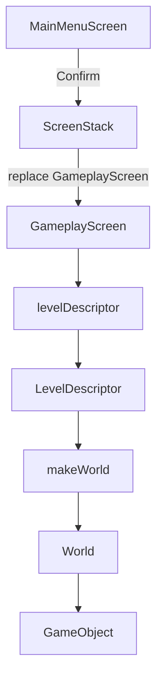
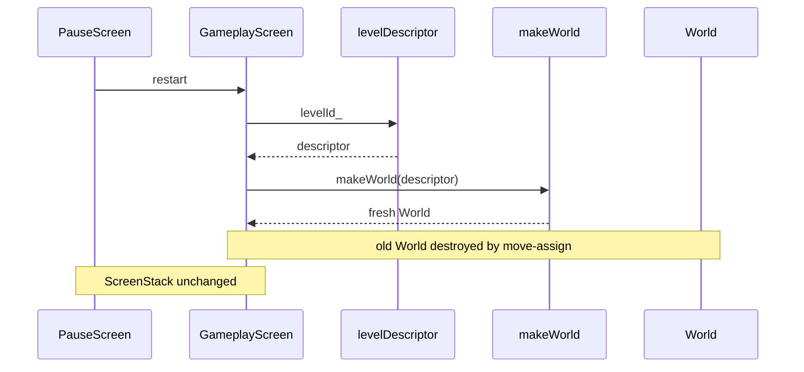
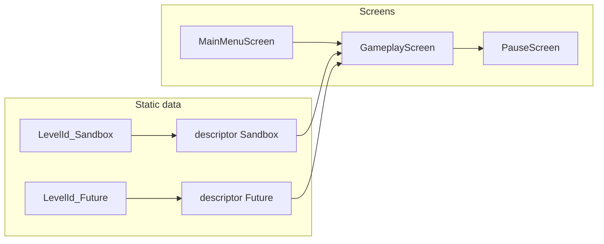

# Levels as data

This chapter is **prospective**. What landed (`LevelId::Sandbox`, `levelDescriptor`, `makeWorld`) is in [10-engine-progress.md](10-engine-progress.md) and [`docs/reference/world-and-levels.md`](../docs/reference/world-and-levels.md). File levels and a second row are **not** in the tree.

A level will be a **record of what to spawn**, not a screen subclass and not a runtime “level object” with its own `update`. `GameplayScreen` will stay the only playing `IScreen`. `LevelId` will select a `LevelDescriptor`. A small free function will turn that descriptor into a `World`. The playable slice will ship exactly one descriptor (`LevelId::Sandbox`). A later second level will be a second row of static data, not a second screen class.

## Purpose and non-goals

**Purpose.** Give `GameplayScreen` a data-driven way to build and rebuild a `World` so that:

- Starting play is `GameplayScreen{LevelId::Sandbox}` from `MainMenuScreen`, not a dedicated “sandbox screen” type.
- The dummy object(s) of [06-world-and-objects.md](06-world-and-objects.md) appear where the descriptor says, with an optional start velocity.
- Restarting play reloads **the same** descriptor into a **fresh** `World` without tearing down `GameplayScreen` or the `PauseScreen` overlay above it.
- Windowless tests can feed a descriptor to the factory and assert object count and positions without opening an `sf::RenderWindow`.
- Adding a second level later does not touch `IScreen`, `ScreenStack`, or pause wiring.

**Non-goals (this chapter and the slice).**

- JSON, YAML, binary packs, hot-reload, or a level editor. `constexpr` / static C++ data is enough. A file format is a later product decision, not an engine prerequisite.
- A `LevelManager`, catalog service, or any `*Manager` type. The README forbids inventing `IManager`. Lookup will be a free function over a static table.
- `class Level1 : public IScreen`, `class SandboxScreen : public GameplayScreen`, or per-level screen subclasses of any kind.
- Genre-specific level types (boards, waves, brick maps, campaign nodes). The descriptor will describe dummy `GameObject` spawns only.
- Copying `v0.1-arkanoid` or any other prototype branch.
- Streaming, room transitions, checkpoints, save slots, or a camera/cinematic track. The design view stays `Game::DESIGN_SIZE` (1280×720) from [`src/Game.hpp`](../src/Game.hpp).
- Resource handles inside the descriptor. SFML 3.1 is fetched with Graphics / Window / System only ([`cmake/FetchSFML.cmake`](../cmake/FetchSFML.cmake)); there is no audio pack and no product-grade resource manager in this plan.
- New `Action` values for the slice. [03-events-and-input.md](03-events-and-input.md) keeps `Confirm`, `Cancel`, `Pause`. Restart is a `GameplayScreen` method the pause overlay **may** call later; the slice does not need a `Restart` action to prove the data model.
- ECS, scripting, or an `engine/` vs `game/` split (see [README.md](README.md) non-goals).

## Why data, not a screen per level

`IScreen` is a **loop participant**: it receives events, actions, a frame delta, and a `sf::RenderTarget&`. A level is **content**: how many dummy objects exist, where they start, how fast they move. Mixing those roles produces a new screen class every time the spawn list changes, and each class re-implements pause requests, world ownership, and draw order.

The mapping the rest of the plan will keep:

| Concern | Type | Cardinality |
|---------|------|-------------|
| Playing loop + pause request | `GameplayScreen` | one class |
| Overlay that freezes world time | `PauseScreen` | one class |
| Which content to load | `LevelId` | one enumerator per descriptor |
| Spawn list and start kinematics | `LevelDescriptor` | one static record per `LevelId` |
| Live simulation | `World` | one instance owned by the current `GameplayScreen` |

`MainMenuScreen` will know `LevelId::Sandbox` (or, later, which id the player picked). It will not know spawn coordinates. `World` will not know `LevelId`. The factory will not know `IScreen`. That split is what lets [05-pause.md](05-pause.md) stay an overlay and [04-screen-stack.md](04-screen-stack.md) stay a stack of loop participants.

## Load path

`GameplayScreen` will be constructed with a `LevelId`. Construction will look up the immortal descriptor, then call the factory. The screen will store the id (cheap, copyable) and the resulting `World` (owned). It will not store a mutable copy of the descriptor; the table is the source of truth.



`ScreenStack` commands stay **deferred** until after the current frame’s update and draw ([04-screen-stack.md](04-screen-stack.md)). `MainMenuScreen` will queue **`replace`** with a newly constructed `GameplayScreen{LevelId::Sandbox}` (menu must not remain under play). The factory will run on that constructor’s thread, before the new screen is asked to `handleEvent` / `update` / `draw`. No screen will call `makeWorld` from `draw`.

## Restart: same `GameplayScreen`, fresh `World`

**Decision.** Restart will reload the same `LevelId` into a new `World` **inside** the existing `GameplayScreen`. It will **not** `replace` the screen, will **not** construct a second `GameplayScreen`, and will **not** pop `PauseScreen` as a side effect of the factory.

**Justification.**

1. **`replace` applies to the top screen.** While paused, the top of `ScreenStack` is `PauseScreen`. A restart implemented as `replace(GameplayScreen{id})` would swap the **overlay** for a new playing screen and leave the old `GameplayScreen` (and its old `World`) underneath. That is the wrong object to replace. Pop-then-replace is two deferred commands and a frame where the stack shape is easy to get wrong. Rebuilding `world_` in place does not touch the stack.
2. **Pause must not destroy play.** [05-pause.md](05-pause.md) freezes the world by pushing an overlay with `blocksUpdate == true`. `GameplayScreen` stays alive so `draw` still shows the frozen dummy. Restart is a content reset of that same screen, not a stack transition.
3. **One load path.** Construction and restart will both end at `world_ = makeWorld(levelDescriptor(levelId_))`. There will not be a second “manual spawn” routine on `GameplayScreen`.
4. **Pointer stability.** Anything that held a pointer or reference to `GameplayScreen` (the stack slot, the overlay’s “screen below”) remains valid. Only `World` and its `GameObject` instances are replaced.
5. **Accumulator hygiene.** [02-application-loop.md](02-application-loop.md) will use a fixed tick. Any leftover frame accumulator on `GameplayScreen` will reset on restart so the new `World` does not receive a burst of leftover ticks.

`PauseScreen` may later offer “restart” as UI. In that case it will call down to `GameplayScreen::restart()` (the screen below) and then either stay up (world is fresh and still frozen) or `pop` (world is fresh and starts ticking). That pop is a pause-layer decision. This chapter does not add an `Action::Restart` for the slice.



Leaving play entirely (quit to menu) remains a stack operation: `PauseScreen` will request a transition back to `MainMenuScreen` as specified in [04-screen-stack.md](04-screen-stack.md) and [05-pause.md](05-pause.md). That path **does** destroy `GameplayScreen` — because the player left the level, not because they paused or restarted.

## Slice catalog: one descriptor

The slice will define exactly one enumerator and one static record.

```text
LevelId::Sandbox  →  one dummy GameObject
                     position inside DESIGN_SIZE
                     non-zero velocity so the tick is visible
```

A future second level will add a second enumerator and a second static `LevelDescriptor`. `GameplayScreen`, `PauseScreen`, `makeWorld`, and `ScreenStack` will not gain new types. `MainMenuScreen` may later pass a different `LevelId`; that is a menu change, not a new playing screen.



`LevelId_Future` is illustrative only. The slice will not declare it. Do not pre-create empty enumerators “for later.”

## Data model

`LevelDescriptor` will be a trivial, copyable view over static storage. It will not own heap objects and will not spawn anything by itself. `SpawnSpec` is the per-object row: where the dummy starts, and optionally how it starts moving. There is no object-kind tag in the slice because [06-world-and-objects.md](06-world-and-objects.md) has a single dummy `GameObject`. A kind field can appear when a second concrete object exists; adding it now would be speculative.

The factory will be a **pure build step**: read the spawn list, construct a `World`, spawn one `GameObject` per spec, return the world. It will not cache worlds, will not talk to `ScreenStack`, and will not be a singleton.

Unknown `LevelId` values will be a programming error (an enumerator was added without a table row). The lookup will not return `std::optional` or throw for the slice; `std::unreachable()` after an exhaustive `switch` is enough. Tests will exercise the one real id, not a fake “missing level” path.

## C++ signatures

Headers will stay `#pragma once`, with no namespaces, matching [README.md](README.md) and the current scaffold. Names below are locked or mechanical companions (`SpawnSpec`, `levelDescriptor`, `makeWorld`). Do not rename them to `Scene`, `Entity`, or `LevelManager`.

```cpp
enum class LevelId
{
    Sandbox
};

struct SpawnSpec
{
    sf::Vector2f position{};
    sf::Vector2f velocity{};
};

struct LevelDescriptor
{
    LevelId id{LevelId::Sandbox};
    std::span<const SpawnSpec> spawns{};
};

const LevelDescriptor& levelDescriptor(LevelId id);

World makeWorld(const LevelDescriptor& descriptor);

class GameplayScreen : public IScreen
{
public:
    explicit GameplayScreen(LevelId levelId);

    void restart();

    bool handleEvent(const sf::Event& event) override;
    bool handleAction(Action action) override;
    void update(sf::Time dt) override;
    void draw(sf::RenderTarget& target) override;
    bool blocksUpdate() const override;
    bool blocksDraw() const override;

private:
    LevelId levelId_{};
    World world_{};
};
```

`IScreen`, `Action`, and `World` method shapes belong to [04-screen-stack.md](04-screen-stack.md), [03-events-and-input.md](03-events-and-input.md), and [06-world-and-objects.md](06-world-and-objects.md). They appear here only to show that `GameplayScreen` takes a `LevelId` and exposes `restart()`. `World` will be move-assignable so `restart()` can be `world_ = makeWorld(levelDescriptor(levelId_));`.

Suggested static table (signatures of the data, not a `.cpp` body):

```cpp
inline constexpr SpawnSpec sandboxSpawns[]{
    SpawnSpec{{0.f, 340.f}, {240.f, 0.f}},
};

inline constexpr LevelDescriptor sandboxDescriptor{
    .id = LevelId::Sandbox,
    .spawns = sandboxSpawns,
};
```

Coordinates are design-view pixels. `Game::DESIGN_SIZE` is `sf::Vector2u{1280u, 720u}`. The sandbox dummy will start on-screen with a horizontal velocity so [08-playable-slice.md](08-playable-slice.md) can show a moving shape without a second object type.

`MainMenuScreen` will not subclass anything to “be” the sandbox. It will construct play like this (call shape only):

```cpp
class MainMenuScreen : public IScreen
{
public:
    // Confirm will queue ScreenStack replace with GameplayScreen{LevelId::Sandbox}.
};
```

`makeWorld` will be a free function in its own pair (`makeWorld.hpp` / `makeWorld.cpp`) when [09-rollout.md](09-rollout.md) adds files to `gameLib`. It will not become `class WorldFactory` or `class LevelLoader`.

## Interaction with other layers

- **[README.md](README.md)** — locked names and the rule that a level is data, not a screen subclass. This chapter is item 8 in the reading order: after `World`, before the playable-slice acceptance list.
- **[01-architecture.md](01-architecture.md)** — `Game` owns the window and `ScreenStack`. `GameplayScreen` owns `World`. Descriptors are process-lifetime static data; no layer owns them uniquely.
- **[02-application-loop.md](02-application-loop.md)** — the factory runs at screen construction and on `restart()`, not in the per-frame tick. Restart clears any leftover fixed-timestep accumulator on `GameplayScreen`. The window is still polled while paused; rebuilding `World` must not open or close the window.
- **[03-events-and-input.md](03-events-and-input.md)** — `InputMapper` still emits `Action`. Level load is not an action. `GameplayScreen` will request pause the same way regardless of `LevelId`.
- **[04-screen-stack.md](04-screen-stack.md)** — enter play with `push` / `replace` of `GameplayScreen`. Leave play by returning to `MainMenuScreen`. Restart does not enqueue stack commands. `replace` remains unsafe as a restart tool while `PauseScreen` is top.
- **[05-pause.md](05-pause.md)** — overlay `blocksUpdate` freezes the current `World`. Pause must not destroy `GameplayScreen`. A future pause “restart” control will call `GameplayScreen::restart()` on the screen below, then optionally `pop`.
- **[06-world-and-objects.md](06-world-and-objects.md)** — `World` is the spawn target. `makeWorld` will call whatever spawn API that chapter defines (one dummy `GameObject` per `SpawnSpec`). `World` will not store `LevelId` and will not implement pause. Object draw stays `draw(sf::RenderTarget&)`.
- **[08-playable-slice.md](08-playable-slice.md)** — player-visible path is MainMenu → one sandbox world → pause/resume. Acceptance does not require a second `LevelId` or a restart button.
- **[09-rollout.md](09-rollout.md)** — when implemented, new sources (`LevelId.hpp`, `LevelDescriptor.hpp`, `makeWorld.hpp` / `makeWorld.cpp`) must be listed in [`src/CMakeLists.txt`](../src/CMakeLists.txt) (`gameLib`). Tests stay Debug-only.

`Game` itself will not call `levelDescriptor` or `makeWorld`. `Game` will keep constructing the window at `DESIGN_SIZE`, pumping events (including `Closed`), and ticking `ScreenStack`.

## Playable-slice implications

[08-playable-slice.md](08-playable-slice.md) will treat the following as enough:

- `MainMenuScreen` starts **one** `GameplayScreen{LevelId::Sandbox}`.
- That screen’s `World` contains **exactly one** dummy `GameObject` at the sandbox spawn position, moving under the fixed tick.
- `PauseScreen` on top stops that motion without unloading the descriptor or destroying `GameplayScreen`.
- Resume (`pop`) continues the **same** `World` (same object identity is allowed). Restart, if exposed at all, would show the dummy back at the descriptor position; the slice does not require that control to ship.

The slice will **not** include a level-select list, a second descriptor, a file load, or a “Level 2” screen. Empty-world descriptors are legal data (zero-length `spawns`) but will not be wired to the menu; they exist so the factory stays a loop, not a special case.

Player-facing proof that “levels are data” is intentionally thin: one moving dummy. The structural proof is that `GameplayScreen` takes `LevelId` and that `makeWorld` is testable without a window.

## Windowless tests

Tests will stay under [`tests/unit_tests/`](../tests/unit_tests/) and Debug-only, like today’s `smoke_test`. They will not construct `sf::RenderWindow`. SFML 3.1 `sf::Vector2f` and the descriptor table do not need a display.

Target cases:

1. **Catalog.** `levelDescriptor(LevelId::Sandbox).id == LevelId::Sandbox`. `spawns.size() == 1`. Position and velocity match the static `sandboxSpawns` row `{0.f, 340.f}` and `{240.f, 0.f}` ([06-world-and-objects.md](06-world-and-objects.md)).
2. **Factory count and pose.** `makeWorld(levelDescriptor(LevelId::Sandbox))` yields a `World` whose live object count is `spawns.size()`, and whose single dummy reports the descriptor position (and velocity, if `World` / `GameObject` expose it — [06-world-and-objects.md](06-world-and-objects.md) will define the query). Do not assert by reading private pixels.
3. **Factory is data-driven.** Build a stack `LevelDescriptor` in the test with two `SpawnSpec` values (no new `LevelId`). `makeWorld` will produce two objects at those positions. This is the regression that prevents `makeWorld` from hard-coding the sandbox.
4. **Empty descriptor.** A descriptor with an empty `spawns` span will produce a `World` with zero objects. Guards against “always spawn one dummy” shortcuts.
5. **Restart contract (no window).** Two successive `makeWorld(sameDescriptor)` results will both satisfy (2). `GameplayScreen::restart()` is specified as that assignment; if a windowless `GameplayScreen` fixture is cheap (no window, no font), assert that `restart()` restores count and position after the dummy has been ticked away from the spawn point. If constructing `GameplayScreen` pulls too much UI, test the factory twice and keep `restart()` as a one-line assign — do not open a window to prove it.
6. **Idempotent lookup.** `levelDescriptor(id)` returns a reference to static storage; two calls yield the same address. The factory must not mutate the descriptor.

`Game::DESIGN_SIZE` remains the existing smoke assertion. Level tests will not replace it.

## Pitfalls

- **Subclassing screens per level.** `class SandboxScreen : public IScreen` (or `: public GameplayScreen`) will duplicate pause requests, input, and draw, then explode when a second level appears. Content goes in `LevelDescriptor`. The playing class stays `GameplayScreen`.
- **Destroying `GameplayScreen` on pause.** Pause is a **push** of `PauseScreen`. `replace(PauseScreen{...})` would destroy the playing screen, drop the `World`, and leave nothing underneath to draw (`blocksDraw == false` would then show an empty stack). Restart that `replace`s `GameplayScreen` while paused replaces the **overlay**, not the world. Keep `GameplayScreen` on the stack from “start” until “quit to menu.”
- **`makeWorld` as a manager.** A long-lived factory object that caches worlds, holds a current `LevelId`, or registers itself with `Game` is out of scope and violates the locked-name rule. A free function plus static data is the whole catalog.
- **Hard-coding the dummy inside `GameplayScreen`.** If the constructor ignores `LevelId` and spawns a shape locally, tests (3) and (4) fail and a second level cannot exist. The screen will only look up and assign.
- **Storing a mutable descriptor on the screen.** Copying spawn rows onto `GameplayScreen` and editing them at runtime makes restart depend on dirty memory. Restart will re-read `levelDescriptor(levelId_)`.
- **JSON “because later.”** A parser, schema, and working-tree fixture path are not required to prove the slice. Static `constexpr` data is visible to windowless tests and needs no file I/O in CI.
- **Genre fields on `LevelDescriptor`.** Brick grids, tile maps, or company-sim decks belong to a future game, not this engine slice. Extra fields would leak genre into `makeWorld`.
- **Opening a window in level tests.** The current scaffold’s only window lives in `Game::run()`. Factory tests will use `World` queries. A test that creates `sf::RenderWindow` will fail on headless CI.
- **Forgetting `gameLib`.** When the rollout adds `makeWorld.cpp`, it must be listed in [`src/CMakeLists.txt`](../src/CMakeLists.txt). An unlisted `.cpp` never builds.
- **Leftover ticks after restart.** Replacing `World` but keeping a large fixed-timestep accumulator will advance the new dummy several ticks before the first presented frame, so tests that assert spawn position after `restart()` + one `update` will flake. Reset leftover time in `restart()`.
- **Identity vs content.** Resume must not rebuild the world (the dummy continues). Restart must rebuild (the dummy returns to the descriptor). Those are different operations; do not implement resume as `makeWorld`.
- **`v0.1-arkanoid`.** That branch is a different product snapshot. Do not import its level types, screen names, or file layout into this tree.
