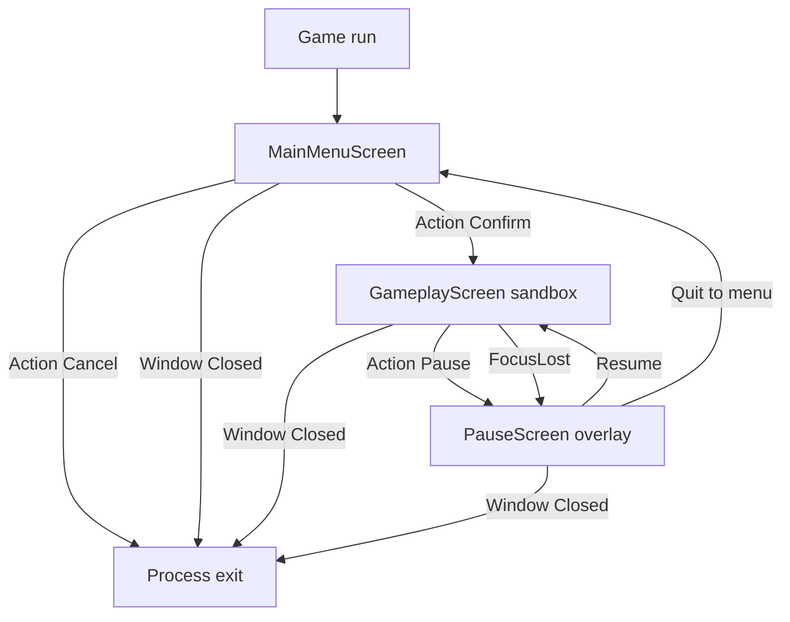
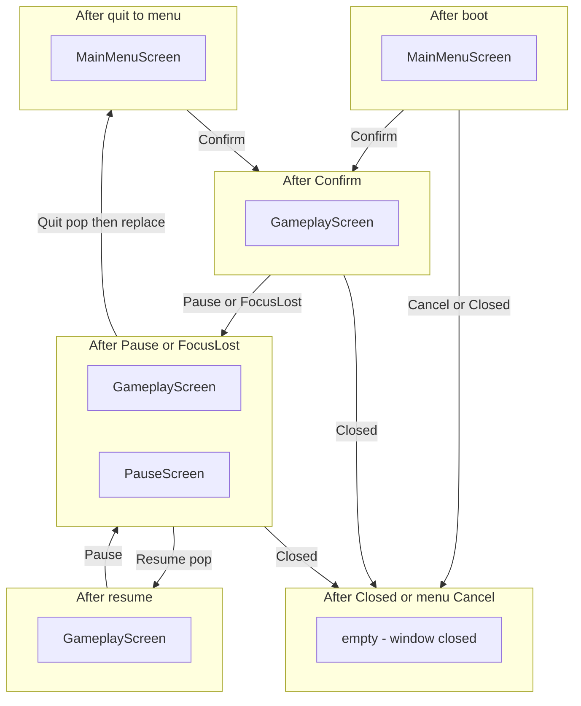
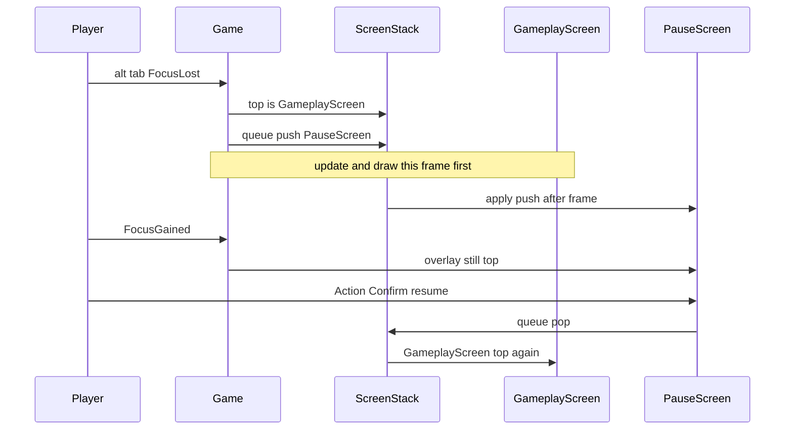
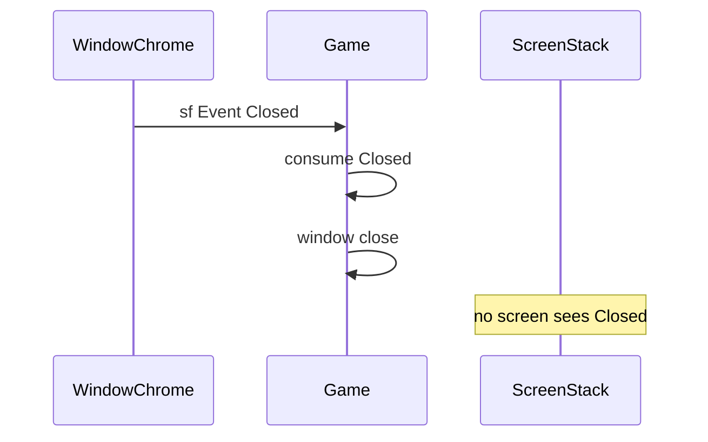

# Playable slice: player-visible acceptance

This chapter is the **acceptance contract** for the first player-visible engine slice. The other `mvp/` chapters describe how the layers will be built; this one states what a human must be able to **see and do** once those layers exist. It is target design, not a description of [`src/Game.cpp`](../src/Game.cpp) today.

Today, `Game::run()` opens a 1280×720 window titled `"Business game"`, polls `sf::Event::Closed`, clears, and displays. After this slice is implemented, the same `Game::run()` will still own that window, but the first frame will show `MainMenuScreen` on `ScreenStack` instead of an empty clear.

## Purpose

Define the smallest loop a player can complete without reading source:

1. Boot into a main menu.
2. Confirm into sandbox gameplay with one moving dummy shape.
3. Pause (action or focus loss), see the dummy freeze under a dim overlay.
4. Resume and watch the dummy continue, or quit back to a clean main menu.
5. Leave the process through `Cancel` on the menu or window chrome, both closed at the `Game` layer.

If those five beats work, the engine layers in [01-architecture.md](01-architecture.md) through [07-levels.md](07-levels.md) have met their first integration goal. [09-rollout.md](09-rollout.md) will sequence the files; this chapter will decide when the slice is **done**.

## Non-goals

This slice will not include:

- Score, lives, timer HUD, win/lose, or any second `LevelId`.
- Audio (FetchContent already forces `SFML_BUILD_AUDIO OFF`; see [`cmake/FetchSFML.cmake`](../cmake/FetchSFML.cmake)).
- A resource manager, texture atlas, or font catalogue. A one-shot `sf::Font` load so `sf::Text` can label the menu and pause overlay is an allowed expedient, not a pipeline.
- Settings, credits, level select, save/load, or a second menu screen.
- Player-steered movement (`MoveDummy`) unless a later decision makes the dummy input-driven. Autonomous translation is enough to prove `World` ticks and freezes.
- Genre rules, board-game types, or anything copied from git branch `v0.1-arkanoid`.
- Changing `Game::DESIGN_SIZE` (1280×720), the `game` / `gameLib` split, or replacing `main()`'s `Game` + `run()` model.

## What success looks like

A person who has never opened the repo launches `build/debug/bin/game.exe` (or the matching preset binary) and can complete the journey below without debug overlays or console instructions. Every transition will be visible in the window. Stack depth will be inferable from what is on screen: menu alone, moving dummy, or frozen dummy plus dim overlay.

Success is **behavioral**, not visual polish. Geometric buttons, default-looking `sf::Text`, and a single contrasting `sf::RectangleShape` or `sf::CircleShape` are enough. The dummy must move far enough in a few seconds that a freeze is obvious. Resume must continue from the same position, not respawn. Quit-to-menu must start a **new** sandbox the next time the player confirms — not a leftover `World`.

## What is explicitly not in the slice

| Present after the slice | Absent (do not treat as missing acceptance) |
|-------------------------|---------------------------------------------|
| `MainMenuScreen` with Confirm / Cancel | Score, combo, currency, or any HUD number |
| One `GameplayScreen` driven by `LevelId::Sandbox` | A second level, level select, or restart-in-place control |
| One dummy `GameObject` that translates | Multiple spawn types, collisions, or AI |
| `PauseScreen` overlay: dim + labels | Animated pause menu, blur, particles |
| `Action::Pause` and `FocusLost` → pause | Auto-resume on `FocusGained` |
| Quit overlay → fresh `MainMenuScreen` | “Are you sure?” dialog, save prompt |
| Window chrome `Closed` always ends the process | Audio cues, music, or SFML Audio |

If a reviewer asks “where is the score?” the correct answer is: **out of scope**. If they ask “why does the dummy keep moving under pause?” the slice has failed.

## Player journey



The player never jumps Boot → `GameplayScreen`. The first drawable screen will be `MainMenuScreen`. `Closed` is not a screen; it is `Game` closing `sf::RenderWindow`.

## Stack snapshots

Each box is the **entire** `ScreenStack` after deferred commands from that frame have been applied. Bottom of a subgraph is the bottom of the stack; the last node in the subgraph is the top (receives `Action` first).



Invariant after **quit to menu**: the stack is exactly one `MainMenuScreen`. There will be no leftover `PauseScreen` and no leftover `GameplayScreen`. The next Confirm will construct a new `GameplayScreen` with a new `World` from `LevelId::Sandbox`.

Invariant while **paused**: top is `PauseScreen`, immediately below is `GameplayScreen`, and nothing else. A second Pause / `FocusLost` must not push a second overlay.

## Boot

`Game::run()` will create the window at `Game::DESIGN_SIZE`, construct `ScreenStack` and `InputMapper`, and **push `MainMenuScreen` before the first poll/clear/display**. The first presented frame will be the menu, not a blank clear and not sandbox gameplay.

`main()` will stay as it is: construct `Game`, call `run()`. Boot wiring belongs inside `run()`, not in `main()`.

If the stack is empty for even one displayed frame, boot has failed. Windowless tests will assert the post-boot stack; a human will assert by seeing menu chrome (text or two labeled rectangles) immediately.

## Main menu

`MainMenuScreen` is a full-screen `IScreen` (`blocksUpdate` and `blocksDraw` both true — nothing sits under it at boot). It will present two intents, even if they are only `sf::Text` lines plus keyboard hints:

- **Confirm** → enqueue `replace` with `GameplayScreen` constructed for `LevelId::Sandbox`. After the frame, the stack is exactly that `GameplayScreen`. The menu instance is gone; it is not sitting under play.
- **Cancel** → request process exit through the same path `Game` uses for `sf::Event::Closed`. `MainMenuScreen` will not call `sf::RenderWindow::close()` itself. It will signal `Game` (or emit a close request `Game` already owns). Window chrome (title-bar X) remains consumed only by `Game`, as in [03-events-and-input.md](03-events-and-input.md).

`Action::Pause` on the menu will be ignored. `FocusLost` on the menu will not push `PauseScreen`. There is no world to freeze.

Visual bar: a dark clear colour, a title string, and two obvious actions. No sprite sheet. `sf::Text` is acceptable if one font file is loaded locally in the screen; that is not a `ResourceManager`.

## Gameplay

`GameplayScreen` will own a `World` populated from the `LevelDescriptor` for `LevelId::Sandbox` ([07-levels.md](07-levels.md)). That descriptor will spawn **one** dummy `GameObject`: a filled shape that translates every fixed tick ([06-world-and-objects.md](06-world-and-objects.md), [02-application-loop.md](02-application-loop.md)).

While `GameplayScreen` is top:

- Fixed ticks will run. The dummy will move. A human watching for two seconds will see displacement.
- `Action::Pause` will enqueue `push PauseScreen`. The dummy will keep its position; the next frames will draw it frozen under the overlay.
- `Action::Confirm` and `Action::Cancel` will not start or quit the process. Cancel during play is not window close; close remains window chrome at `Game`.
- Draw: `World` / dummy via `draw(sf::RenderTarget&)`, never `sf::RenderWindow&`. No score text.

`GameplayScreen` will not own the window, the clock, or `ScreenStack`. Pause is a stack overlay, not `if (!paused)` inside the dummy ([05-pause.md](05-pause.md)).

## Pause overlay

`PauseScreen` will be an overlay: `blocksUpdate() == true`, `blocksDraw() == false`. `Game` will still poll events and present frames so the window never starves ([02-application-loop.md](02-application-loop.md)).

**What the player sees**

1. The sandbox still drawn underneath — dummy visible at the freeze position.
2. A dimming quad (translucent `sf::RectangleShape` covering the design view).
3. Simple labels: paused state, resume, quit to menu. `sf::Text` is enough. Geometric hit-boxes or keyboard-only is enough; there is no UI toolkit.

**Resume**

Consumes Confirm (and/or Pause used as toggle). Enqueues `pop`. After the frame: stack is `GameplayScreen` only. Dummy resumes from the frozen transform; `World` did not reset.

**Quit to menu**

Must not `replace` only the top overlay — that would leave `GameplayScreen` under a new menu. Target command sequence (deferred, end of frame, order preserved):

1. `pop` — removes `PauseScreen`.
2. `replace` — swaps `GameplayScreen` for a new `MainMenuScreen`.

After apply: stack is exactly one `MainMenuScreen`. The old `World` is destroyed with `GameplayScreen`. Confirm from that menu starts sandbox from spawn.

**Cancel vs close**

On `PauseScreen`, `Action::Cancel` will mean **quit to menu**, not process exit. Process exit stays `sf::Event::Closed` at `Game`. That is the opposite of the main-menu mapping (menu Cancel exits). The difference is intentional and must be obvious in on-screen hints.

## FocusLost while playing

`Game` will consume `sf::Event::FocusLost` ([03-events-and-input.md](03-events-and-input.md)). Policy for this slice:

| Top of stack | FocusLost |
|--------------|-----------|
| `MainMenuScreen` | Ignore for pause. Menu stays. |
| `GameplayScreen` | Enqueue `push PauseScreen` (same overlay as `Action::Pause`). |
| `PauseScreen` | Do nothing. Do not stack a second overlay. |

`FocusGained` will not pop the overlay. Alt-tab away and back will leave the game paused until the player resumes. That avoids a tick burst while the player is not looking.

If `FocusLost` and `Action::Pause` happen in the same frame, `ScreenStack` will still end with **one** `PauseScreen`. Commands will be coalesced or the second push will be rejected while the top is already `PauseScreen`.



## Closed at the Game layer

`sf::Event::Closed` (title-bar X, Alt+F4 on Windows where the OS delivers it as Closed) will always be consumed by `Game` and will close the window, **regardless of which `IScreen` is top**. Screens will not need a “handle quit application” path for chrome.

`Action::Cancel` on `MainMenuScreen` will join that same close path. `Action::Cancel` on `PauseScreen` will not.



## Light signatures

Only the acceptance-facing surface. Full contracts live in sibling chapters.

```cpp
enum class Action
{
    Confirm,
    Cancel,
    Pause
};

enum class LevelId
{
    Sandbox
};

class Game
{
public:
    static constexpr sf::Vector2u DESIGN_SIZE{1280u, 720u};
    void run();
};

class IScreen
{
public:
    virtual ~IScreen() = default;
    virtual bool handleEvent(const sf::Event& event) = 0;
    virtual bool handleAction(Action action) = 0;
    virtual void update(sf::Time dt) = 0;
    virtual void draw(sf::RenderTarget& target) const = 0;
    virtual bool blocksUpdate() const = 0;
    virtual bool blocksDraw() const = 0;
};

class MainMenuScreen : public IScreen
{
public:
    bool handleAction(Action action) override;
};

class GameplayScreen : public IScreen
{
public:
    explicit GameplayScreen(LevelId levelId);
};

class PauseScreen : public IScreen
{
public:
    bool blocksUpdate() const override; // true
    bool blocksDraw() const override;   // false
};
```

`GameplayScreen(LevelId::Sandbox)` is how Confirm starts play. Lookup of `LevelDescriptor` stays inside gameplay / level data, not in `Game`.

## Interaction with other layers

Read this chapter last among the design notes, except [09-rollout.md](09-rollout.md). Links are mandatory siblings plus the plan index:

- [README.md](README.md) — locked names, consume / overlay / dummy glossary, genre ban.
- [01-architecture.md](01-architecture.md) — `Game` owns window + `ScreenStack`; `GameplayScreen` owns `World`; objects never see the window.
- [02-application-loop.md](02-application-loop.md) — fixed tick for the dummy; UI may use frame delta; poll even while paused; deferred stack commands after update and draw.
- [03-events-and-input.md](03-events-and-input.md) — SFML 3 events; `Game` consumes `Closed`, `Resized`, `FocusLost`, `FocusGained`; remainder becomes `Action` through `InputMapper`.
- [04-screen-stack.md](04-screen-stack.md) — `IScreen` push / pop / replace; top consumes `Action`; quit-to-menu is pop-then-replace, not a single naive replace of the overlay.
- [05-pause.md](05-pause.md) — overlay + `blocksUpdate`; not a flag on `GameObject`; distinct from a later `World` time scale.
- [06-world-and-objects.md](06-world-and-objects.md) — one dummy `GameObject`, `fixedUpdate` + `draw(sf::RenderTarget&)`.
- [07-levels.md](07-levels.md) — `LevelId` / `LevelDescriptor` as data; sandbox is the only id the slice will bind.
- [09-rollout.md](09-rollout.md) — which files land in `gameLib` and in which order so this checklist can actually be run.

This chapter does not add types. If a name is not in the README locked table, it does not belong in the slice.

## Playable-slice implications

This file **is** the slice. UX and acceptance are the design, not an afterthought.

### Session shape

One process, one window, three player-facing places: menu, play, pause. The mental model is a stack, but the player should not need that word. They should think: start, move, pause, continue or go back.

### First impression

Boot must not flash gameplay or a unique “loading” screen. Empty-scaffold black is acceptable only as the window clear colour **behind** menu text. If the dummy is visible before Confirm, boot is wrong.

### Confirm is the only way in

There is no cheat to spawn `GameplayScreen` from `main()`. Keyboard focus starts on Confirm. Bindings come from `InputMapper` ([03-events-and-input.md](03-events-and-input.md)); this chapter only requires that Confirm, Cancel, and Pause are reachable from a keyboard on Windows.

### Dummy as instrument

The dummy exists so a human can audit time:

- Moving ⇒ `World` is ticking and `PauseScreen` is not blocking.
- Frozen under dim ⇒ overlay is up and `blocksUpdate` is working.
- Continues after resume ⇒ pop did not reconstruct `GameplayScreen`.
- Back at spawn after quit + Confirm ⇒ `World` was destroyed.

If the dummy is too slow, too small, or matches the clear colour, the slice is untestable. Pick a high-contrast fill and the locked sandbox kinematics in [06-world-and-objects.md](06-world-and-objects.md): `{40.f, 40.f}` at `{0.f, 340.f}` with velocity `{240.f, 0.f}`, wrapping in `DESIGN_SIZE`. Stopping off-screen is not allowed (the freeze test would become “trust me”).

### Overlay readability

Dim enough that “paused” is obvious, not so opaque that the dummy disappears — freeze must remain visible. Labels must distinguish **Resume** (pop) from **Quit to menu** (clean stack) from window close. Do not label pause-Cancel as “Quit” if that word sounds like process exit; prefer “Quit to menu”.

### Input ownership by place

| Place | Confirm | Cancel | Pause | Closed | FocusLost |
|-------|---------|--------|-------|--------|-----------|
| Main menu | Start sandbox | Close process via `Game` | Ignore | Close process | Ignore |
| Gameplay | Ignore | Ignore | Push overlay | Close process | Push overlay if not paused |
| Pause | Resume (pop) | Quit to menu | Resume (pop) or ignore if already top | Close process | Ignore |

`InputMapper` may still emit Pause while the overlay is top; `PauseScreen` or `ScreenStack` will not push another overlay.

### Resize and focus chrome

`Game` will still own `Resized` and focus events. The slice will not add letterboxing UI. A resize must not crash and must not drop the stack; layout quality is not acceptance. FocusLost during play **is** acceptance.

### No audio, on purpose

Silence is correct. Do not add a stub sound API “for later”. Reviewers must not fail the slice for missing beeps.

### Restart semantics

There is no in-play Restart `Action`. The supported restart is: pause → quit to menu → Confirm. That path is the one windowless tests and the human checklist will exercise for “fresh `World`”.

### Failure modes that look like success

A dummy that stops because it hit a wall can look paused. Prefer the locked **wrap** motion ([06-world-and-objects.md](06-world-and-objects.md)). A menu that is drawn **on top of** a still-ticking world can look like a menu while the sandbox is leaking CPU and later leaking state. After quit, if Confirm continues the old dummy position, the stack was not cleaned.

## Human acceptance checklist

Run after implementation, Debug or Release binary, real window, Windows. Do not skip to unit tests; this list is the player contract.

**Boot**

- [ ] Launching the executable shows `MainMenuScreen` on the first visible frame (title / Confirm / Cancel), not an empty world and not the dummy.
- [ ] Window is 1280×720 class of size (`DESIGN_SIZE`); title still identifies the app.

**Main menu**

- [ ] Confirm enters sandbox: dummy appears and starts moving within a second.
- [ ] Cancel closes the window. Process exits. No hang.
- [ ] Title-bar close on the menu closes the window the same way (Closed at `Game`).
- [ ] Pause key on the menu does not open `PauseScreen`.

**Gameplay**

- [ ] Exactly one dummy shape moves; background is otherwise empty of gameplay chrome.
- [ ] No score, no level name requirement, no second spawn.
- [ ] Pause action pushes the overlay; dummy stops translating.
- [ ] Title-bar close during play ends the process.

**Pause overlay**

- [ ] Gameplay remains visible under a dim layer; dummy position is the freeze position.
- [ ] Overlay copy is readable (`sf::Text` or equivalent labels): paused, resume, quit to menu.
- [ ] Resume pops the overlay; dummy continues from the freeze position (not respawned).
- [ ] Pause again: still a single overlay, not stacked dimmers.
- [ ] Quit to menu shows `MainMenuScreen` only: no dimmer, no dummy.
- [ ] From that menu, Confirm starts the dummy at sandbox spawn again (new `World`).
- [ ] Title-bar close while paused ends the process (does not “quit to menu”).

**Focus**

- [ ] Alt-tab (or otherwise `FocusLost`) during play opens the same pause overlay if it was not already paused.
- [ ] Alt-tab while already paused leaves a single overlay.
- [ ] Returning focus does **not** auto-resume; Confirm/resume still required.
- [ ] Alt-tab on the main menu does not open pause.

**Out of slice (must remain absent)**

- [ ] No score or HUD counters.
- [ ] No way to load a second `LevelId`.
- [ ] No audio playback.

If every box is checked, the playable slice is accepted. Polish, extra actions, and genre content are later work.

## Windowless tests that support the slice

Tests stay Debug-only under [`tests/unit_tests/`](../tests/unit_tests/), registered like `smoke_test`, and **must not** open `sf::RenderWindow` unless a display is unavoidable. Drive `ScreenStack`, `Action`, and `World` with fakes or direct calls. Fixture names `*Should` ([tests conventions](../tests/unit_tests/CMakeLists.txt)).

Suggested cases (names indicative):

**Boot and menu**

- `ScreenStackBootShould` — after the same setup `Game::run()` will use, top is `MainMenuScreen`, size 1.
- `MainMenuConfirmShould` — `handleAction(Action::Confirm)` queues replace; after `apply`, top is `GameplayScreen`, size 1, no menu underneath.
- `MainMenuCancelShould` — Cancel raises a close request observable without a window (flag, callback, or test double for `Game`). It must not push gameplay.
- `MainMenuPauseShould` — `Action::Pause` leaves the stack unchanged.

**Gameplay and pause**

- `GameplayPauseShould` — from a stack of one `GameplayScreen`, `Action::Pause` yields `[GameplayScreen, PauseScreen]`.
- `PauseResumeShould` — `Action::Pause` or `Action::Cancel` on `PauseScreen` pops to a single `GameplayScreen`. Same `GameplayScreen` instance if the test holds a pointer; dummy tick count / position is unchanged across the paused frames. `Action::Confirm` on the overlay is quit, not resume.
- `PauseQuitShould` — after quit commands apply, size 1 and top is `MainMenuScreen`. No `PauseScreen`, no `GameplayScreen`.
- `PauseQuitThenConfirmShould` — a new `GameplayScreen` / `World`; dummy pose equals sandbox spawn, not the pre-quit pose.
- `PauseDoesNotDoublePushShould` — Pause or simulated FocusLost while top is `PauseScreen` keeps size 2.

**Focus policy (no OS focus needed)**

- `GameFocusLostWhilePlayingShould` — a testable `Game` helper or extracted policy: given top `GameplayScreen`, FocusLost queues one `PauseScreen`.
- `GameFocusLostWhilePausedShould` — no extra push.
- `GameFocusLostOnMenuShould` — stack unchanged.
- `GameFocusGainedShould` — does not pop.

**World freeze (the dummy contract)**

- `WorldTicksWhenGameplayTopShould` — N fixed ticks move the dummy by N * velocity * tick.
- `WorldDoesNotTickUnderPauseShould` — with `PauseScreen` on top (`blocksUpdate`), the same N ticks leave position unchanged.
- `SandboxDescriptorShould` — `LevelId::Sandbox` descriptor spawns exactly one `GameObject`.

**Closed**

- `GameClosedShould` — Closed is handled at `Game` even when a dummy `IScreen` is installed; the screen’s `handleEvent` does not receive Closed (or receiving it is a test failure). Existing `GameSmoke` `DESIGN_SIZE` stays.

Keep rendering tests off this list unless a headless `sf::RenderTexture` is already easy. Acceptance of dimming and text is human. Logic of stack + tick is automated.

## Pitfalls

- **Naive `replace` on quit.** Replacing `PauseScreen` with `MainMenuScreen` leaves `GameplayScreen` underneath. The player sees a menu; Confirm then stacks or fights a live `World`. Always pop overlay then replace play, or equivalent multi-command apply.
- **Confirm as `push` without updating quit.** If Confirm pushes gameplay onto the menu, quit must pop twice (pause and play) and must not replace the overlay with a second menu. Pick **replace on Confirm** as this chapter specifies, and keep tests aligned.
- **Double pause.** FocusLost and Pause in one frame, or Pause while already paused, can stack overlays. Dimmer ×2, two pops to resume. Reject push when top is already `PauseScreen`.
- **Auto-resume on FocusGained.** Convenient, wrong for this slice, and it hides whether `blocksUpdate` works.
- **Menu Cancel vs pause Cancel.** Menu Cancel exits the process; pause Cancel returns to menu. Using one global “Cancel means quit app” will fail the checklist.
- **Screens calling `window.close()`.** Breaks “Closed at `Game`”. Menu Cancel must request close; chrome stays in `Game`.
- **Pause flag on `GameObject`.** Dummy may freeze while other future objects forget the flag. Overlay `blocksUpdate` is the slice rule.
- **Destroying screens mid-`handleAction`.** Apply `ScreenStack` commands after update and draw ([02-application-loop.md](02-application-loop.md), [04-screen-stack.md](04-screen-stack.md)).
- **Empty first frame.** Pushing `MainMenuScreen` after the first `display()` fails boot acceptance.
- **Invisible dummy.** Dark shape on dark clear, or motion of 0.1 px/s, makes freeze unverifiable. Contrast and speed are acceptance, not polish.
- **Respawn on resume.** Pop must not reconstruct `GameplayScreen`. If resume looks like a new level, the stack command was replace instead of pop.
- **Stale `World` after quit.** If the menu Confirm reuses the old `GameplayScreen`, the dummy continues mid-path. Quit must destroy play.
- **Asset pipeline creep.** One font file for `sf::Text` is allowed. A `ResourceManager`, texture packing, or audio bank is not.
- **SFML Audio “just for a click”.** Audio is compiled out. Do not FetchContent it for the slice.
- **Second `LevelId` “while we are here”.** Sandbox only.
- **Score “so the slice feels like a game”.** Out of scope; it also forces HUD, fonts, and persistence questions.
- **Opening a window in unit tests.** Fails headless CI. Stack and `World` tests are windowless.
- **Forgetting `gameLib`.** New `.cpp` files must be listed in [`src/CMakeLists.txt`](../src/CMakeLists.txt) when implementation happens; this chapter does not add them.
- **Copying `v0.1-arkanoid`.** Different product, different types, banned names (`Scene`, `Entity`, …). This slice is menu / dummy / pause only.
- **Starving the window while paused.** Skipping `pollEvent` because `blocksUpdate` is true makes chrome and FocusLost dead. Always poll; skip **world** ticks only.

When implementation starts, treat the human checklist as the definition of done. If a layer chapter disagrees with a visible beat on this page, this page wins for player-facing behaviour; file the layer change in the same prospective set rather than shipping a stack the player cannot audit.