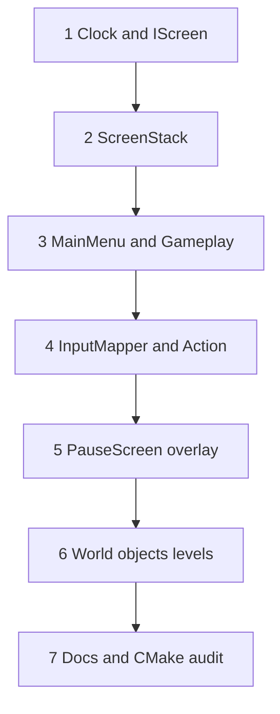
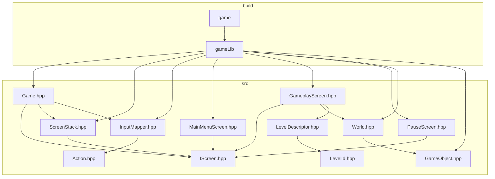
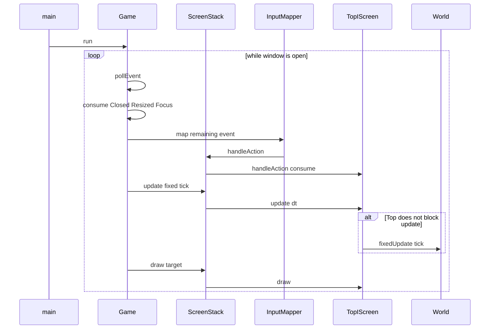

# 09 — Phased implementation rollout

This chapter is the **ordered coding plan** for the first engine slice. It does not describe code that exists today. It will be executed later, one phase at a time, against the C++23 / SFML 3.1 tree on `main`.

**In the tree today:** [10-engine-progress.md](10-engine-progress.md) (window port). This chapter stays prospective.

The empty loop in `Game::run()` (Closed, clear, display, `DESIGN_SIZE`) is the starting point to extend. Window ownership is already behind `WindowI`; later phases of this chapter still start at clock / `IScreen`. Debug tests register windowless suites via `add_unit_test` in [`tests/unit_tests/CMakeLists.txt`](../tests/unit_tests/CMakeLists.txt). SFML Audio and Network stay off ([`cmake/FetchSFML.cmake`](../cmake/FetchSFML.cmake)).

Facts about the running tree belong in [`docs/`](../docs/index.md). This file belongs in `mvp/` and will stay prospective until each phase lands.

## Purpose and non-goals

**Purpose.** Give implementers a single, ordered path from the current screenless loop to the playable slice in [08-playable-slice.md](08-playable-slice.md): **MainMenu → empty Gameplay → Pause overlay → resume or quit to menu**, with one dummy `GameObject` that moves only while unpaused. Each phase lists proposed `src/` paths, windowless tests, acceptance, and risk. Locked type names from [README.md](README.md) are the only vocabulary: `Game`, `ScreenStack`, `IScreen`, `MainMenuScreen`, `GameplayScreen`, `PauseScreen`, `InputMapper`, `Action`, `World`, `GameObject`, `LevelId`, `LevelDescriptor`.

**Non-goals.**

- Implementing any C++ in this change; this file is documentation only.
- Copying `v0.1-arkanoid` or introducing Arkanoid, board-game, or business-domain types.
- ECS, audio, networking, a product-grade resource manager, level editor, scripting, or an `engine/` vs `game/` split ([README.md](README.md) non-goals).
- Opening `sf::RenderWindow` (or otherwise requiring a display) inside GoogleTest.
- Replacing `Game::DESIGN_SIZE` or the `game` / `gameLib` / `main.cpp` executable model.
- Enabling `SFML_BUILD_AUDIO` or `SFML_BUILD_NETWORK`.
- Treating `mvp/` itself as the Diataxis source of truth; when code lands, [docs/](../docs/index.md) will be updated (phase 7), not this folder.

## Cross-cutting constraints (every phase)

These are not optional reminders at the end; they apply from phase 1.

| Constraint | Rule |
|------------|------|
| GoogleTest | Fetched and built **only in Debug**. Suites are registered with `add_unit_test(...)` in [`tests/unit_tests/CMakeLists.txt`](../tests/unit_tests/CMakeLists.txt). Release configure does not add `tests/`. |
| `smoke_test` | Remains. [`tests/unit_tests/GameSmokeTest.cpp`](../tests/unit_tests/GameSmokeTest.cpp) will keep asserting `Game::DESIGN_SIZE` is 1280×720. Do not delete or fold it into another binary. |
| `DESIGN_SIZE` | Stays `sf::Vector2u{1280u, 720u}` on `Game`. The plan extends `Game::run()`; it does not change the design resolution. |
| SFML modules | Graphics, Window, System only. No Audio, no Network. |
| `gameLib` | Every new implementation `.cpp` under `src/` will be listed in [`src/CMakeLists.txt`](../src/CMakeLists.txt) **in the same phase it is added**. Headers need not be listed. Omitting a `.cpp` means it never compiles. |
| Windowless tests | Prefer tests that do not open a window ([`docs/how-to/build-and-test.md`](../docs/how-to/build-and-test.md)). CI runs `ctest --preset debug` on Ubuntu 24.04 and Windows 2022; a hidden display is not an API. |
| Style | C++23, `#pragma once`, no namespaces, classes `CamelCase`, methods `camelCase`, one primary type per `src/` pair. Includes from `src/`: `#include <Game.hpp>`. |
| Wording in this folder | Prospective: “will”, “target design”. Never claim the architecture is already in the tree. |
| Interface name | This plan locks `IScreen`, not `ScreenI`. Do not rename to satisfy the general `FooI` suffix rule. |

Verify each coding phase with the same commands as [`docs/how-to/build-and-test.md`](../docs/how-to/build-and-test.md):

```sh
cmake --preset debug
cmake --build --preset debug --target game
cmake --build --preset debug --target build_ut
ctest --preset debug
```

## Phase dependency

Phases are strictly sequential. Later types may be *named* in earlier tests as fakes, but production types will not be introduced early to “get ahead.” Phase 5 will prove pause with a tick spy owned by `GameplayScreen`; phase 6 will replace that spy with `World` / `GameObject`. Phase 7 is a closing audit of `docs/` and CMake, but **listing new `.cpp` files in `gameLib` is required in the phase that adds them**, not deferred until phase 7.



Why this order:

1. A fixed clock is useless if `Closed` handling and the window loop regress. Introduce `IScreen` immediately so `Game::run()` never grows a second ad-hoc “mode” enum.
2. `ScreenStack` needs `IScreen` and deferred commands before any real menu exists.
3. Menu ↔ gameplay is a stack operation, not an input-mapper problem.
4. `Action` and `InputMapper` sit between the event pump and screens; `FocusLost` stays a `Game` lifecycle event that calls `ScreenStack::requestPauseOverlay()` — it is **not** mapped to `Action::Pause`.
5. `PauseScreen` is an overlay on an existing `GameplayScreen`. Pause tests need a tick counter; they do not yet need `World`.
6. `World` / `GameObject` / `LevelId` / `LevelDescriptor` complete the playable slice: a dummy that moves only while unpaused.
7. Diataxis `docs/` catch-up and a CMake/test inventory, after the slice is real.



Frame of the target loop after phase 6 (for implementers; not current code):



## Sibling chapters

Read this file last in the `mvp/` set. When a phase names a type, the detailed contract lives in the sibling, not here.

| Phase | Primary siblings |
|-------|------------------|
| 1 | [02-application-loop.md](02-application-loop.md), [01-architecture.md](01-architecture.md), [04-screen-stack.md](04-screen-stack.md) (`IScreen` only) |
| 2 | [04-screen-stack.md](04-screen-stack.md), [02-application-loop.md](02-application-loop.md) |
| 3 | [04-screen-stack.md](04-screen-stack.md), [08-playable-slice.md](08-playable-slice.md) |
| 4 | [03-events-and-input.md](03-events-and-input.md), [02-application-loop.md](02-application-loop.md) |
| 5 | [05-pause.md](05-pause.md), [04-screen-stack.md](04-screen-stack.md) |
| 6 | [06-world-and-objects.md](06-world-and-objects.md), [07-levels.md](07-levels.md), [08-playable-slice.md](08-playable-slice.md) |
| 7 | [README.md](README.md) locked rules; [docs/how-to/build-and-test.md](../docs/how-to/build-and-test.md); [docs/reference/source-layout.md](../docs/reference/source-layout.md) |

Architecture ownership ([01-architecture.md](01-architecture.md)): `Game` owns the window, clock, event pump, and `ScreenStack`. `GameplayScreen` owns `World`. `World` owns `GameObject` instances. `PauseScreen` does not own the world. `LevelDescriptor` is data, not a screen.

## Playable-slice implications

The player-visible slice in [08-playable-slice.md](08-playable-slice.md) is **not** complete until **phase 6**. Earlier phases are scaffolding that must stay shippable (window still opens, `Closed` still works, `smoke_test` still passes) but they are not the slice.

| After phase | What a human can do | Slice status |
|-------------|---------------------|--------------|
| 1 | Close the window. Dummy `IScreen` may draw nothing interesting. Fixed ticks exist. | Not playable |
| 2 | Same, plus a real stack under the dummy screen. | Not playable |
| 3 | Start on `MainMenuScreen`, enter empty `GameplayScreen`, quit if the menu already has a path. No pause overlay, no moving dummy. | Partial navigation |
| 4 | Keyboard (and `FocusLost`) map to `Action`. Still no overlay. | Input wired |
| 5 | Pause overlay freezes whatever `GameplayScreen` uses as a tick sink. Dummy object still absent. | Pause proven |
| **6** | **Dummy `GameObject` moves in `World` loaded from a `LevelDescriptor`. Pause freezes it. Resume continues. Quit to menu destroys the world.** | **Slice complete** |
| 7 | No new player-visible behavior. Docs and CMake match the tree. | Slice documented |

Phase 6 acceptance for the slice (human, with a display; not a unit test):

1. Launch `game` → `MainMenuScreen`.
2. `Action::Confirm` → `GameplayScreen` with a dummy shape translating in the 1280×720 design view.
3. `Action::Pause` or focus lost → `PauseScreen` overlay; dummy motion stops; gameplay remains visible underneath (`blocksDraw == false`).
4. Resume (`pop`) → dummy continues from the frozen pose (same world instance).
5. Quit to menu → `MainMenuScreen`; a later Confirm creates a **new** world, not a resurrected one.
6. Window chrome close → `Game` consumes `Closed` from any screen; process exits.

Until phase 6, do not treat “empty `GameplayScreen`” as failure. [08-playable-slice.md](08-playable-slice.md) allows an empty world through phase 3 by design.

## Windowless tests (inventory)

Do **not** call `Game::run()` from tests. `run()` will own `sf::RenderWindow` for the life of the process. Extract lifecycle and simulation so tests construct `ScreenStack`, `InputMapper`, `World`, and screens directly.

Fixture names will follow `*Should` ([`.cursor/rules/cmake-and-tests.mdc`](../.cursor/rules/cmake-and-tests.mdc)). Each suite is a separate `add_unit_test` binary unless a later phase has a strong reason to share one; small binaries keep CI failures readable.

| Phase | Proposed test binary | Sources under `tests/unit_tests/` | Must not |
|-------|----------------------|-----------------------------------|----------|
| stays | `smoke_test` | `GameSmokeTest.cpp` | Open a window; drop `DESIGN_SIZE` asserts |
| 1 | `fixed_timestep_test` | `FixedTimestepTest.cpp` plus a tiny drain helper tested without `Game::run` | Construct `sf::RenderWindow` |
| 1 | `iscreen_dummy_test` | `IScreenDummyTest.cpp`, test-only `SpyScreen` | Live in `src/` as a permanent type |
| 2 | `screen_stack_test` | `ScreenStackTest.cpp`, `SpyScreen` | Apply push/pop mid-`update` without a deferred queue |
| 3 | `menu_gameplay_test` | `MenuGameplayTest.cpp` | Load textures from disk as a requirement |
| 4 | `input_mapper_test` | `InputMapperTest.cpp` | Open a window to build `sf::Event` values |
| 4 | `focus_lost_test` | `FocusLostTest.cpp` | Require an OS focus change |
| 5 | `pause_blocks_ticks_test` | `PauseBlocksTicksTest.cpp` | Tick `World` before it exists; open a window |
| 6 | `world_test` | `WorldTest.cpp` | Pause flags inside `GameObject` |
| 6 | `level_descriptor_test` | `LevelDescriptorTest.cpp` | Parse a custom file format in this slice |
| 7 | (none new) | — | Remove `smoke_test` |

`SpyScreen` and other fakes will live under `tests/unit_tests/` (for example `tests/unit_tests/fakes/SpyScreen.hpp`). They will not be added to `gameLib`.

GoogleTest exists only after `cmake --preset debug`. `ctest --preset debug` is the gate. `build_ut` must depend on every new suite via `add_unit_test` so CI’s `cmake --build --preset debug --target build_ut` compiles them.

---

## Phase 1 — Clock, accumulator, and `IScreen`

**Intent.** Keep a single window loop. Add a fixed-timestep accumulator inside `Game::run()`. Prefer introducing `IScreen` immediately so the loop already talks to a screen, not a future `enum class Mode`. A file-local or test-local dummy is enough; do **not** invent `MainMenuScreen` yet.

**Why not stay screenless.** A screenless `Game::run()` that later sprouts `if (state)` blocks becomes the thing [04-screen-stack.md](04-screen-stack.md) exists to prevent. The dummy may draw nothing. That is acceptable.

### Files

| Path | Action |
|------|--------|
| [`src/Game.hpp`](../src/Game.hpp) / [`src/Game.cpp`](../src/Game.cpp) | Modify: `sf::Clock`, accumulator, fixed tick (target `1/60` s per [02-application-loop.md](02-application-loop.md)), still consume `Closed` only (Focus hooks wait for phase 4). Hold `std::unique_ptr<IScreen>` **or** a file-local dummy that implements `IScreen`. Do not add `ScreenStack` yet. |
| `src/IScreen.hpp` | **Add** (header-only). |
| `src/FixedTimestep.hpp` (optional) | **Add** only if the drain math needs a name for windowless tests. This is a helper, not a locked engine type. Do not call it `ClockManager`. |
| `tests/unit_tests/fakes/SpyScreen.hpp` | **Add** (tests only). |
| `tests/unit_tests/FixedTimestepTest.cpp` | **Add**. |
| `tests/unit_tests/IScreenDummyTest.cpp` | **Add**. |
| [`src/CMakeLists.txt`](../src/CMakeLists.txt) | List any new `src/*.cpp`. `IScreen.hpp` alone needs no listing. |

Do **not** add `DummyScreen.cpp` to `gameLib` as a permanent product type. If the live window needs a concrete screen before phase 3, keep it file-local inside `Game.cpp` or a short-lived type deleted in phase 3.

### New header signatures

`handleAction` is part of the locked `IScreen` surface in [README.md](README.md), but `Action` will not exist until phase 4. Phase 1 will ship `IScreen` **without** `handleAction`, then add that method in phase 4 when `Action.hpp` lands. Do not stub `handleAction(int)`.

```cpp
#pragma once

#include <SFML/Graphics/RenderTarget.hpp>
#include <SFML/System/Time.hpp>
#include <SFML/Window/Event.hpp>

class IScreen
{
public:
    virtual ~IScreen() = default;

    virtual bool handleEvent(const sf::Event& event) = 0;
    virtual void update(sf::Time dt) = 0;
    virtual void draw(sf::RenderTarget& target) = 0;
    virtual bool blocksUpdate() const = 0;
    virtual bool blocksDraw() const = 0;
};
```

If a drain helper is extracted for tests:

```cpp
#pragma once

#include <SFML/System/Time.hpp>
#include <cstdint>

struct FixedTimestep
{
    static constexpr sf::Time tick{sf::seconds(1.f / 60.f)};

    std::uint32_t drain(sf::Time frameDt);
    sf::Time accumulator{};
    std::uint32_t maxStepsPerFrame{8};
};
```

`Game` will keep `static constexpr sf::Vector2u DESIGN_SIZE{1280u, 720u}` and `void run();`. Phase 1 may add private helpers on `Game` that tests can call **without** opening a window (for example draining ticks into the current `IScreen`). `run()` itself stays untested.

### Tests (windowless)

- Drain helper: several `frameDt` values produce the expected number of ticks; a huge `frameDt` is capped (`maxStepsPerFrame`) so a hitch cannot spiral.
- `SpyScreen`: `update` call count increases when the test harness drains ticks; `draw` is not required to paint pixels (record that it was called, or skip draw in this phase).
- `smoke_test` unchanged: `DESIGN_SIZE` is still 1280×720.
- `Game::run()` is **not** invoked.

### Acceptance

- `cmake --build --preset debug --target game` links.
- Live window still closes on chrome `Closed`.
- `ctest --preset debug` includes `smoke_test` plus the new suites.
- `Game::run()` uses `sf::Clock` + accumulator; dummy `IScreen::update` is invoked on the fixed tick, not once per unclamped frame.
- Events are still polled every frame even if the dummy later blocks updates (the dummy will not block yet).

### Risk

- Putting the accumulator only inside an anonymous loop in `run()` makes it untestable without a window. Extract drain math.
- Calling `IScreen::update` with variable frame delta and calling that “fixed.” World time in later phases depends on this being actually fixed.
- Unbounded drain after a debugger pause (spiral of death) freezes the window. Cap steps; leftover accumulator is OK.
- Inventing `ScreenI` or a `Mode` enum “just for now.”

---

## Phase 2 — `ScreenStack` and one dummy screen; `Closed` stays in `Game`

**Intent.** Replace `Game`’s single `unique_ptr<IScreen>` with `ScreenStack`. Queue `push` / `pop` / `replace` and apply them **after** the current frame’s update and draw ([README.md](README.md) deferred command; [04-screen-stack.md](04-screen-stack.md)). `Game` still consumes `sf::Event::Closed` and closes the window. Screens never own the window.

### Files

| Path | Action |
|------|--------|
| `src/ScreenStack.hpp` / `src/ScreenStack.cpp` | **Add**. |
| `src/IScreen.hpp` | Unchanged except includes `ScreenStack` does not need. |
| [`src/Game.hpp`](../src/Game.hpp) / [`src/Game.cpp`](../src/Game.cpp) | Own `ScreenStack`. Poll → consume `Closed` → remaining events to the stack’s `handleEvent` for now. Drain ticks into `ScreenStack::update`. `draw` via `ScreenStack::draw(window)` where `window` is used as `sf::RenderTarget&`. |
| [`src/CMakeLists.txt`](../src/CMakeLists.txt) | Add `ScreenStack.cpp` to `gameLib`. |
| `tests/unit_tests/ScreenStackTest.cpp` | **Add**. |
| `tests/unit_tests/fakes/SpyScreen.hpp` | Extend: record `blocksUpdate` / `blocksDraw`, event counts, destruction. |

### New header signatures

```cpp
#pragma once

#include <IScreen.hpp>
#include <SFML/Graphics/RenderTarget.hpp>
#include <SFML/System/Time.hpp>
#include <SFML/Window/Event.hpp>

#include <memory>
#include <vector>

class ScreenStack
{
public:
    void push(std::unique_ptr<IScreen> screen);
    void pop();
    void replace(std::unique_ptr<IScreen> screen);

    bool handleEvent(const sf::Event& event);
    void update(sf::Time dt);
    void draw(sf::RenderTarget& target);

    bool empty() const;
    std::size_t size() const;

private:
    void applyDeferredCommands();
};
```

`push` / `pop` / `replace` will **record** commands and apply them in `applyDeferredCommands()` at end of frame (after update **and** draw of that frame), so no screen destructor runs in the middle of `update`/`handleEvent`/`draw`.

Walk order (target design, [04-screen-stack.md](04-screen-stack.md)):

- **Update / events:** from the top of the stack downward; stop propagating when a screen returns `blocksUpdate() == true` (for update) or consumes the event.
- **Draw:** from the bottom upward; skip screens buried under a screen with `blocksDraw() == true`.

A phase-2 dummy at the bottom will use `blocksUpdate() == false`, `blocksDraw() == false`.

### Tests (windowless)

- Push two `SpyScreen` instances; `size() == 2`.
- `pop` during `update` does not destroy the current screen until after `draw` (inspect a flag set in the destructor vs. a flag set at end of `update`).
- `replace` leaves exactly one screen.
- Top screen with `blocksUpdate() == true` prevents `update` on the screen below; top with `blocksDraw() == false` still allows `draw` on the screen below (overlay rehearsal for phase 5).
- Empty stack: defined, safe no-op or guarded; `Game` will not ship an empty stack in production, but the type must not crash in tests.
- No `sf::RenderWindow`. `draw` may use a dummy `RenderTarget` only if constructing one does not need a window; otherwise assert by spy counters and skip real drawing.

### Acceptance

- Live app: still one dummy on the stack; window closes only through `Game` on `Closed`.
- Dummy screens do not call `window.close()`.
- `ScreenStack.cpp` is in `gameLib`.
- `smoke_test` still passes.

### Risk

- Applying stack commands immediately inside `handleEvent` (use-after-free when the current screen pops itself).
- Letting a screen hold `sf::RenderWindow&` “for convenience.” Draw takes `sf::RenderTarget&` only.
- Moving `Closed` handling into the dummy screen. Then overlays and menus each reimplement quit-the-process incorrectly.
- Forgetting `ScreenStack.cpp` in `gameLib` — the header will include, the linker will not see the methods.

---

## Phase 3 — `MainMenuScreen` + `GameplayScreen` transition (empty world OK)

**Intent.** Seed the stack with `MainMenuScreen`. Confirm (still a raw key or `handleEvent` until phase 4) will `replace` or `push` `GameplayScreen`. `GameplayScreen` may be visually empty. No `World` yet. Remove any file-local dummy from `Game.cpp`.

### Files

| Path | Action |
|------|--------|
| `src/MainMenuScreen.hpp` / `src/MainMenuScreen.cpp` | **Add**. |
| `src/GameplayScreen.hpp` / `src/GameplayScreen.cpp` | **Add**. Owns nothing world-like yet; may hold a `std::uint32_t tickCount` so phase 5 has a sink. |
| [`src/Game.cpp`](../src/Game.cpp) | Push `MainMenuScreen` at startup. Delete file-local dummy. |
| [`src/CMakeLists.txt`](../src/CMakeLists.txt) | Add both `.cpp` files to `gameLib`. |
| `tests/unit_tests/MenuGameplayTest.cpp` | **Add**. |

Screens need a way to request stack commands without owning `ScreenStack`. Target design: pass `ScreenStack&` into screen constructors, **or** pass a small command sink. Do not create `IManager`. Prefer `ScreenStack&` (already a locked type) over a new interface.

### New header signatures

```cpp
#pragma once

#include <IScreen.hpp>

class ScreenStack;

class MainMenuScreen : public IScreen
{
public:
    explicit MainMenuScreen(ScreenStack& stack);

    bool handleEvent(const sf::Event& event) override;
    void update(sf::Time dt) override;
    void draw(sf::RenderTarget& target) override;
    bool blocksUpdate() const override;
    bool blocksDraw() const override;
};

class GameplayScreen : public IScreen
{
public:
    explicit GameplayScreen(ScreenStack& stack);

    bool handleEvent(const sf::Event& event) override;
    void update(sf::Time dt) override;
    void draw(sf::RenderTarget& target) override;
    bool blocksUpdate() const override;
    bool blocksDraw() const override;

    std::uint32_t tickCount() const;
};
```

`MainMenuScreen` and `GameplayScreen` will both **block** the screens below (`blocksUpdate` and `blocksDraw` true). They are not overlays. Only `PauseScreen` (phase 5) will set `blocksDraw == false`.

Until `Action` exists, `handleEvent` may look at `sf::Event::KeyPressed` for a single hardcoded Start key. Phase 4 will delete that branch.

### Tests (windowless)

- Construct `ScreenStack`, `push(MainMenuScreen)`, simulate the Start event, `apply` deferred commands (drive `update`/`draw`/`applyDeferredCommands` as `Game` will), stack top becomes `GameplayScreen` (detect via `tickCount` accessor, `dynamic_cast` in tests, or a test-only `id()` — prefer a narrow accessor on `GameplayScreen` rather than RTTI if the sibling chapter forbids it).
- `GameplayScreen::update(tick)` increments `tickCount`.
- Menu does not increment gameplay ticks (gameplay is not on the stack yet).
- No window. `draw` can be a no-op in this phase (clear color only in the live app).

### Acceptance

- Live: window opens on a menu (even a blank frame with a later-drawn label). A key enters an empty gameplay screen. `Closed` still works on both.
- Empty world is **OK**. Do not spawn `GameObject` here.
- Both new `.cpp` files are in `gameLib`.

### Risk

- Making `GameplayScreen` own the window or recreate a `RenderWindow`.
- Implementing pause in this phase “while we are here.”
- Hardcoding a second loop inside `GameplayScreen` instead of using `Game`’s accumulator.
- Genre content (bricks, boards, companies). The slice is a dummy later, not a product.

---

## Phase 4 — `InputMapper` + `Action`; `FocusLost` hook

**Intent.** `Game` consumes window lifecycle events: `Closed`, `Resized`, `FocusLost`, `FocusGained` ([README.md](README.md)). Everything else is mapped to `Action` or ignored. Top screen may **consume** an action so screens below never see it ([03-events-and-input.md](03-events-and-input.md)). `IScreen::handleAction(Action)` lands here. Raw Start-key branches in `MainMenuScreen` / `GameplayScreen` will be removed.

`Action` enumerators for this slice: `Confirm`, `Cancel`, `Pause`. Do not add movement actions unless phase 6 makes the dummy player-steered; prefer an **auto-translating** dummy so the mapper stays three values.

### Files

| Path | Action |
|------|--------|
| `src/Action.hpp` | **Add** (header-only `enum class`). |
| `src/InputMapper.hpp` / `src/InputMapper.cpp` | **Add**. |
| `src/IScreen.hpp` | Add `bool handleAction(Action action)`. |
| `src/ScreenStack.hpp` / `src/ScreenStack.cpp` | Add `handleAction`; walk from the top; stop if consumed. |
| `src/MainMenuScreen.*` / `src/GameplayScreen.*` | Switch to `handleAction`. |
| [`src/Game.cpp`](../src/Game.cpp) | Consume `Closed` (close), `Resized` (no-op beyond keeping `DESIGN_SIZE`; no extra letterbox required in this slice), `FocusLost` / `FocusGained`. On `FocusLost` call `ScreenStack::requestPauseOverlay()` (no-op if pause is already top or gameplay is not top). Do **not** map `FocusLost` to `Action::Pause`. Always poll; never skip the pump when paused. |
| [`src/CMakeLists.txt`](../src/CMakeLists.txt) | Add `InputMapper.cpp`. |
| `tests/unit_tests/InputMapperTest.cpp` | **Add**. |
| `tests/unit_tests/FocusLostTest.cpp` | **Add**. |

### New header signatures

```cpp
#pragma once

enum class Action
{
    Confirm,
    Cancel,
    Pause
};
```

```cpp
#pragma once

#include <Action.hpp>
#include <SFML/Window/Event.hpp>

#include <optional>

class InputMapper
{
public:
    std::optional<Action> map(const sf::Event& event) const;
};
```

`IScreen` after this phase:

```cpp
virtual bool handleEvent(const sf::Event& event) = 0;
virtual bool handleAction(Action action) = 0;
virtual void update(sf::Time dt) = 0;
virtual void draw(sf::RenderTarget& target) = 0;
virtual bool blocksUpdate() const = 0;
virtual bool blocksDraw() const = 0;
```

Consumption: `handleAction` and `handleEvent` return **`bool`** (`true` = consumed; stop the walk). That is locked in [03-events-and-input.md](03-events-and-input.md) and [README.md](README.md). `PauseScreen` will consume `Pause` / `Confirm` / `Cancel` so `GameplayScreen` does not toggle pause twice. `blocksUpdate` is not an action cutoff.

`handleEvent` remains for events that are not actions (unused in the slice; can be empty). Do not pass `Closed` into screens.

Focus hook: a test will call a `Game` method such as `void handleWindowEvent(const sf::Event& event)` **if** that method is extracted. If `Game` remains a thin `run()` wrapper, test `InputMapper` plus a free function / `ScreenStack` reaction instead. Do not open a window to lose OS focus.

### Tests (windowless)

- `InputMapper::map` on constructed `sf::Event::KeyPressed` values (SFML 3 events are values; no window required) yields `Confirm` / `Cancel` / `Pause` for the chosen keys, and `std::nullopt` for unmapped keys.
- Unmapped events do not become a default `Action`.
- `FocusLost` path: synthesizing `sf::Event::FocusLost` results in `requestPauseOverlay()` (spy records a push request when gameplay is top). It must **not** appear as `Action::Pause` on a mapper spy. `FocusGained` does not auto-resume (resume is `Pause` or `Cancel` on `PauseScreen` in phase 5).
- `Closed` is not mapped to `Action`; a spy screen must not see it if `Game` consumed it. Test via a small pump helper, not `run()`.

### Acceptance

- Menu Start uses `Action::Confirm`, not a leftover raw key if-statement.
- `GameplayScreen` will request pause via `Action::Pause` in phase 5; in this phase it may ignore `Pause` or no-op.
- `InputMapper.cpp` is in `gameLib`. `Action.hpp` is not listed.
- Audio/Network still off.

### Risk

- Mapping `Closed` to `Cancel` and letting the menu “handle quit” by leaking window ownership.
- Polling `sf::Keyboard` in four screens **and** mapping events, so one physical key fires twice.
- Adding `MoveDummy` / `MoveLeft` “for completeness.” Locked slice actions are three values.
- Implementing `FocusLost` by pausing inside `GameObject` (`if (!paused)`), which [05-pause.md](05-pause.md) forbids.

---

## Phase 5 — `PauseScreen` overlay + tests that pause blocks world ticks

**Intent.** `GameplayScreen` reacts to `Action::Pause` by `push`ing `PauseScreen` through `requestPauseOverlay()`. Overlay flags: `blocksUpdate == true`, `blocksDraw == false` ([README.md](README.md), [05-pause.md](05-pause.md)). Resume is `pop` (`Action::Pause` or `Action::Cancel`). Quit to menu is **`pop` then `replace(MainMenuScreen)`** so the overlay is not the object replaced.

**World does not exist yet.** “Blocks world ticks” in this phase means: `GameplayScreen::update` (and its `tickCount` sink) is **not** called while `PauseScreen` is on top, because `ScreenStack` honors `blocksUpdate`. Phase 6 will keep the same test and point the sink at `World::fixedUpdate`.

Pause is **not** `if (!paused)` inside a future `GameObject`. Pause is not a `World` flag. Optional later time scale (slow-mo) is out of scope.

### Files

| Path | Action |
|------|--------|
| `src/PauseScreen.hpp` / `src/PauseScreen.cpp` | **Add**. |
| `src/GameplayScreen.*` | On `Action::Pause`, `stack.push(std::make_unique<PauseScreen>(stack))`. |
| `src/MainMenuScreen.*` | Unchanged except any Cancel-to-quit policy. |
| [`src/CMakeLists.txt`](../src/CMakeLists.txt) | Add `PauseScreen.cpp`. |
| `tests/unit_tests/PauseBlocksTicksTest.cpp` | **Add**. |

### New header signatures

```cpp
#pragma once

#include <IScreen.hpp>

class ScreenStack;

class PauseScreen : public IScreen
{
public:
    explicit PauseScreen(ScreenStack& stack);

    bool handleEvent(const sf::Event& event) override;
    bool handleAction(Action action) override;
    void update(sf::Time dt) override;
    void draw(sf::RenderTarget& target) override;
    bool blocksUpdate() const override;
    bool blocksDraw() const override;
};
```

`blocksUpdate()` will return `true`. `blocksDraw()` will return `false`. `draw` may tint or draw a label; it must not clear the whole target in a way that erases gameplay (clear remains `Game`’s job once per frame, then the stack draws bottom-up).

### Tests (windowless)

This is the critical suite for the slice’s pause guarantee.

1. Stack: `GameplayScreen` then `push PauseScreen` (or drive `Action::Pause` on gameplay).
2. Record `GameplayScreen::tickCount()`.
3. Call `ScreenStack::update(tick)` many times.
4. Assert `tickCount` is **unchanged**.
5. `handleAction(Action::Pause)` or `handleAction(Action::Cancel)` on `PauseScreen` → `pop` applied after the frame. `Action::Confirm` on the overlay is quit-to-menu, not resume.
6. Further `update` calls **increase** `tickCount` again.
7. Quit-to-menu: after deferred apply, `GameplayScreen` is destroyed (spy destructor or stack size/top identity); a new gameplay push starts `tickCount` at 0.

Also assert `GameplayScreen::draw` is still invoked while paused (overlay does not block draw). If draw is a no-op, assert a `drawCount` spy on gameplay.

Do **not** construct `World` here. Do **not** open a window.

### Acceptance

- Live: from gameplay, Pause key and (if wired) `FocusLost` show the overlay; gameplay frame remains visible; closing the window still works.
- `PauseScreen.cpp` is in `gameLib`.
- `smoke_test` still passes.

### Risk

- Setting `blocksDraw == true` on pause (gameplay disappears; overlay looks like a new mode).
- Toggling a `bool paused` on `GameplayScreen` **and** pushing an overlay (double pause, resume only clears one).
- Updating `GameplayScreen` from `PauseScreen` via a back-pointer “to keep animations.” Overlay UI may use frame delta on `PauseScreen::update` only.
- Writing this test with `sf::RenderWindow` so CI becomes display-dependent.
- Skipping the test because `World` is “next phase” — the sink exists now for a reason.

---

## Phase 6 — `World`, dummy `GameObject`, `LevelId` / `LevelDescriptor` sandbox

**Intent.** Complete the playable slice. `GameplayScreen` owns `World`. `World` runs a **fixed** timestep and has **no pause flag**. Spawning comes from `LevelDescriptor` keyed by `LevelId`, not from a screen subclass ([07-levels.md](07-levels.md), [06-world-and-objects.md](06-world-and-objects.md)). One dummy `GameObject` (the base type itself, or a test-local subclass) translates in the design view. Pause continues to work **because the stack stops calling `GameplayScreen::update`**, which is the only caller of `World::fixedUpdate`.

Do not implement ECS. Do not add `Entity`. Composition over a deep `GameObject` tree; a single dummy type is enough.

### Files

| Path | Action |
|------|--------|
| `src/GameObject.hpp` / `src/GameObject.cpp` | **Add**. Shallow base **or** the dummy itself. `fixedUpdate(tick)`, `draw(sf::RenderTarget&)`. |
| `src/World.hpp` / `src/World.cpp` | **Add**. Spawn / despawn, `fixedUpdate`, `draw`. No `setPaused`. |
| `src/LevelId.hpp` | **Add** (header-only). Cheap identifier. |
| `src/LevelDescriptor.hpp` | **Add** (header-only or with `.cpp` if tables need a home). Data: what to spawn. |
| `src/GameplayScreen.*` | Construct `World` from a `LevelDescriptor` for a sandbox `LevelId`. Forward `update` → `World::fixedUpdate`. Forward `draw` → `World::draw`. Remove the stand-in `tickCount` or implement it as “how many times `World::fixedUpdate` ran” for tests. |
| [`src/CMakeLists.txt`](../src/CMakeLists.txt) | Add `GameObject.cpp`, `World.cpp`, and any `LevelDescriptor.cpp`. |
| `tests/unit_tests/WorldTest.cpp` | **Add**. |
| `tests/unit_tests/LevelDescriptorTest.cpp` | **Add**. |
| `tests/unit_tests/PauseBlocksTicksTest.cpp` | **Update**: freeze is observed on dummy pose / world tick count, not only a screen counter. |

### New header signatures

```cpp
#pragma once

#include <SFML/Graphics/RenderTarget.hpp>
#include <SFML/System/Time.hpp>
#include <SFML/System/Vector2.hpp>

class GameObject
{
public:
    virtual ~GameObject() = default;

    virtual void fixedUpdate(sf::Time tick) = 0;
    virtual void draw(sf::RenderTarget& target) = 0;
};
```

If the slice uses one concrete dummy and no further subclasses, `GameObject` may be non-abstract (methods non-pure) and still be the dummy. Tests may then construct `GameObject` directly. Prefer that over inventing `DummyMover` as a product type.

```cpp
#pragma once

#include <GameObject.hpp>
#include <SFML/Graphics/RenderTarget.hpp>
#include <SFML/System/Time.hpp>

#include <memory>
#include <vector>

class World
{
public:
    void spawn(std::unique_ptr<GameObject> object);
    void fixedUpdate(sf::Time tick);
    void draw(sf::RenderTarget& target);
};
```

```cpp
#pragma once

enum class LevelId
{
    Sandbox
};
```

```cpp
#pragma once

#include <LevelId.hpp>
#include <SFML/System/Vector2.hpp>

struct SpawnSpec
{
    sf::Vector2f position{};
    sf::Vector2f velocity{};
};

struct LevelDescriptor
{
    LevelId id{LevelId::Sandbox};
    std::span<const SpawnSpec> spawns{};
};
```

`GameplayScreen` will take a `LevelDescriptor` (or look one up from a static table of one sandbox row). It will not become `class SandboxScreen`.

Objects **never** receive `sf::RenderWindow&`.

### Tests (windowless)

- `World::spawn` a dummy; `fixedUpdate(tick)` N times; dummy translation equals `N * velocity * tick.asSeconds()` (or equivalent public pose accessor for tests).
- `World` has no `pause` API; pausing is not tested on `World` in isolation except as a negative: calling `fixedUpdate` always moves the dummy.
- `PauseBlocksTicksTest`: with `GameplayScreen` + `PauseScreen`, dummy pose is unchanged across paused updates; after pop, pose advances again.
- `LevelDescriptor` for `LevelId::Sandbox` produces the dummy spawn used by `GameplayScreen` (table lookup or constructor). No JSON, no custom file parser in this slice.
- Still no `Game::run()`, no window.

### Acceptance

- Human slice in [08-playable-slice.md](08-playable-slice.md) is complete (see **Playable-slice implications** above).
- Dummy moves only while `PauseScreen` is absent.
- `DESIGN_SIZE` still 1280×720; dummy is authored in that space.
- New `.cpp` files are in `gameLib`.
- `ctest --preset debug` green, including updated pause tests.

### Risk

- ECS, `Entity`, component registries, or copying `v0.1-arkanoid` brick/paddle types.
- Putting `bool paused` on `World` or `GameObject` because the overlay “felt indirect.”
- Passing `sf::RenderWindow&` into `draw`.
- Loading levels from disk with a new format before a single in-code descriptor works.
- Skipping `gameLib` listings for `World.cpp` / `GameObject.cpp`.
- Player-steered dummy that forces new `Action` values without updating [03-events-and-input.md](03-events-and-input.md). Prefer auto-move.

---

## Phase 7 — Docs in `docs/`, `gameLib` listing, Debug tests, `smoke_test`, `ctest`

**Intent.** No new engine types. After phase 6 the slice exists; this phase makes **Diataxis `docs/`** and CMake match the tree. `mvp/` stays a prospective plan until someone later marks chapters implemented; **do not** treat `mvp/` as the source of truth for the running product.

This audit is listed last, but every earlier phase already listed new `.cpp` files. Phase 7 is the sweep that catches drift.

### Files (not under `src/` product types)

| Path | Action when code has landed |
|------|-----------------------------|
| [`docs/index.md`](../docs/index.md) | Add any new how-to/reference pages to the map table. |
| [`docs/reference/source-layout.md`](../docs/reference/source-layout.md) | List new `src/` pairs, `gameLib` sources, new `add_unit_test` binaries. Set `last_reviewed`. |
| [`docs/how-to/build-and-test.md`](../docs/how-to/build-and-test.md) | Mention new suites; keep Debug-only GoogleTest; keep `smoke_test`. |
| [`docs/tutorials/getting-started.md`](../docs/tutorials/getting-started.md) | First-run path: menu, not only “empty window,” if that is now true. |
| [`docs/explanation/roadmap.md`](../docs/explanation/roadmap.md) | Direction: engine slice exists; still no commercial genre. |
| New `docs/how-to/` or `docs/reference/` pages | Only if a new workflow or layout fact has no home; register them in `docs/index.md`. |
| [`src/CMakeLists.txt`](../src/CMakeLists.txt) | Final `gameLib` inventory (below). |
| [`tests/unit_tests/CMakeLists.txt`](../tests/unit_tests/CMakeLists.txt) | Every suite uses `add_unit_test`; `build_ut` depends on all of them. |
| `mvp/*.md` | Optional status notes only; **not** a substitute for `docs/`. |

### Target `gameLib` after phase 6 (proposed)

```cmake
add_library(gameLib
    STATIC
        Game.cpp
        ScreenStack.cpp
        MainMenuScreen.cpp
        GameplayScreen.cpp
        PauseScreen.cpp
        InputMapper.cpp
        World.cpp
        GameObject.cpp
)
```

Header-only: `IScreen.hpp`, `Action.hpp`, `LevelId.hpp`, `LevelDescriptor.hpp` (unless a `.cpp` was justified). If `FixedTimestep` became a `.cpp`, list it. `main.cpp` stays on the `game` executable only.

### Tests (windowless)

No new gameplay tests. Re-run the full Debug suite:

```sh
cmake --preset debug
cmake --build --preset debug --target game
cmake --build --preset debug --target build_ut
ctest --preset debug
```

Release: `cmake --preset release` then `cmake --build --preset release --target game`. Tests must **not** be required in Release (root [`CMakeLists.txt`](../CMakeLists.txt) adds `tests/` only in Debug).

### Acceptance

- `docs/` `related_code` paths match files that exist.
- `smoke_test` still registered and passing.
- CI-equivalent path in [`.github/workflows/ci.yml`](../.github/workflows/ci.yml) still: Debug `build_ut` + `ctest --preset debug`, Release `game` only.
- No Audio/Network flags flipped in [`cmake/FetchSFML.cmake`](../cmake/FetchSFML.cmake).
- `DESIGN_SIZE` documentation still says 1280×720.

### Risk

- Updating only `mvp/` and leaving `docs/` stale (agents treat `docs/` as truth).
- Registering tests with raw `add_executable` instead of `add_unit_test`, so `build_ut` and CI skip them.
- Enabling GoogleTest in Release “so contributors can test optimized builds” — out of scope; this repo’s contract is Debug-only tests.
- Adding `SFML::Audio` because pause “should have a sound.”

---

## C++ signatures — full target surface (after phase 6)

Collected for implementers. Bodies are out of scope here. Details and invariants live in sibling chapters.

| Header | Role |
|--------|------|
| `src/Game.hpp` | `DESIGN_SIZE`, `run()`; owns window, clock, mapper, stack |
| `src/IScreen.hpp` | Virtual screen protocol |
| `src/ScreenStack.hpp` | Deferred push/pop/replace |
| `src/Action.hpp` | `Confirm`, `Cancel`, `Pause` |
| `src/InputMapper.hpp` | Event → optional `Action` |
| `src/MainMenuScreen.hpp` | Start / quit |
| `src/GameplayScreen.hpp` | Owns `World`; requests pause |
| `src/PauseScreen.hpp` | Overlay |
| `src/World.hpp` | Fixed sim, spawn, no pause flag |
| `src/GameObject.hpp` | `fixedUpdate`, `draw(RenderTarget&)` |
| `src/LevelId.hpp` | Cheap id |
| `src/LevelDescriptor.hpp` | Spawn data |

`Game` target methods beyond `run()` will exist only as needed to keep tests windowless (for example a testable event consume helper). Do not grow a second public façade.

## Pitfalls

1. **Forgetting `gameLib` listing.** A new `src/Foo.cpp` that is not in [`src/CMakeLists.txt`](../src/CMakeLists.txt) never compiles. The header will include in tests; the linker will fail or, worse, an old object file will mask the omission until CI. List the `.cpp` in the **same phase** that adds it.

2. **Opening windows in tests.** `Game::run()` creates `sf::RenderWindow`. Unit tests that call it hang CI, fail on headless Ubuntu, or depend on a display. Drive `ScreenStack`, `InputMapper`, and `World` directly. Do not create `RenderWindow` to build `sf::Event` values. Do not use `RenderTexture` if it requires a GL context on the CI image; spy `draw` calls instead of checking pixels.

3. **Implementing ECS.** The locked world model is `World` + a shallow `GameObject`. No entities, archetypes, systems lists, or `IManager`. If a dummy needs two data fields, put them on the dummy, not in a component store.

4. **Staying screenless in `Game::run()` after phase 1.** A `switch (appState)` next to the accumulator is a second stack. `IScreen` is the extension point.

5. **Moving `Closed` into screens.** Every overlay then needs an emergency exit. `Game` consumes `Closed` in every phase.

6. **Pause as an object flag.** `if (!paused)` in `GameObject::fixedUpdate` will desync from the overlay, break quit-to-menu, and fight any later time scale. Pause is `PauseScreen::blocksUpdate()`.

7. **Starving the window.** Skipping `pollEvent` while paused makes `Closed` lag and fill the OS queue. Always poll ([02-application-loop.md](02-application-loop.md)).

8. **Unbounded accumulator.** After a breakpoint, draining thousands of ticks before `display` looks like a freeze. Cap steps per frame in phase 1.

9. **Deferred commands applied too early.** `pop` inside `handleAction` must not destroy `this` before the function returns.

10. **Draw taking `sf::RenderWindow&`.** Locks tests and future render textures. Signature is `draw(sf::RenderTarget&)`.

11. **Renaming `IScreen` to `ScreenI`.** Locked name wins over the general `FooI` convention.

12. **Copying `v0.1-arkanoid`.** Wrong genre, wrong types, wrong pause. This tree is an empty scaffold plus this plan.

13. **Audio / Network “while we are in CMake.”** [`cmake/FetchSFML.cmake`](../cmake/FetchSFML.cmake) forces both off. Leave them off.

14. **Changing `DESIGN_SIZE`.** Tests, view, and dummy spawn are authored for 1280×720. Letterboxing, if any, is a later `Resized` policy, not a new design size.

15. **Dropping `smoke_test`.** It is the CI canary for the constant and for the Debug GoogleTest path. New suites join it; they do not replace it.

16. **Documenting only in `mvp/`.** When code lands, [docs/](../docs/index.md) must change (phase 7 and incrementally). `mvp/` is the plan.

17. **Release `ctest`.** There is no `ctest --preset release` in [`CMakePresets.json`](../CMakePresets.json). Do not invent one as part of this slice.

18. **Inventing synonyms.** No `Scene`, `StateMachine`, `Entity`, `IManager`, `ScreenI`, `PauseManager`.

## Definition of done (whole rollout)

The rollout is done when phases 1–7 have been implemented in order, `ctest --preset debug` is green with `smoke_test` plus the new windowless suites, `gameLib` lists every new `.cpp`, `docs/` matches the tree, SFML Audio/Network remain off, `Game::DESIGN_SIZE` is still 1280×720, and a human can perform the phase-6 playable slice without any Arkanoid, ECS, or `v0.1-arkanoid` types in `src/`.
