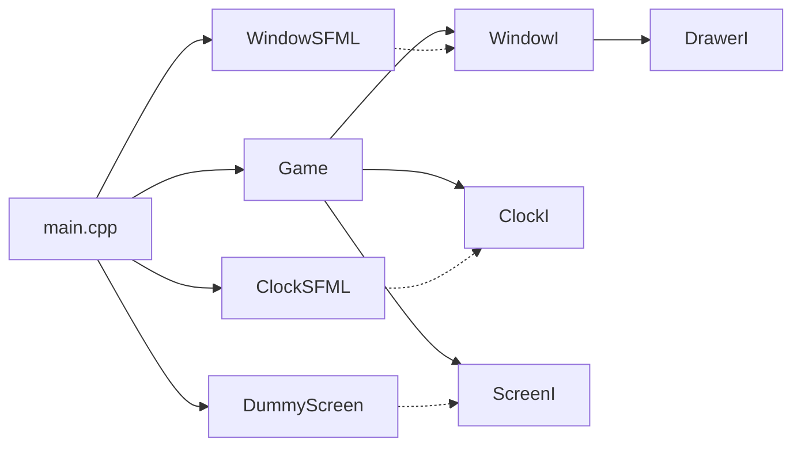
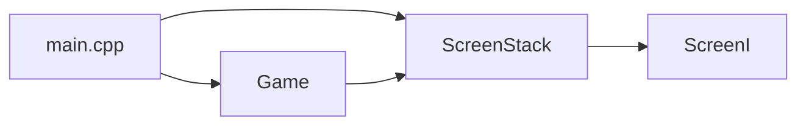

# Engine implementation progress

This file is the **living register** of names and files that exist in the tree. [`01`](01-architecture.md)–[`09`](09-rollout.md) stay **prospective** (target design, wording “will”). Do not rewrite those chapters into “already implemented.” Facts about running code also belong in [`docs/`](../docs/index.md).

## Conventions in the tree

| Rule | In this tree |
|------|----------------|
| Interfaces | Suffix `FooI` (example: `WindowI`, `ClockI`, `DrawerI`, `ScreenI`) |
| `mvp/` names with prefix `I` | Remap when that type lands — do not edit 01–09 |
| Directories | No `engine/` vs `game/` split ([README.md](README.md) non-goal). Window: `src/window/`. Time: `src/time/`. Screen port: `src/screen/`. Process loop: `Game` in `src/` |
| SOLID | One `WindowI` (inherits `DrawerI` because `ScreenI` must not see `close()`) |
| `gameLib` vs SFML | `gameLib` compiles `Game.cpp` and `ScreenStack.cpp` with **SFML headers only** (no SFML / OpenGL link). `WindowSFML.cpp` and `ClockSFML.cpp` live on executable `game` |

### Name remap (when those types are added)

| Locked in 01–09 | Name to use in `src/` |
|-----------------|------------------------|
| `IScreen` | `ScreenI` (landed) |
| (other `IFoo` from mvp) | `FooI` |

Until a row is implemented, the mvp spelling in 01–09 is still the design vocabulary for those chapters.

## Slice log

Check a box only after that slice is on `main`. Paths are what landed, not a promise of future files.

| # | Slice | Status | In the tree |
|---|-------|--------|-------------|
| 0 | Scaffold: `Example` in `gameLib`; empty window loop | done (loop moved in slice 1) | `src/Example.*` |
| 1 | Window port | **done** | see slice 1 |
| 2 | Clock + `DrawerI` + `ScreenI` | **done** | see below |
| 3 | `ScreenStack` | **done** | see below |
| 4 | Main menu + gameplay screens | not-started | — |
| 5 | `InputMapper` + `Action` | not-started | — |
| 6 | Pause overlay | not-started | — |
| 7 | World, objects, levels | not-started | — |

Next slice (menu / gameplay screens) starts only after names and signatures are agreed in chat. Do not invent them here.

### Slice 1 — window port (landed)

- [x] `WindowI` — `isOpen`, `close`, `pollEvent`, `clear`, `display` (now also `DrawerI`)
- [x] `WindowSFML` — adapter on `sf::RenderWindow`; framerate cap 60
- [x] `Game` — process loop; holds `WindowI&`, **not** `sf::RenderWindow`; `DESIGN_SIZE` `{1280u, 720u}`
- [x] `main.cpp` — wires adapters + `Game`
- [x] `WindowMock` + `GameTest`
- [x] CMake: `Game.cpp` in `gameLib`; `WindowSFML.cpp` on `game`

`pollEvent` returns `std::optional<sf::Event>`. That is a test seam for the window, not a full platform abstraction.

### Slice 2 — clock, `DrawerI`, `ScreenI` (landed)

- [x] `ClockI` / `ClockSFML` — `restart`, `getElapsedTime`; adapter on `game`
- [x] `FixedTimestep` — `tick` 1/60 s, `accumulatorMax` 0.25 s, `drain`
- [x] `DrawerI` — `draw(const sf::Drawable&)`; `WindowI` inherits it
- [x] `ScreenI` — `handleEvent`, `update`, `draw(DrawerI&)`, `blocksUpdate`, `blocksDraw` (no `handleAction`)
- [x] `Game` — Closed in `Game`; leftover events to the (then single) screen; drain unless `blocksUpdate`; `update(tick)` N times; `clear` / `draw` / `display`
- [x] File-local dummy screen in `main.cpp`
- [x] `ClockMock`, `ScreenSpy`, `FixedTimestepTest`, extended `GameTest`

| Path | Role |
|------|------|
| [`src/window/WindowI.hpp`](../src/window/WindowI.hpp) | Window port (`DrawerI`) |
| [`src/window/DrawerI.hpp`](../src/window/DrawerI.hpp) | Draw seam |
| [`src/window/WindowSFML.hpp`](../src/window/WindowSFML.hpp) / [`.cpp`](../src/window/WindowSFML.cpp) | SFML window adapter (`game`) |
| [`src/time/ClockI.hpp`](../src/time/ClockI.hpp) | Clock port |
| [`src/time/ClockSFML.hpp`](../src/time/ClockSFML.hpp) / [`.cpp`](../src/time/ClockSFML.cpp) | SFML clock adapter (`game`) |
| [`src/time/FixedTimestep.hpp`](../src/time/FixedTimestep.hpp) | Drain helper |
| [`src/screen/ScreenI.hpp`](../src/screen/ScreenI.hpp) | Screen port |
| [`src/Game.hpp`](../src/Game.hpp) / [`Game.cpp`](../src/Game.cpp) | Loop (`gameLib`) |
| [`src/main.cpp`](../src/main.cpp) | Wires adapters + dummy + `Game` |
| [`tests/mocks/window/WindowMock.hpp`](../tests/mocks/window/WindowMock.hpp) | gmock window |
| [`tests/mocks/time/ClockMock.hpp`](../tests/mocks/time/ClockMock.hpp) | gmock clock |
| [`tests/unit_tests/fakes/ScreenSpy.hpp`](../tests/unit_tests/fakes/ScreenSpy.hpp) | counters |
| [`tests/unit_tests/GameTest.cpp`](../tests/unit_tests/GameTest.cpp) | `game_test` |
| [`tests/unit_tests/FixedTimestepTest.cpp`](../tests/unit_tests/FixedTimestepTest.cpp) | `fixed_timestep_test` |

### Slice 3 — `ScreenStack` (landed)

- [x] `ScreenStack` — `push` / `pop` / `replace`; apply private (immediate when idle, after `draw` when dispatched)
- [x] Walk: events/update top-down; draw from highest `blocksDraw` upward
- [x] `Game(WindowI&, ClockI&, ScreenStack&)`
- [x] Dummy `push` in `main`
- [x] `ScreenStackTest` + `GameTest` on a stack with `ScreenSpy`

| Path | Role |
|------|------|
| [`src/screen/ScreenStack.hpp`](../src/screen/ScreenStack.hpp) / [`.cpp`](../src/screen/ScreenStack.cpp) | Stack (`gameLib`) |
| [`tests/unit_tests/ScreenStackTest.cpp`](../tests/unit_tests/ScreenStackTest.cpp) | `screen_stack_test` |
