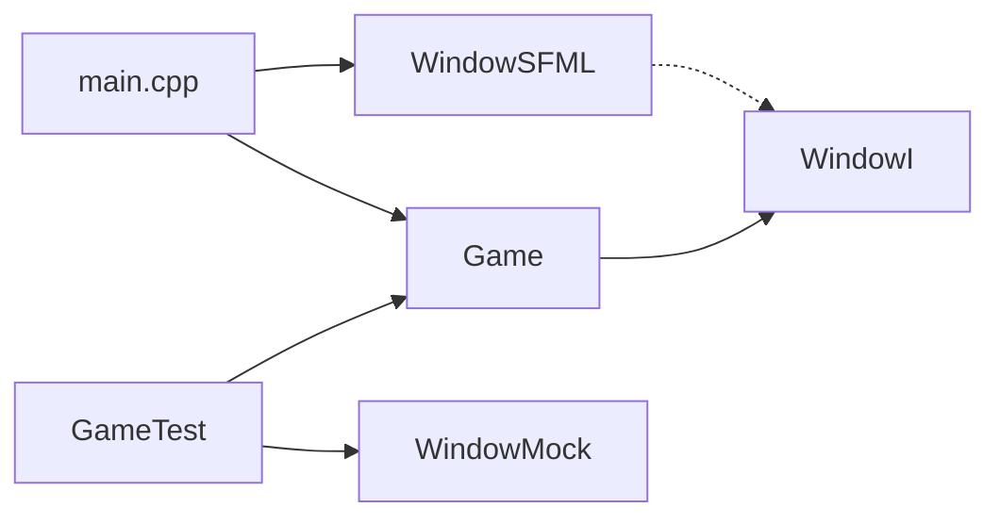

# Engine implementation progress

This file is the **living register** of names and files that exist in the tree. [`01`](01-architecture.md)–[`09`](09-rollout.md) stay **prospective** (target design, wording “will”). Do not rewrite those chapters into “already implemented.” Facts about running code also belong in [`docs/`](../docs/index.md).

## Conventions in the tree

| Rule | In this tree |
|------|----------------|
| Interfaces | Suffix `FooI` (example: `WindowI`) |
| `mvp/` names with prefix `I` | Remap when that type lands — do not edit 01–09 |
| Directories | No `engine/` vs `game/` split ([README.md](README.md) non-goal). Window port: `src/window/`. Process loop: `Game` in `src/` |
| SOLID (slice 1) | One `WindowI` (ISP later, when a second consumer needs a narrower facet) |
| `gameLib` vs SFML | `gameLib` compiles `Game.cpp` with **SFML headers only** (no SFML / OpenGL link). `WindowSFML.cpp` lives on executable `game` |

### Name remap (when those types are added)

| Locked in 01–09 | Name to use in `src/` |
|-----------------|------------------------|
| `IScreen` | `ScreenI` |
| (other `IFoo` from mvp) | `FooI` |

Until a row is implemented, the mvp spelling in 01–09 is still the design vocabulary for those chapters.

## Slice log

Check a box only after that slice is on `main`. Paths are what landed, not a promise of future files.

| # | Slice | Status | In the tree |
|---|-------|--------|-------------|
| 0 | Scaffold: `Example` in `gameLib`; empty window loop | done (loop moved in slice 1) | `src/Example.*`; window no longer inline in `main.cpp` |
| 1 | Window port | **done** | see below |
| 2 | Clock + `ScreenI` (mvp/09 phase 1, remapped) | not-started | — |
| 3 | `ScreenStack` | not-started | — |
| 4 | Main menu + gameplay screens | not-started | — |
| 5 | `InputMapper` + `Action` | not-started | — |
| 6 | Pause overlay | not-started | — |
| 7 | World, objects, levels | not-started | — |

Next slice (clock / `ScreenI`) starts only after names and signatures are agreed in chat. Do not invent them here.

### Slice 1 — window port (landed)

- [x] `WindowI` — `isOpen`, `close`, `pollEvent`, `clear`, `display`
- [x] `WindowSFML` — adapter on `sf::RenderWindow`; framerate cap 60
- [x] `Game` — process loop; holds `WindowI&`, **not** `sf::RenderWindow`; `DESIGN_SIZE` `{1280u, 720u}`; title `"Business game"` at construction in `main`
- [x] `main.cpp` — `WindowSFML` + `Game{window}.run()`
- [x] `WindowMock` + `GameTest` — windowless; Closed → `close` / `clear` / `display`
- [x] CMake: `Game.cpp` in `gameLib`; `WindowSFML.cpp` on `game`

`pollEvent` returns `std::optional<sf::Event>`. That is a test seam for the window, not a full platform abstraction (`Game` still consumes SFML 3 events, as in [03](03-events-and-input.md)).

| Path | Role |
|------|------|
| [`src/window/WindowI.hpp`](../src/window/WindowI.hpp) | Port |
| [`src/window/WindowSFML.hpp`](../src/window/WindowSFML.hpp) / [`.cpp`](../src/window/WindowSFML.cpp) | SFML adapter (`game` only) |
| [`src/Game.hpp`](../src/Game.hpp) / [`Game.cpp`](../src/Game.cpp) | Loop (`gameLib`) |
| [`src/main.cpp`](../src/main.cpp) | Wires adapter + `Game` |
| [`tests/mocks/window/WindowMock.hpp`](../tests/mocks/window/WindowMock.hpp) | gmock |
| [`tests/unit_tests/GameTest.cpp`](../tests/unit_tests/GameTest.cpp) | `game_test` |
