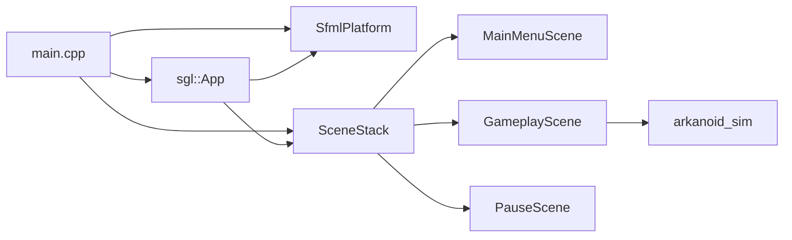

# Engine implementation progress

This file is the **living register** of names and files that exist in the tree. [`01`](01-architecture.md)–[`09`](09-rollout.md) stay **prospective** (target design, wording “will”). Do not rewrite those chapters into “already implemented.” Facts about running code also belong in [`docs/`](../docs/index.md).

## Conventions in the tree

| Rule | In this tree |
|------|----------------|
| Interfaces | Suffix `FooI` (`SceneI`, `RendererI`, `PlatformI`, `ClockI`) |
| `mvp/` names with prefix `I` | Remap when that type lands — do not edit 01–09 |
| Directories | Engine split **landed**: `engine/` (`sgl`) and `games/arkanoid/` (`sgl::arkanoid`, executable `arkanoid`). Contract: [`docs/explanation/architecture.md`](../docs/explanation/architecture.md) |
| SFML | Only `engine/sfml` and `games/arkanoid/main.cpp` include SFML. `arkanoid/sim` stays headless |
| CMake | Each module owns its `CMakeLists.txt` |

### Name remap (when those types are added)

| Locked in 01–09 | Name to use in the tree |
|-----------------|------------------------|
| `IScreen` | `SceneI` (landed) |
| (other `IFoo` from mvp) | `FooI` |

Until a row is implemented, the mvp spelling in 01–09 is still the design vocabulary for those chapters.

## Slice log

Check a box only after that slice is on `main`. Paths are what landed, not a promise of future files.

| # | Slice | Status | In the tree |
|---|-------|--------|-------------|
| 0–10 | Pre-cutover breakout under former `src/` | **superseded** | removed at cutover; historical notes below |
| 11 | Engine split | **done** | see Slice 11 |
| 12 | Phase II: `sgl`, Arkanoid fixes, Tetris | **in progress** | contract in [`architecture.md`](../docs/explanation/architecture.md); boxes below stay open until the code lands |

Three stages and four power-ups live in `arkanoid_sim` / `arkanoid_app`. `01`–`09` stay prospective design notes.

### Slices 0–10 — pre-cutover (historical)

Slices 0–10 built the former `src/` breakout (`ScreenStack`, `World`, stages, power-ups). That tree is **gone**. Do not treat those paths as current. Detail lives in git history if needed; current facts are in [`docs/`](../docs/index.md) and Slice 11.

### Slice 11 — engine split (landed)

- [x] `sgl_core` — Vec2, Rect, Handle, Image, Features
- [x] `sgl_input` — InputEvent, ActionMap, InputState
- [x] `sgl_scene` — SceneI, SceneStack, SceneRequest, SceneTraits
- [x] `sgl_loop` — FixedStepLoop, App, PlatformI, ClockI
- [x] `sgl_render` — RenderQueue, DrawCommand, Projection
- [x] `sgl_collision` — intersect, sweep, reflect
- [x] `sgl_resources` — ResourceCache, ResourceError
- [x] `sgl_sfml` — SfmlPlatform, EventTranslate, SfmlRenderer, SfmlAssets, SfmlClock
- [x] `arkanoid_sim` — headless State / step / levels / power-ups
- [x] `arkanoid_app` — MainMenuScene, GameplayScene, PauseScene, HUD, assets, bindings
- [x] executable `arkanoid` — `games/arkanoid/main.cpp`
- [x] Headless tests under `tests/engine/` and `tests/arkanoid/` (`event_translate_test` links SFML::Window, opens no window)

| Path | Role |
|------|------|
| [`docs/explanation/architecture.md`](../docs/explanation/architecture.md) | Contract |
| [`docs/reference/source-layout.md`](../docs/reference/source-layout.md) | Targets and suites |
| [`docs/reference/arkanoid-sim.md`](../docs/reference/arkanoid-sim.md) | Sim rules |
| [`docs/reference/arkanoid-app.md`](../docs/reference/arkanoid-app.md) | Scenes and HUD |

### Slice 12 — Phase II (locked, not landed)

Namespace `sgl`, targets `sgl_*`, games `sgl::arkanoid` and `sgl::tetris`. New modules: `sgl_audio`, `sgl_fx`, `sgl_save`. Simulation randomness is `sgl::Pcg32` only. Timed effects are data. Tetris sim stays headless (grid, SRS, DAS/ARR).

- [x] Rename `eng` → `sgl` (includes, namespaces, targets)
- [x] Input edges survive a zero-step frame; multi-key `held` stays down
- [x] Rounded circle-vs-AABB sweep
- [x] Arkanoid paddle, speed, and seam fixes
- [x] Power-ups as `std::variant` with pure derived values
- [x] `AudioI`, `sgl_fx`, `sgl_save` (modules)
- [x] Tetris grid, shapes, SRS, and headless `TetrisGame`
- [x] Tetris app and executable `tetris`
- [x] Arkanoid result overlay and `arkanoid.scores` (capacity 5)
- [x] Tetris sounds, particles, and `tetris.scores` (capacity 5)
