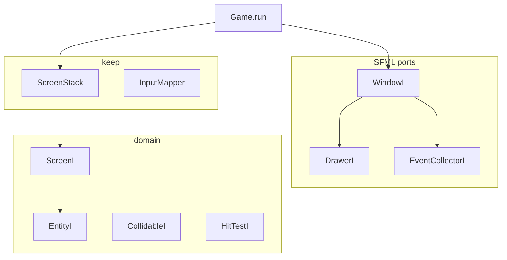
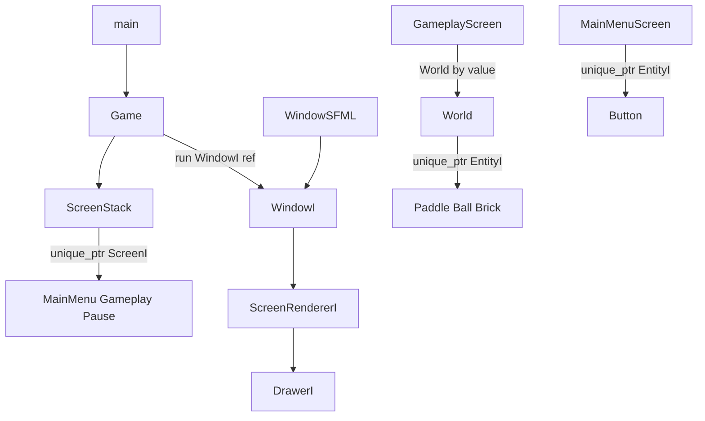
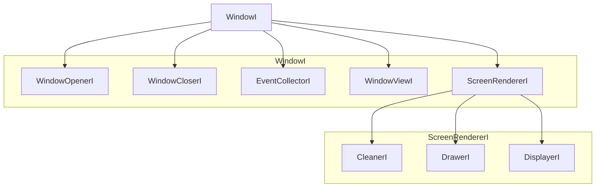

# FooI interface base (v0.1 ports + ScreenStack)

## Purpose

Lock the **next engine base**: v0.1-style `FooI` ports (especially `WindowI` / `DrawerI` / `EntityI`) on top of the **current `ScreenStack`** (overlays, consume, deferred commands). This chapter **supersedes naming** in [README.md](README.md) chapters 01–09 (`IScreen`, `GameObject`, `draw(sf::RenderTarget&)`) for work after 2026-09-20. Do not rewrite 01–09; they stay historical.

Facts about **today’s tree** live in [`docs/`](../docs/index.md). This file is the **target** until the waves land.

## Non-goals

- Port `v0.1-arkanoid` 1:1 (`EventController`, `KeyboardManagerI` as a process-wide registry, `ScreenI::display()`, `GameController` as a second loop).
- Rewrite [`mvp/01–09`](README.md).
- Fonts / `ResourceManager`, letterbox, ECS, GMock of all of SFML.

## Three bases

| | **v0.1-arkanoid** | **mvp/01–09** | **Current main (before this chapter)** |
|--|--|--|--|
| Names | `ScreenI`, `EntityI`, `DrawerI`, `WindowI` | `IScreen`, `GameObject`, `draw(RenderTarget&)` | `IScreen`, `GameObject`, `IDrawer` |
| Window | `WindowI` + `WindowMock` in UT | `Game` owns `sf::RenderWindow` | same + `SfmlDrawer` |
| Screens | `ScreenController`; `update` top only; `display()` | `ScreenStack` + consume + pause overlay | mvp stack + Arkanoid |
| Input | global managers; entities register in ctor | `handleEvent` on the screen | paddle keys in `GameplayScreen::handleEvent` |
| Pause vs input | entity callbacks still fire under overlay | `blocksUpdate` was meant to cut input (04) | **gap:** pause does not consume raw keys; paddle flags still set |
| Entities | `EntityI` = update + draw (Button fits) | dummy `GameObject` | Paddle/Ball/Brick **require** `position`/`bounds` — Button does not fit |

Target = **v0.1 names and SFML ports** + **ScreenStack consume/overlay** + **thinner `EntityI` than `GameObject`**.



## Ownership (target)



`World` remains the unique owner of gameplay entities. `GameplayScreen` may cache raw `Paddle*` / `Ball*` (non-owning). Menu buttons are **not** in `World`.

## WindowI facets (keep and improve)

v0.1 split the window so tests can mock poll/clear/display without constructing `sf::RenderWindow`.



### Target signatures

```cpp
struct WindowOpenerI {
    virtual ~WindowOpenerI() = default;
    virtual bool isOpen() const = 0;
};

struct WindowCloserI {
    virtual ~WindowCloserI() = default;
    virtual void close() = 0;
};

struct EventCollectorI {
    virtual ~EventCollectorI() = default;
    virtual std::optional<sf::Event> pollEvent() = 0;
};

struct CleanerI {
    virtual ~CleanerI() = default;
    virtual void clear(const sf::Color& color = sf::Color::Black) = 0;
};

struct DrawerI {
    virtual ~DrawerI() = default;
    virtual void draw(const sf::Drawable& drawable,
                      const sf::RenderStates& states = sf::RenderStates::Default) = 0;
};

struct DisplayerI {
    virtual ~DisplayerI() = default;
    virtual void display() = 0;
};

struct ScreenRendererI : CleanerI, DrawerI, DisplayerI {};

struct WindowViewI {
    virtual ~WindowViewI() = default;
    virtual void setView(const sf::View& view) = 0;
    virtual sf::Vector2u getSize() const = 0;
};

struct WindowI : WindowOpenerI, WindowCloserI, ScreenRendererI, EventCollectorI, WindowViewI {};

class Game {
public:
    static constexpr sf::Vector2u DESIGN_SIZE{1280u, 720u};
    void run();            // constructs WindowSFML, delegates
    void run(WindowI&);    // unit-testable; tests must not construct WindowSFML
};
```

`WindowSFML` is the only production impl (`sf::RenderWindow` member, framerate 60, key repeat off). `SfmlDrawer` may remain as a `DrawerI` adapter around an arbitrary `sf::RenderTarget` (e.g. future render texture); `WindowSFML` also **is-a** `DrawerI`.

`handleWindowEvent` takes `WindowCloserI&` (or `WindowI&`) instead of `sf::RenderWindow&`. `Closed` → `close()`. `FocusLost` → `ScreenUpdaterI::requestPauseOverlay()`.

## ScreenI and ScreenUpdaterI (keep stack, rename, narrow DI)

Keep [`ScreenStack`](../src/ScreenStack.hpp). Extract the navigation port screens actually need:

```cpp
class ScreenUpdaterI {
public:
    virtual ~ScreenUpdaterI() = default;
    virtual void requestPush(std::unique_ptr<ScreenI> screen) = 0;
    virtual void requestPop() = 0;
    virtual void requestReplace(std::unique_ptr<ScreenI> screen) = 0;
    virtual void requestClose() = 0;
    virtual void requestPauseOverlay() = 0;
};

class ScreenI {
public:
    virtual ~ScreenI() = default;
    virtual bool handleEvent(const sf::Event& event) = 0;
    virtual bool handleAction(Action action) = 0;
    virtual void update(sf::Time dt) = 0;
    virtual void draw(DrawerI& drawer) = 0;
    virtual bool blocksUpdate() const = 0;
    virtual bool blocksDraw() const = 0;
    virtual bool isGameplay() const { return false; }
    virtual bool isPauseOverlay() const { return false; }
};
```

`ScreenStack` implements `ScreenUpdaterI`. Screens hold `ScreenUpdaterI&`, not the full stack, when possible.

Do **not** bring back `ScreenControllerI` / `GameController`: they duplicate `ScreenStack` + `Game::run(WindowI&)`.

### Pause vs input (lock)

Today `handleEvent` walks top → bottom until consume, **ignoring** `blocksUpdate`. `PauseScreen::handleEvent` returns `false`, so Left/Right still set paddle flags under the overlay.

**Lock:** after calling `handleEvent` / `handleAction` on a screen, **stop the walk if `blocksUpdate()`**. The overlay still receives the event; gameplay entities under it do not. Test: while pause is top, `handleEvent(Left)` must not change paddle move flags.

`Game::run` still skips `stack.update` when `pauseIsTop()` (no catch-up ticks). That freeze stays.

## EntityI (improve v0.1 and current GameObject)

v0.1 `EntityI` was `update(float)` + `draw(DrawerI&)`. Current `GameObject` also requires `position` / `bounds`, which a menu `Button` should not fake.

```cpp
class EntityI {
public:
    virtual ~EntityI() = default;
    virtual void fixedUpdate(sf::Time tick) = 0; // Button / static: empty
    virtual void draw(DrawerI& drawer) const = 0;
    virtual bool alive() const { return true; }
};

class CollidableI : public EntityI {
public:
    virtual sf::Vector2f position() const = 0;
    virtual sf::FloatRect bounds() const = 0;
};

struct HitTestI {
    virtual ~HitTestI() = default;
    virtual bool contains(sf::Vector2i pixel) const = 0;
};
```

- `Paddle` / `Ball` / `Brick` : `CollidableI`
- `Button` : `EntityI` + `HitTestI` (menu only)
- `World` : `vector<unique_ptr<EntityI>>`; collisions `dynamic_cast<CollidableI*>`

Keep `fixedUpdate(sf::Time)` (not v0.1 `update(float)`). Tick length is [`FixedTimestep::tick`](../src/FixedTimestep.hpp).

## v0.1 types — keep / improve / drop

| Type | Verdict | Why |
|------|---------|-----|
| **WindowI** + facets | **Keep + improve** | Only way to mock poll/clear/display without a GPU window. `IDrawer` becomes `DrawerI`. `WindowViewI` lands as `setView` / `getSize`; letterbox later. |
| **ScreenUpdaterI** | **Keep + improve** | Screens should not depend on the whole `ScreenStack`. |
| **ScreenControllerI** / **GameController** | **Drop** | `ScreenStack` + `Game::run(WindowI&)`. |
| **EventCollectorI** | **Keep** (facet of WindowI) | `pollEvent` behind a mock. |
| **EventControllerI**, **EventManagers**, **ManagerOf** | **Drop** | Global dispatch fights the stack: pause cannot unhook paddle. `Closed` / `Focus*` stay in `Game`. |
| **KeyboardManagerI** | **Drop as global** | Ctor registration on `Paddle` outlives the overlay. Keys stay on the **top** `ScreenI::handleEvent`. Per-screen `KeyBinderI` only if `GameplayScreen` bloats later. |
| **MouseManagerI** | **Drop as global** | Hover/click: `HitTestI` + events on `MainMenuScreen`. No process-wide `ManagedList`. |
| **OnClickHandler** / **OnHoverHandler** | **Simplify** | Methods on `Button` + screen hit-test. Do not inherit a handler base that registers on a global mouse manager. |
| **GameExitManagerI** | **Drop** | `Closed` → `WindowCloserI::close()` in `Game`. |
| **GameWindowManagerI** | **Defer** | No letterbox in this slice. Keep `WindowViewI` on the window. |
| **ResourceManager** | **Defer** | No fonts/text yet. |
| **EntityI** | **Keep + split CollidableI / HitTestI** | One type for anything drawn on a screen; physics and hit-test are extra ports. |

## Advantages of the hybrid

1. **Unit tests** can drive `Game::run(WindowI&)` with `WindowMock` (open → one empty poll → close) without `opengl32` draw-to-window. Draw walk still uses `DrawerI` mocks (`NullDrawer` / `DrawerMock`).
2. **Pause overlays** work: `blocksDraw == false` still paints gameplay; `blocksUpdate` freezes ticks **and** (after the lock) cuts entity input.
3. **Buttons and bricks share `EntityI`** without forcing AABB on UI.
4. **No second event bus.** Screen-scoped `handleEvent` is the bus. Global managers were the v0.1 feature that made pause leaky.
5. **Names match** `.cursor/rules/cpp-conventions.mdc` (`FooI`) and the old branch, so ports read like v0.1 without importing its controllers.

## Pitfalls

- **Global `KeyboardManagerI`:** looks object-oriented, but the paddle’s lambda is not on the stack. Overlay cannot stop it without extra “enabled” flags. Do not reintroduce it.
- **`handleEvent` without `blocksUpdate`:** the current leak (paddle flags while paused). The input walk lock is mandatory.
- **`Game::run()` only:** if production still constructs `RenderWindow` inline and tests never call `run(WindowI&)`, `WindowI` is unused theatre. The wave must add a windowless loop test.
- **Fat `EntityI`:** putting `bounds()` on every entity recreates `GameObject`. Keep `CollidableI` separate.
- **`ScreenI&` vs `ScreenUpdaterI&` cycles:** pause overlay still needs `requestPauseOverlay` on the updater; gameplay still needs it for Escape. Do not pass `ScreenStack*` “for convenience” into entities.
- **Letterbox in Wave 1:** `WindowViewI` exists; `GameWindowManager` does not. `Resized` stays consumed with no view change until a later slice.

## Playable-slice implications

Visible behaviour (menu → Arkanoid → pause) stays the same except: **Left/Right while pause is top must not arm the paddle.** Draw, lives, bricks, and menu hover/click stay.

## Windowless tests (target)

- `WindowMock`: `isOpen` true then false; `pollEvent` nullopt; expect `clear` / `draw` / `display` as appropriate for one frame.
- Pause: overlay top + `KeyPressed` Left → paddle flags unchanged.
- Menu: `HitTestI` on start/exit rects without `RenderWindow`.
- World/collision tests stay on `CollidableI` pose, not shapes.

## Interaction with 01–09

Chapters 01–09 remain the original engine-slice design (sandbox dummy, `IScreen` names). Prefer **this chapter + `docs/`** when they disagree on names or input barriers. Implementers must not “fix” 01–09 prose.
