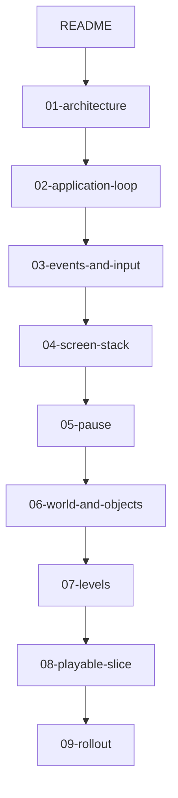
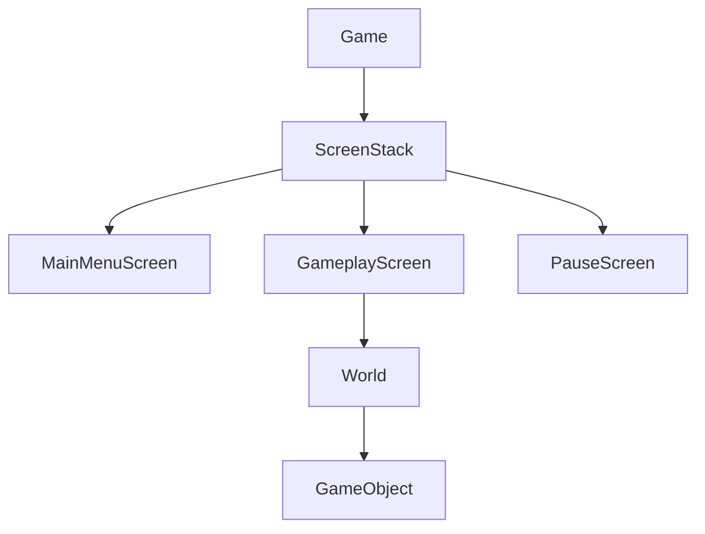

# Prospective SFML 3.1 engine plan

Chapters **01–09** are a **target design** (prospective). They are **not** rewritten when code lands.

What exists in the tree is tracked in [10-engine-progress.md](10-engine-progress.md) (living) and in [`docs/`](../docs/index.md). In the tree: `WindowI` / `DrawerI` / `ClockI` / `ScreenI` / `ScreenStack` / `Game`. There is no menu, input mapper, world, or pause.

This folder is also the implementation plan for the first playable engine slice: **MainMenu → empty Gameplay → Pause overlay → resume or quit to menu**.

## Reading order

1. This file (names, rules, non-goals)
2. [01-architecture.md](01-architecture.md) — four layers and ownership
3. [02-application-loop.md](02-application-loop.md) — window, clock, fixed tick, deferred stack commands
4. [03-events-and-input.md](03-events-and-input.md) — SFML 3 events, consume, `Action`
5. [04-screen-stack.md](04-screen-stack.md) — `IScreen`, push/pop/replace
6. [05-pause.md](05-pause.md) — overlay vs world time scale
7. [06-world-and-objects.md](06-world-and-objects.md) — `World`, dummy `GameObject`
8. [07-levels.md](07-levels.md) — `LevelDescriptor` as data
9. [08-playable-slice.md](08-playable-slice.md) — player-visible acceptance
10. [09-rollout.md](09-rollout.md) — phased files, tests, `gameLib`
11. [10-engine-progress.md](10-engine-progress.md) — living names and slices in the tree (not prospect)

## Locked type names

Use these identifiers in every chapter. Do not invent synonyms (`Scene`, `StateMachine`, `Entity`, `IManager`).

| Type | Role |
|------|------|
| `Game` | Owns `sf::RenderWindow`, clock, event pump, and `ScreenStack`. Handles `Closed`, `Resized`, `FocusLost`, `FocusGained`. |
| `ScreenStack` | Ordered screens. Queues `push` / `pop` / `replace`; applies them **after** update and draw of the current frame. |
| `IScreen` | `handleEvent`, `handleAction`, `update(dt)`, `draw(target)`, `blocksUpdate()`, `blocksDraw()`. |
| `MainMenuScreen` | Start / quit. Pushes or replaces with `GameplayScreen`. |
| `GameplayScreen` | Owns `World`. Requests pause overlay. Does not own the window. |
| `PauseScreen` | Overlay: resume (`pop`) or quit to menu. `blocksUpdate == true`, `blocksDraw == false`. |
| `InputMapper` | Maps remaining SFML events (and polled keys where needed) to `Action`. |
| `Action` | `enum class`: `Confirm`, `Cancel`, `Pause`. Movement actions come later; the slice may add `MoveDummy` only if the dummy object is player-steered. |
| `World` | Fixed-timestep simulation. Spawn / despawn. No pause flag. |
| `GameObject` | Shallow base or a single dummy type. `fixedUpdate(tick)`, `draw(sf::RenderTarget&)`. Composition over deep inheritance. |
| `LevelId` | Cheap identifier for a descriptor. |
| `LevelDescriptor` | Data: what to spawn, not a screen subclass. |

## Locked rules

- **Language / stack:** C++23, SFML 3.1 (`GIT_TAG 3.1.0`). Graphics / Window / System only (`SFML_BUILD_AUDIO` and `SFML_BUILD_NETWORK` are off). Headers: `#pragma once`. No namespaces. Classes `CamelCase`; methods `camelCase`.
- **Wording:** prospective — “will”, “target design”. Never claim this architecture is already in the tree.
- **Pause:** overlay on `ScreenStack` with `blocksUpdate`. Not `if (!paused)` inside `GameObject`. Distinct from optional later `World` time scale (slow-mo).
- **Events:** `Game` consumes window lifecycle events. Everything else becomes `Action` (or is ignored). Top screen may consume an action so screens below never see it.
- **Time:** world uses a **fixed** timestep (target 1/60 s). Screen UI may use frame delta. Do not starve the window (always poll events even when paused).
- **Draw:** `draw(sf::RenderTarget&)`. Objects never receive `sf::RenderWindow&`.
- **Playable slice:** one dummy moving shape in an otherwise empty world is enough to prove the world ticks while unpaused and freezes under `PauseScreen`.
- **Genre:** no Arkanoid, board game, or business-domain types. Do not copy `v0.1-arkanoid`.
- **New `.cpp` files** (when implemented later) must be listed in [`src/CMakeLists.txt`](../src/CMakeLists.txt) (`gameLib`). Tests stay Debug-only and should not open a window unless a display is required.

## Locked cross-chapter decisions

Chapters 01–09 were written in parallel. These resolutions win if a signature or number disagrees:

- **Start play:** `MainMenuScreen` queues **`replace`** with `GameplayScreen{LevelId::Sandbox}` — never `push` (menu must not remain under play).
- **Quit to menu:** while `PauseScreen` is top, queue **`pop` then `replace(MainMenuScreen)`**. A single `replace` would swap only the overlay.
- **Resume:** `Action::Pause` or `Action::Cancel` on `PauseScreen` queues `pop`. **`Action::Confirm` on the overlay quits to menu**, not resume. The slice has no highlighted dual-purpose Confirm row.
- **Escape:** `InputMapper` maps Escape to `Action::Pause` only. `Cancel` stays in the enum; the slice does not bind a key to it. If `Cancel` is delivered (later UI), `PauseScreen` treats it as resume.
- **FocusLost:** `Game` consumes it and calls `ScreenStack::requestPauseOverlay()`. It is **not** mapped to `Action::Pause`. `FocusGained` does not auto-resume. The overlay request no-ops if pause is already top or gameplay is not top.
- **Consume:** `IScreen::handleEvent` and `handleAction` return **`bool`** (`true` = stop the walk). Action dispatch does **not** use `blocksUpdate` as a cutoff; that flag is for `update` only.
- **Time while paused:** do not add this frame’s `dt` to the world accumulator, and do not call `GameplayScreen::update` / `World::fixedUpdate`. Resume must not catch up missed time.
- **Dummy (sandbox):** `sf::RectangleShape` `{40.f, 40.f}`, start `{0.f, 340.f}`, velocity `{240.f, 0.f}` px/s, **wrap** in `DESIGN_SIZE`. Not bounce, not player-steered.
- **Level data:** `LevelId::Sandbox` plus `SpawnSpec` rows and free function `makeWorld`. Not `class Level1`, not a `*Manager`.
- **Draw:** `void draw(sf::RenderTarget&)` on screens (non-const). `GameObject::draw` may be `const`. Never `sf::RenderWindow&`.
- **End-of-frame apply:** `ScreenStack::applyCommands()` (chapters may say `applyDeferred` / `applyDeferredCommands` — same step, after draw, before `display`).

## Chapter template

Every `mvp/0*.md` file will include:

1. YAML front-matter: `title`, `status: prospective`, `last_reviewed: 2026-09-19`, `related_docs` (this README plus sibling filenames).
2. Purpose and non-goals for that chapter.
3. At least **two** mermaid diagrams (flowchart or sequence). Node ids: PascalCase or camelCase, no spaces. Labels with punctuation go in double quotes. Subgraphs: `subgraph id [Label]`. No `style`, colors, or `click`.
4. C++ **signatures only** (types, methods, enums) — not full `.cpp` bodies.
5. Interaction with other layers, with links to exact sibling filenames.
6. Playable-slice implications.
7. Windowless test ideas.
8. Pitfalls.

## Glossary

- **Consume:** a screen or `Game` handles an event/action and the rest of the stack must not see it.
- **Deferred command:** `push` / `pop` / `replace` recorded during `update`/`handleAction` and applied at end of frame so no screen is destroyed mid-call.
- **Overlay:** a screen on top of gameplay that still draws the screens below.
- **Fixed tick:** simulation step of constant length; render may happen at a different rate.
- **Dummy object:** a single `GameObject` (for example a shape translating across the design view) with no genre rules.

## Non-goals (this plan)

ECS, audio, networking, a product-grade resource manager, level editor, scripting, `engine/` vs `game/` directory split, and any specific commercial genre.

## Current scaffold (do not contradict)

In-tree facts: [10-engine-progress.md](10-engine-progress.md). Snapshot for authors of 01–09:

- Window size: `Game::DESIGN_SIZE` = 1280×720.
- Entry: [`src/main.cpp`](../src/main.cpp) constructs `WindowSFML`, `ClockSFML`, `ScreenStack` (dummy `ScreenI`), and `Game`, then calls `run()`.
- Tests: [`tests/unit_tests/`](../tests/unit_tests/) (`example_test`, `game_test`, `fixed_timestep_test`, `screen_stack_test`). Windowless.
- Design size and the loop stay; later phases **extend** `Game::run()`, they do not replace the executable model.
