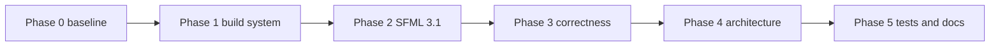

# Refactoring roadmap

The master checklist to fully refactor the project, in dependency order. Each phase is a separate branch/PR-sized unit with an explicit exit criterion; commit when the criterion holds (per the repo's golden rule). Details live in [stack-review.md](stack-review.md), [sfml3-migration.md](sfml3-migration.md), and [architecture-review.md](architecture-review.md).



## Phase 0 — Baseline (size: XS)

```
- [ ] Fresh cmake --preset debug; build game and build_ut; ctest green
- [ ] Decide fate of untracked Ball.cpp/Ball.hpp (commit as WIP or delete) so the tree is clean
- [ ] Tag/note the commit as the pre-refactor baseline
```

Exit: reproducible green build recorded.

## Phase 1 — Build system modernization (size: S)

Still on SFML 2.6.1; isolates build churn from API churn.

```
- [ ] FetchContent_MakeAvailable in cmake/FetchSFML.cmake and cmake/FetchGTest.cmake (kills CMP0169 warnings)
- [ ] gameLib SHARED → STATIC in src/CMakeLists.txt
- [ ] GoogleTest v1.14.0 → v1.17.0
- [ ] Full rebuild + ctest green on debug and release
```

Exit: same behavior, zero configure warnings, static lib.

## Phase 2 — SFML 3.1 migration (size: M–L)

Follow [sfml3-migration.md](sfml3-migration.md) step by step (CMake targets → window layer → event dispatch → managers → entities → main → tests → CI).

```
- [ ] All 11 steps of the migration checklist done
- [ ] Verification gate of the migration doc passes (build, tests, manual smoke, CI)
```

Exit: game runs on SFML 3.1.0, CI green on both platforms.

## Phase 3 — Correctness fixes (size: M)

Bugs and traps from [architecture-review.md](architecture-review.md), issues 1, 2, 4.

```
- [ ] RAII unregistration: ManagedList returns a move-only handle that erases on destruction; register methods [[nodiscard]]
- [ ] Fix Paddle to store its registration handles (kills the dangling-this bug); simplify OnClickHandler/OnHoverHandler destructors
- [ ] Unit test proving handlers die with their owner
- [ ] Delta time: sf::Clock in GameController loop, update(float dt) through ScreenI/EntityI, Paddle speed in px/s, fixed-timestep accumulator
- [ ] Remove per-event std::cerr logging from EventController (delete or debug-gate EventPrinter)
```

Exit: no dangling handlers, framerate-independent movement, silent event loop; tests green.

## Phase 4 — Architecture upgrades (size: L)

Issues 3, 5, 6, 7 of the architecture review; makes the codebase ready for actual game content.

```
- [ ] ResourceManager (font cache), injected from main.cpp; exe-relative resource paths; hard failure on missing assets
- [ ] Scene stack in ScreenController (push/pop/replace via extended ScreenUpdaterI); initial screen injected, not hardcoded
- [ ] GameWindowManager for Resized/focus (correct view handling on resize)
- [ ] Decide and execute: Player (delete or repurpose), Ball (implement with dt + collision vs Paddle, or delete), EntitiesManagerI (implement only if collisions arrive now)
```

Exit: pause/overlay technically possible, resources cached, window resize handled, no dead code left undecided.

## Phase 5 — Tests and documentation sync (size: M)

```
- [ ] Unit tests for MenuScreen/GameScreen, Paddle (dt movement, unregistration), Button (hover/click)
- [ ] Update docs/ (reference/architecture.md, interfaces.md, event-flow.md, how-to pages) to the post-refactor reality — run the update-docs skill
- [ ] Update .cursor rules/skills where they reference changed APIs (SFML 2 snippets, update() signature)
- [ ] Refresh README.md facts if commands or prerequisites changed
```

Exit: coverage extended to screens/entities, `docs/` front-matter `last_reviewed` current, CI green.

## Suggested sequencing notes

- Phases 0–1 are safe to do immediately; each is independently shippable.
- Phase 2 must not be mixed with phase 3 in one PR — API churn plus behavior change is unreviewable.
- Phase 3's RAII fix is the highest-value single change in the plan; if time is short, do 0 → 1 → 3 (RAII + logging only) and defer SFML 3.
- Phase 4 items are independent of each other and can land as four small PRs.
